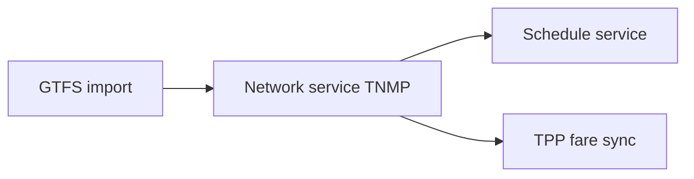
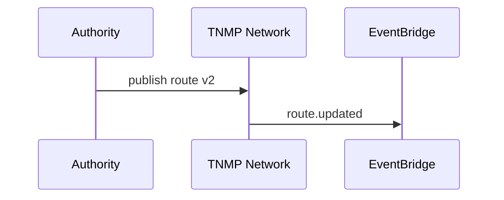

# 06 — Route Management

---

## Executive summary

**Canonical national network**: routes, patterns, stops, stations, schedules, interchanges—GTFS-native; TPP consumes fare products derived from network IDs.

---

## Business purpose

Single source of truth for planning, operations, and government statistics.

---

## Architecture overview

---

## Entities

`Route`, `RoutePattern`, `Stop`, `Station`, `Interchange`, `ServiceCalendar`, `TripTemplate`, `StopTime`.

---

## Modes

All listed transport modes share core model; mode extensions (rail seat class, ferry deck) as attributes.

---

## Sequence: route update

---

## API

`/v1/mobility/network/*` — [08_API_SPECIFICATION.md](08_API_SPECIFICATION.md).

---

## Security

Authority-only writes; versioned effective dates.

---

## AWS

PostGIS on RDS; S3 GTFS archives.

---

## Implementation strategy

NM-5 GTFS BRT import first.

---

## Future expansion

Dynamic lanes BRT priority data feed.

---

## Cross-references

[transport/04_ROUTE_MANAGEMENT.md](../transport/04_ROUTE_MANAGEMENT.md)
