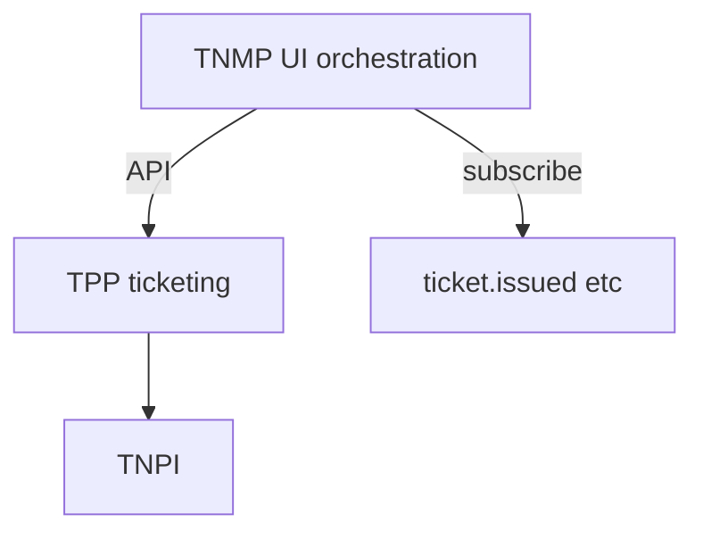
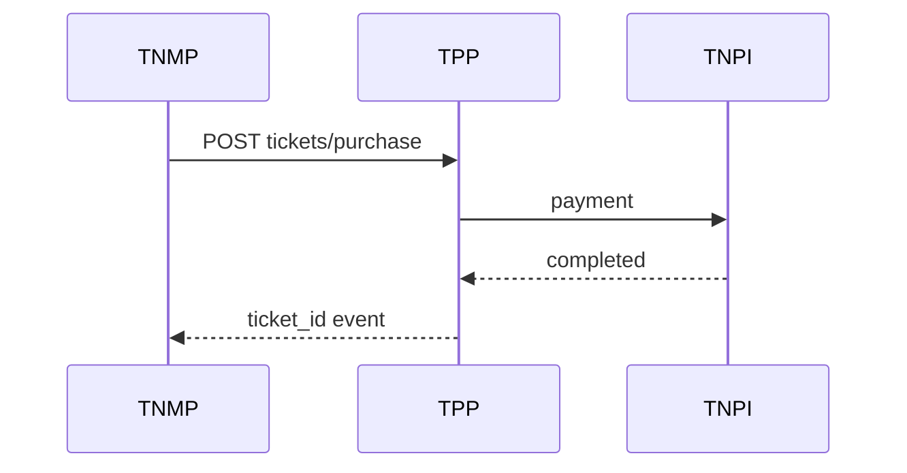

# 07 — Ticketing

---

## Executive summary

TNMP **does not issue tickets**—it surfaces entitlements and validation UX by **integrating TPP** (QR, NFC, SoftPOS, passes, subscriptions, corporate/gov billing via TNPI).

---

## Business purpose

Clear separation: mobility OS vs payment product.

---

## Architecture overview

---

## Supported payment modalities (via TPP/TNPI)

QR · NFC · SoftPOS · digital passes · subscriptions · corporate billing · government subsidies.

---

## TNMP responsibilities

Show ticket in journey context · Deep link to purchase · Display validation status on live trip · Inspector app shell calling TPP validate API.

---

## Sequence

---

## Events

Listen: `transport.ticket.issued` (TPP); emit: `passenger.boarded` with `ticket_id` ref.

---

## Security

No local payment keys in TNMP apps.

---

## Implementation strategy

Embed TPP SDK in passenger app; contract tests.

---

## Future expansion

Account-based mobility (ABT) — still TPP/TNPI token.

---

## Cross-references

[transport/05_TICKETING.md](../transport/05_TICKETING.md)
