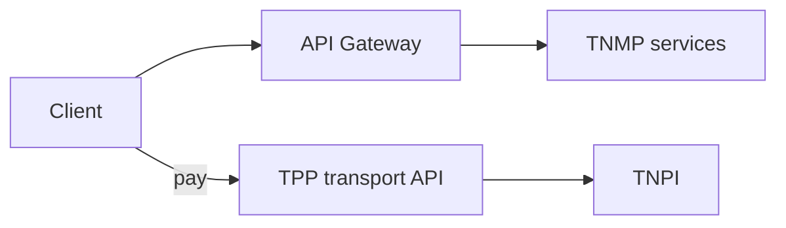

# 08 — API Specification

**Public base:** `https://api.taifa.go.tz/v1/mobility` (via [Developer Platform](../payments/developer-platform/03_API_PLATFORM.md))  
**Payments / tickets:** `/v1/transport/*` → **TPP** (do not duplicate)

---

## Executive summary

REST OpenAPI 3.1 for TNMP domains; payment endpoints **not** defined here.

---

## Business purpose

Stable national mobility API for partners and internal apps.

---

## API categories

### Passengers
`GET/POST /passengers`, `/passengers/me/journeys`, `/passengers/me/preferences`

### Journeys & trips
`POST /journeys/plan`, `GET /journeys/{id}`, `GET /trips/{id}/positions`

### Network
`GET /routes`, `/stops`, `/stations`, `/schedules`

### Fleet
`GET/POST /operators/{id}/fleets`, `/vehicles`, `/drivers`, `POST /vehicles/{id}/positions`

### Operations
`GET /monitoring/fleets/{id}`, `POST /incidents`, `GET /incidents/{id}`

### Government (scoped)
`GET /gov/analytics/ridership`, `/gov/analytics/cashless`, `/gov/heatmaps/traffic`

### AI
`POST /ai/mobility/chat`, `POST /ai/mobility/plan`

### Support
`POST /support/tickets`, `POST /lost-found`

### Ticketing (proxy)
`POST /ticketing/*` → **HTTP 307 to TPP** or client calls TPP directly (documented)

---

## Standard envelope

```json
{
  "data": {},
  "meta": { "request_id": "req_xxx" },
  "error": null
}
```

---

## API flow



---

## OpenAPI standards

`openapi/tnmp-v1.yaml`; merged in developer catalog; `x-taifa-domain: mobility`.

---

## Security

Scopes: `mobility:read`, `mobility:operator:{id}`, `mobility:gov:read`.

---

## AWS

API Gateway routes to ECS services.

---

## Implementation strategy

Contract-first; Spectral lint in CI.

---

## Future expansion

Mobility GraphQL read API for dashboards.

---

## Cross-references

[09_EVENT_CATALOG.md](09_EVENT_CATALOG.md) · [10_DATABASE_MODEL.md](10_DATABASE_MODEL.md)
