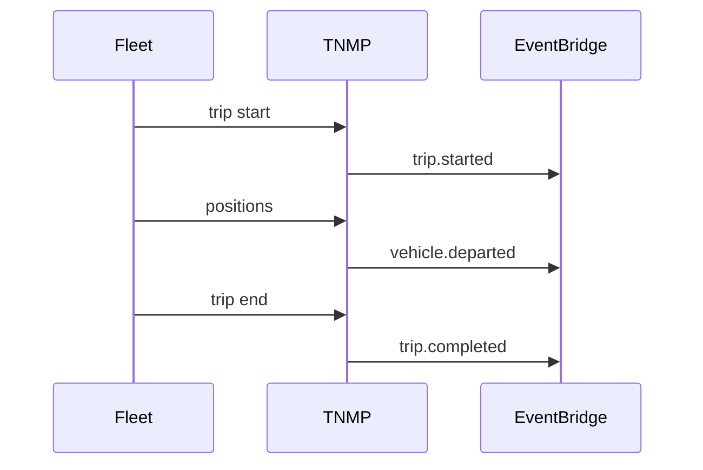

# 09 — Event Catalog

**Topic prefix:** `taifa.mobility` · **Bus:** `tnpi-platform`

---

## Executive summary

National mobility event mesh for real-time ops, analytics, and integrations—**financial events consumed from TNPI/TPP, not re-published as payment SoR**.

---

## Business purpose

Event-driven smart city and multi-agency coordination.

---

## TNMP publishes

| Event | When |
| --- | --- |
| `journey.created` | Planned journey |
| `journey.updated` | Reroute |
| `trip.started` | Revenue service started |
| `trip.completed` | Service ended |
| `route.updated` | Network change |
| `fleet.updated` | Fleet metadata |
| `vehicle.departed` | Geofence leave |
| `vehicle.arrived` | Geofence enter |
| `driver.assigned` | Shift |
| `passenger.boarded` | Validation/boarding signal |
| `passenger.alighted` | Alighting |
| `incident.reported` | Safety/ops |
| `incident.resolved` | Closed |
| `emergency.alert` | SOS |
| `capacity.threshold` | Predictive alert |

---

## TNMP subscribes

| Event | Source | Action |
| --- | --- | --- |
| `transport.ticket.issued` | TPP | Attach to journey |
| `transport.ticket.validated` | TPP | Boarding event |
| `payment.completed` | TNPI | Optional cache refresh via TPP only |
| `payment.failed` | TNPI | Cancel pending journey leg |

---

## Sequence: trip lifecycle

---

## Security

Aggregate gov events anonymized; no payment PAN.

---

## AWS

EventBridge schema registry; archive to S3 data lake.

---

## Implementation strategy

NM-0 event schemas; idempotent consumers.

---

## Future expansion

City sensor `infrastructure.signal.updated` (smart city).

---

## Cross-references

[transport/08_EVENT_CATALOG.md](../transport/08_EVENT_CATALOG.md)
