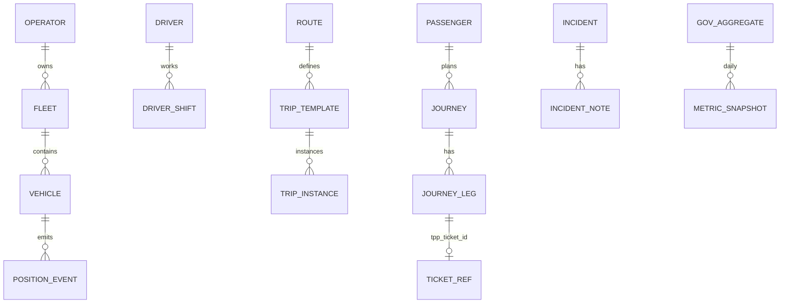

# 10 — Database Model

**Schema:** `mobility` (TNMP core)

---

## Executive summary

ER for network, operations, journeys, fleet, incidents, gov aggregates—**ticket/payment refs only**.

---

## Business purpose

Mobility SoR separate from payment SoR.

---

## ER diagram

---

## Forbidden tables

`wallet_balance`, `payment_intent`, `settlement_batch` (use external IDs only).

---

## Context map (storage)

| Data | System |
| --- | --- |
| Network, fleet, trips | TNMP RDS |
| Tickets | TPP |
| Payments | TNPI |

---

## API / events

Aligned with [08](08_API_SPECIFICATION.md) and [09](09_EVENT_CATALOG.md).

---

## Security

RLS per operator tenant; gov role read aggregates.

---

## AWS

RDS PostgreSQL Multi-AZ; Timescale/extension for positions optional.

---

## Implementation strategy

Partition `position_event` by time; cold storage S3.

---

## Future expansion

Regional read replica for East Africa hub.

---

## Cross-references

[04_FLEET_PLATFORM.md](04_FLEET_PLATFORM.md)
