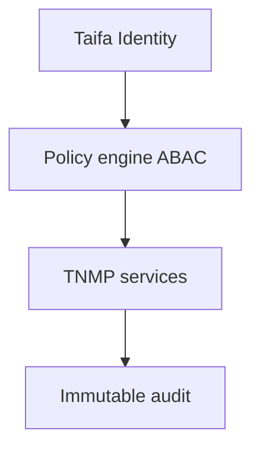

# 11 — Security Model

---

## Executive summary

National-scale RBAC/ABAC: passenger, operator, driver, inspector, municipal, ministry, emergency services; encryption, audit, LATRA compliance fields; **zero PCI scope in TNMP** (TPP/TNPI).

---

## Business purpose

Protect citizens and critical transport infrastructure data.

---

## Architecture overview

---

## Role matrix (sample)

| Role | Access |
| --- | --- |
| `passenger` | Self journeys |
| `driver` | Assigned vehicle, validate via TPP |
| `operator_admin` | Tenant fleet/schedules |
| `inspector` | Scan + incidents |
| `municipal_viewer` | City aggregates |
| `ministry_analyst` | National aggregates |
| `emergency_responder` | Active incidents SOS |

---

## Data classification

Public schedules · Internal fleet · Confidential driver PII · Restricted emergency traces.

---

## Payments security

TNMP apps use TPP checkout components only; no API secrets for TNPI in passenger mobile except via TPP SDK patterns.

---

## AWS

KMS, Secrets Manager, CloudTrail, GuardDuty.

---

## Operational considerations

National CERT coordination for incidents.

---

## Implementation strategy

Security baseline NM-0.

---

## Future expansion

Zero-trust service mesh mTLS east-west.

---

## Cross-references

[payments/10_SECURITY.md](../payments/10_SECURITY.md)
