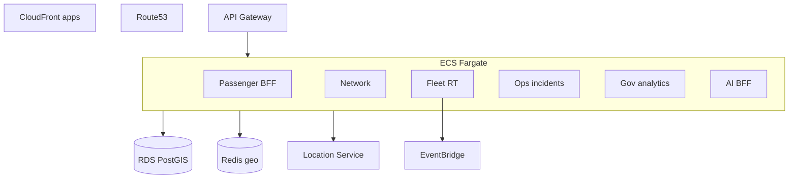
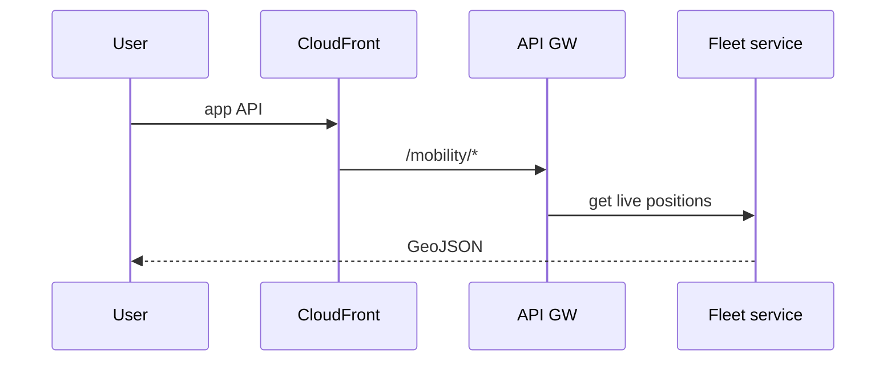

# 12 — AWS Architecture

---

## Executive summary

Production TNMP on AWS: **CloudFront**, **Route53**, **API Gateway**, **ECS Fargate** domain services, **Lambda** ingest, **Step Functions** incident workflows, **EventBridge**, **SQS/SNS**, **RDS PostgreSQL** + PostGIS, **Redis**, **Location Service**, **CloudWatch**, **CloudTrail**, **KMS**, **Backup**.

---

## Business purpose

Scale from one city to nationwide + future smart-city ingest.

---

## Architecture overview

---

## Multi-region strategy

| Phase | Topology |
| --- | --- |
| MVP | Single region `af-south-1` |
| National | Active-passive DR |
| Regional EA | Hub in Dar + read replicas |

---

## Sequence: national API

---

## Smart city ingest (future)

IoT Core / Kinesis for sensors → EventBridge → traffic analytics Lambda.

---

## TNPI connectivity

TPP services in same org VPC; no direct TNMP → TNPI except through TPP service mesh policy exception (read-only reporting BFF).

---

## Security

Private subnets; WAF; per-tenant encryption keys optional.

---

## Operational considerations

Autoscale fleet ingest on peak; cost caps on AI inference.

---

## Implementation strategy

Terraform module `taifa-mobility`; wave-based service rollout.

---

## Future expansion

Outposts at major stations for low latency.

---

## Cross-references

[13_IMPLEMENTATION_GUIDE.md](13_IMPLEMENTATION_GUIDE.md)
