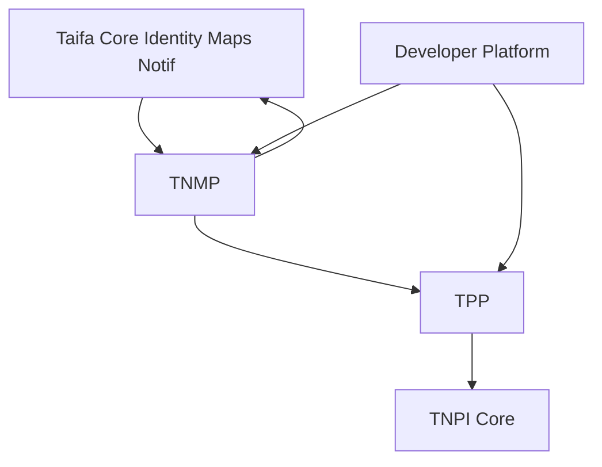

# 13 — Implementation Guide

---

## Executive summary

Build TNMP as **federated mobility services** with TPP as payment/ticketing adapter to TNPI; Taifa Core for identity, notifications, maps, AI.

---

## Business purpose

Executable delivery model from MVP city to nation to smart city.

---

## Dependency graph

---

## Service decomposition

| Service | Domain |
| --- | --- |
| `mobility-network` | Routes, schedules |
| `mobility-fleet` | Vehicles, positions |
| `mobility-journey` | Trips, passenger state |
| `mobility-ops` | Incidents, emergency |
| `mobility-gov` | Aggregates, heatmaps |
| `mobility-ai-bff` | AI assistant |
| `mobility-passenger-bff` | App API |

**Not in TNMP:** payment orchestration, ticket signing keys *(TPP)*.

---

## Integration rules

1. All fares/tickets → **TPP API**.  
2. All money → **TNPI** (via TPP only).  
3. TNMP stores `ticket_id`, `payment_id` as opaque refs.  
4. Subscribe TPP + TNMP events; never write TNPI state.

---

## Government platform

Ministry · LATRA · municipalities · traffic · statistics · emergency — read models in `mobility-gov` fed by event lake (anonymized). Metrics: ridership, cashless %, fleet utilization, heatmaps, carbon estimates.

---

## Sprint alignment

See [TNMP_GATE_PACKAGE.md](TNMP_GATE_PACKAGE.md) §3 and [15_BACKLOG.md](15_BACKLOG.md).

---

## Testing

Contract tests with TPP sandbox; load test position ingest; gov aggregate privacy tests.

---

## Security gates

Per-wave threat model; LATRA data sharing agreement.

---

## Implementation strategy

[14_ROADMAP.md](14_ROADMAP.md) waves NM-W0–W5.

---

## Future expansion

East Africa API federation hub.

---

## Cross-references

[16_ACCEPTANCE_CRITERIA.md](16_ACCEPTANCE_CRITERIA.md)
