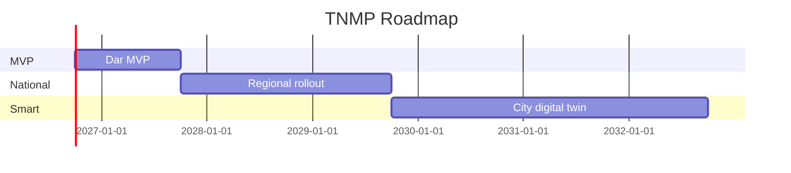

# 14 — Roadmap

---

## Executive summary

**20-year horizon** with executable phases: **MVP (1 city)** → **National (all modes)** → **Smart City & Regional (EA)**.

---

## Business purpose

Align investment with measurable mobility outcomes, not feature sprawl.

---

## Phase map

---

## MVP roadmap (Months 1–12) — Dar es Salaam

| Quarter | Deliverable |
| --- | --- |
| Q1 | NM-W0 foundation: network BRT GTFS, fleet registry, events |
| Q2 | Live map + schedules; TPP ticket embed; passenger app shell |
| Q3 | Operator console; incident MVP; municipal dashboard pilot |
| Q4 | AI rule-based planner; LATRA fleet report; go-live KPI review |

**MVP definition:** See [TNMP_GATE_PACKAGE.md](TNMP_GATE_PACKAGE.md) §4.

---

## National rollout strategy (Months 13–36)

| Wave | Geography / mode |
| --- | --- |
| N1 | Morogoro, Dodoma commuter |
| N2 | TRC/SGR corridors |
| N3 | Coastal ferries + Zanzibar |
| N4 | Airports JNIA/DAR |
| N5 | Taxi/ride-hail/bajaji national APIs |
| N6 | School & corporate transport modules |
| N7 | Parking + tour operators |

**Principle:** Network + fleet before AI; TPP payment wave follows TNMP ops wave per city.

---

## Smart city expansion strategy (Years 4–10)

| Layer | Capability |
| --- | --- |
| L1 Digital twin | City traffic model ingest |
| L2 Sensors | CCTV/loop/IoT via EventBridge |
| L3 AI traffic | Signal timing recommendations (gov approval) |
| L4 EV | Charging occupancy + routing |
| L5 Autonomous | Shuttle geofenced ops API |
| L6 Drone | Cargo corridor registry (future) |

Carbon metrics and cashless adoption KPIs published to ministry dashboards.

---

## Gantt (indicative)

---

## Capability model rollout

| Year | Focus |
| --- | --- |
| 1 | Passenger, fleet, network, TPP integration |
| 2–3 | Govt analytics, AI assistant, incidents |
| 4–7 | Smart city ingest, EV/toll readiness |
| 8–20 | Autonomous/drone, EA federation |

---

## Operational considerations

City playbooks; operator migration workshops; data sovereignty compliance.

---

## Implementation strategy

Backlog [15_BACKLOG.md](15_BACKLOG.md) tagged by wave.

---

## Future expansion

UN sustainable mobility goals reporting.

---

## Cross-references

[transport/13_ROADMAP.md](../transport/13_ROADMAP.md) — TPP payment waves run in parallel.
