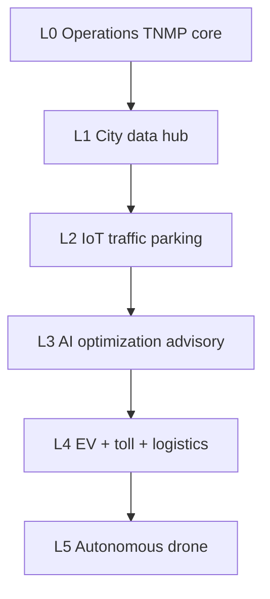
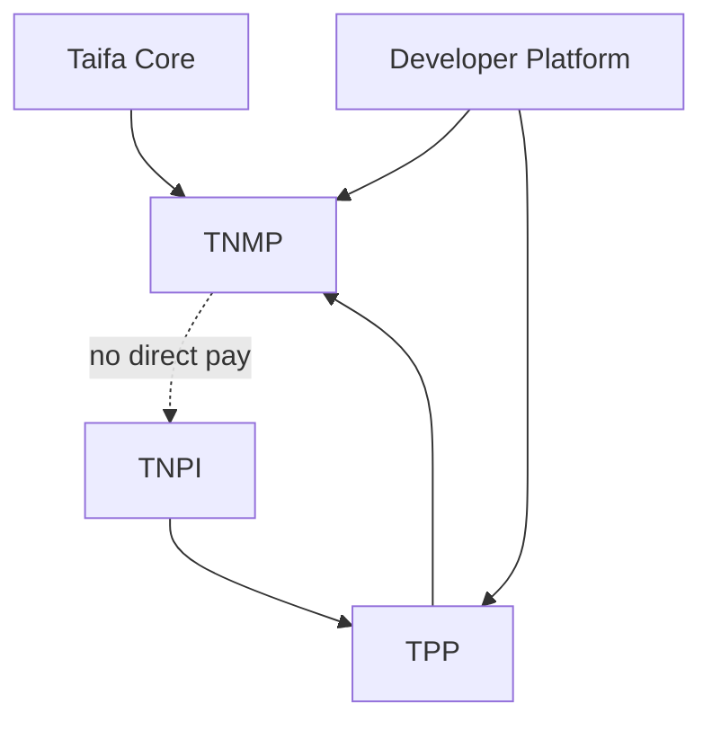

# TNMP — Gate Package

**Product:** Taifa National Mobility Platform (TNMP)  
**Status:** Architecture planning complete — Taifa Core + TNPI + TPP assumed available  
**Date:** 2026-08-06

---

## 1. Product Readiness Report

### Executive summary

The **TNMP** pack (`docs/mobility/00–18`) defines Tanzania’s **national mobility operating system**—passenger, operator, fleet, network, ITS, AI, government analytics, incidents—**delegating all payments to [TPP](../transport/00_PLATFORM_OVERVIEW.md) → TNPI**. Not a ticketing-only or payment-only product.

### Readiness matrix

| Dimension | Status |
| --- | --- |
| Business architecture, capability & domain models | ✅ |
| Context map TNMP–TPP–TNPI | ✅ |
| APIs, events, ER, security, AWS | ✅ |
| MVP / national / smart city roadmaps | ✅ |
| Backlog, acceptance, risks | ✅ |
| **Implementation** | ⬜ |
| **TPP Wave 0–1** (ticket + TNPI) | ⬜ parallel dependency |
| **Taifa Core Identity/Maps** | ✅ assumed |

### Verdict

| Question | Answer |
| --- | --- |
| Start TNMP **implementation**? | **Yes** (architecture) |
| Replace TPP? | **No** — complementary |
| Duplicate TNPI? | **Forbidden** |

---

## 2. Architecture Review Report

### Scope

National mobility OS vs TPP payment product vs TNPI; 20-year extensibility; government data; AI safety.

### Findings

| ID | Finding | Severity | Action |
| --- | --- | --- | --- |
| AR-NM-01 | Single payment path TPP→TNPI | Critical | ADR-TNMP-001 enforce |
| AR-NM-02 | Network SoR in TNMP, fares in TPP | High | Sync contract |
| AR-NM-03 | Position data volume | High | Partition + Redis |
| AR-NM-04 | Gov PII in aggregates | Critical | Privacy pipeline |
| AR-NM-05 | AI must not execute payments | High | Confirm step + TPP |
| AR-NM-06 | Duplicate route APIs TPP/TNMP | Med | TNMP canonical, TPP fare slice |
| AR-NM-07 | Smart city scope creep | Med | Phase S gated |

### Proposed ADRs

- **ADR-TNMP-001** — TNMP does not implement any TNPI capability  
- **ADR-TNMP-002** — Canonical network graph lives in TNMP; TPP references `route_id`  
- **ADR-TNMP-003** — Government dashboards read anonymized lake only

### Verdict

**Approved to implement TNMP MVP** when TPP sandbox ticket purchase and TNMP network API contracts are frozen.

---

## 3. Sprint Breakdown

| Sprint | Duration | Focus | Backlog |
| --- | --- | --- | --- |
| **NM-W0** | 3 wk | IaC, events, GTFS, network API | NMB-001–004 |
| **NM-W1** | 4 wk | Fleet, positions, passenger BFF | NMB-005–008 |
| **NM-W2** | 4 wk | Live trip, operator portal, incidents | NMB-009–012 |
| **NM-W3** | 4 wk | Gov aggregates, AI rules, support/SOS | NMB-013–017 |
| **NM-W4** | 3 wk | Inspection shell, LATRA, heatmaps | NMB-018–020 |
| **NM-N1** | 6 wk | City 2 rollout + ML delays | NMB-021 |
| **NM-N2** | 8 wk | LLM assistant + rail module | NMB-022–023 |
| **NM-S1** | 6 wk | Smart city IoT PoC | NMB-026 |

**MVP target:** NM-W0–W4 (~18 weeks) + TPP Wave 1 parallel.

---

## 4. MVP Definition

**Geography:** Dar es Salaam (BRT corridor + pilot dala dala operators)

**In scope**

- GTFS network + schedules API  
- Fleet/vehicle registry + manual/conductor GPS ingest  
- Passenger app API: plan (rule-based), live vehicle map  
- TPP-embedded ticket purchase (QR); TNMP journey shows ticket  
- Operator web: fleet list, basic schedule, incidents  
- Municipal dashboard: daily ridership estimate, cashless % (from TPP/TNPI reads)  
- Event bus: `trip.*`, `vehicle.*`, `journey.created`  
- Identity login  

**Out of scope (MVP)**

- LLM assistant (post-MVP)  
- National ministry dashboard  
- Smart city sensors  
- Direct TNPI API calls from TNMP  
- Toll/EV/autonomous  

**Success metrics (6 months post launch)**

- 200+ tracked vehicles  
- 25k monthly journeys planned  
- 10k TPP tickets linked to TNMP journeys  
- &lt;1% position ingest loss  
- Zero TNPI logic in TNMP codebase (audit)

---

## 5. National Rollout Plan

| Phase | Timeline | Focus |
| --- | --- | --- |
| **P0 MVP** | Mo 1–12 | Dar, BRT + dala dala |
| **P1 Urban** | Mo 13–18 | Morogoro, Dodoma, Mwanza |
| **P2 Corridor** | Mo 19–24 | TRC/SGR, long-distance bus |
| **P3 Coastal** | Mo 25–30 | Ferries, Zanzibar |
| **P4 Aviation** | Mo 31–36 | Airports, shuttles |
| **P5 On-demand** | Mo 37–42 | Taxi, bajaji, bodaboda APIs |
| **P6 Institutional** | Mo 43–48 | School, corporate, tour |

**Governance:** Ministry/LATRA/municipal steering quarterly; operator certification via TPP/TNPI developer program.

**Technical:** Each phase = network GTFS pack + fleet onboarding + gov dashboard tier; TPP payment wave follows 4–8 weeks after ops wave per city.

---

## 6. Smart City Expansion Strategy

### Vision (Years 4–20)

TNMP becomes **mobility digital twin** for Tanzanian cities: multimodal demand, infrastructure sensors, EV grid, emergency orchestration, later autonomous/drone logistics corridors.

### Layers

### Principles

- Open event standards (`taifa.mobility.*`)  
- Privacy by design for citizen traces  
- Payments always TNPI; congestion pricing *(future)* as TPP products  
- Partner municipal systems via API Gateway, not ad-hoc VPNs  
- East Africa: federated identity + reciprocal journey quotes (Year 7+)

### Pilot cities (proposed)

Dar es Salaam (L1–L2) → Dodoma (gov campus) → Arusha (tourism + park shuttles)

### KPIs

- Cashless transit %  
- Average multimodal planning time  
- Incident response time  
- Estimated CO₂ avoided (model-based)  
- Sensor coverage km²

---

## Dependency graph (program)

---

## Cross-references

[00_PLATFORM_OVERVIEW.md](00_PLATFORM_OVERVIEW.md) · [14_ROADMAP.md](14_ROADMAP.md) · [transport/00_PLATFORM_OVERVIEW.md](../transport/00_PLATFORM_OVERVIEW.md)
