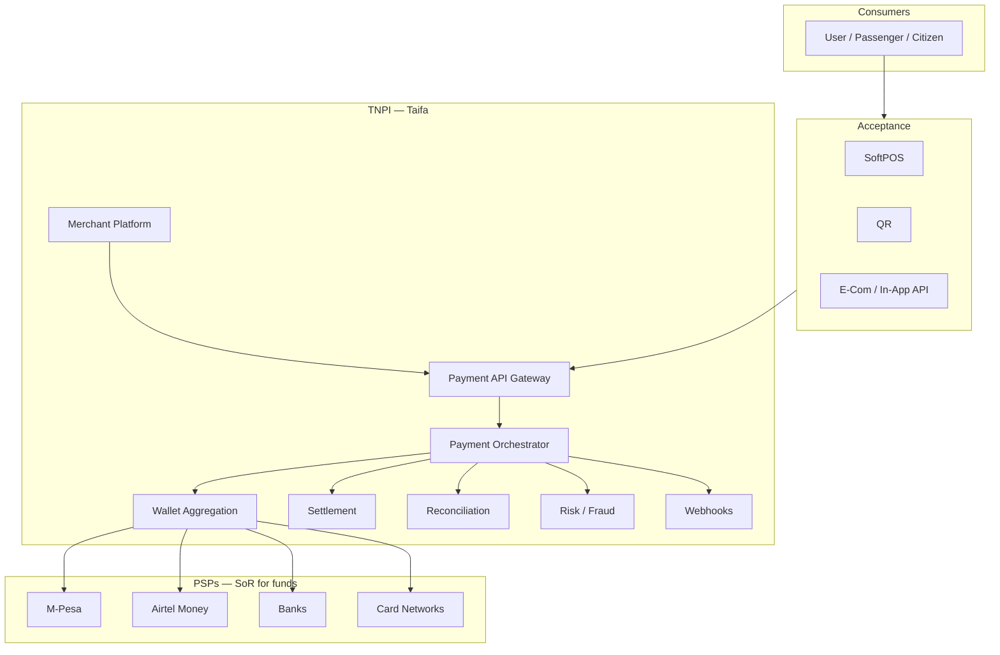

# 00 — Payment Program Charter (TNPI)

**Program:** Taifa National Payment Infrastructure (TNPI)  
**Version:** 1.0 (architecture)  
**Status:** Approved for design & phased implementation planning

---

## Executive summary

TNPI positions Taifa as **national payment acceptance infrastructure**: one orchestration layer for merchants, operators, and agencies to accept money from M-Pesa, Airtel Money, Mixx by Yas, HaloPesa, banks, Visa, Mastercard, and future rails—without Taifa becoming a wallet or holding consumer float.

This charter defines vision, phases, governance alignment, bounded contexts, and success criteria for East Africa–scale expansion.

---

## Business vision

**One nation, many rails, one acceptance fabric.**

- Citizens keep using their preferred wallet or bank.
- Merchants, daladalas, hospitals, and government counters get **one integration**, **one reconciliation view**, and **certified acceptance** (SoftPOS, QR, API).
- Tanzania gains **interoperability**, **auditability**, and **fraud visibility** without replacing BoT-regulated institutions.

---

## Architecture overview

---

## Governance alignment

| Topic | Position |
| --- | --- |
| **Customer funds** | Held by PSPs; TNPI stores tokens, mandates, and settlement **positions** only |
| **Ledger** | [ADR-0001](../adr/0001-single-payment-ledger.md) applies to **acceptance accounting** (merchant payables, fees, suspense, provider settlement)—not a competing M-Pesa balance |
| **Domain owner** | **Finance / TNPI** (`finance.acceptance`, `finance.orchestration`) per [Domain Governance](../architecture/01_DOMAIN_GOVERNANCE.md) |
| **Tap & Pay** | UX/channel layer; money path → orchestrator ([tap_pay](../tap_pay/00_INDEX.md)) |
| **Platform Core** | Identity, audit, events, API gateway from [Taifa Core](../platform/README.md) |

**Planned ADR:** TNPI charter supersedes wallet-centric wording in legacy docs where it implied Taifa custodies consumer float.

---

## Bounded contexts (summary)

| Context | Responsibility |
| --- | --- |
| `finance.merchant` | Merchant profile, KYC, terminals, MCC |
| `finance.wallet_aggregation` | Link mandates, token vault references |
| `finance.orchestration` | Payment intents, routing, retries, splits |
| `finance.settlement` | Payout batches, cutoffs, nostro mapping |
| `finance.reconciliation` | PSP files, exceptions, adjustments |
| `finance.acceptance.softpos` | NFC sessions, offline queue |
| `finance.acceptance.qr` | Static/dynamic QR lifecycle |
| `finance.risk` | Scoring, rules, lists |
| `finance.disputes` | Chargebacks, mobile money disputes |

---

## Program phases

| Phase | Name | Outcomes |
| --- | --- | --- |
| **1** | Platform foundation | Identity, merchant KYC, payment API GW, audit, IaC |
| **2** | Payment core | Orchestration, settlement, reconciliation, webhooks, fraud |
| **3** | Acceptance platform | SoftPOS, QR, links, e-com APIs |
| **4** | National mobility | Transit, parking, multimodal fares |
| **5** | National digital | Gov, health, edu, tourism, utilities |

Detail: [13_PAYMENT_ROADMAP.md](13_PAYMENT_ROADMAP.md) · execution: [12_IMPLEMENTATION_PLAN.md](12_IMPLEMENTATION_PLAN.md).

---

## Microservices (target)

Identity (Core) · Merchant · Wallet Aggregation · Payment Orchestrator · Settlement · Reconciliation · SoftPOS · QR · Receipt · Notification (Core) · Fraud · Risk · Reporting · Analytics · Partner Gateway · Developer Portal · Configuration (Core) · Audit (Core).

---

## Security & compliance (summary)

PCI DSS scoped to card data environments; ISO 27001 control mapping; BoT PSP partnership model; PII minimization. See [10_SECURITY.md](10_SECURITY.md), [17_COMPLIANCE_GUIDE.md](17_COMPLIANCE_GUIDE.md).

---

## AWS (summary)

Multi-account, `af-south-1` primary; API Gateway, ECS Fargate, RDS, Redis, EventBridge, Step Functions for sagas. See [11_AWS_ARCHITECTURE.md](11_AWS_ARCHITECTURE.md).

---

## Dependencies

| Dependency | Owner |
| --- | --- |
| Taifa Core identity (OIDC, merchant RBAC) | Platform S1+ |
| Event bus & outbox | Platform S3 |
| PSP commercial & technical agreements | Partnerships |
| Scheme certification (Visa/Mastercard) | Compliance / Acquirer |
| BoT / regulatory notifications | Legal |

---

## Acceptance criteria (program)

| # | Criterion |
| --- | --- |
| AC-1 | All TNPI docs `00–18` published and cross-linked |
| AC-2 | Event & API catalogs reviewed by Architecture Board |
| AC-3 | PCI scope document signed by Security |
| AC-4 | Implementation plan aligned with Core sprint gates |
| AC-5 | Risk register owned with mitigations |

---

## Definition of done (documentation)

- Executive summary, diagrams, bounded contexts, APIs/events referenced, roadmap sprint mapped, compliance section present per doc template.
- No production code in `docs/payments/` program phase.

---

## Future roadmap

- East Africa PSP hub (Kenya, Uganda, Rwanda)
- CBDC adapter interface
- Real-time gross settlement hooks with TIPS
- Cross-border FX orchestration (regulated)

---

## Cross-references

[01_PAYMENT_FOUNDATION.md](01_PAYMENT_FOUNDATION.md) · [12_IMPLEMENTATION_PLAN.md](12_IMPLEMENTATION_PLAN.md) · [18_RISK_REGISTER.md](18_RISK_REGISTER.md)
