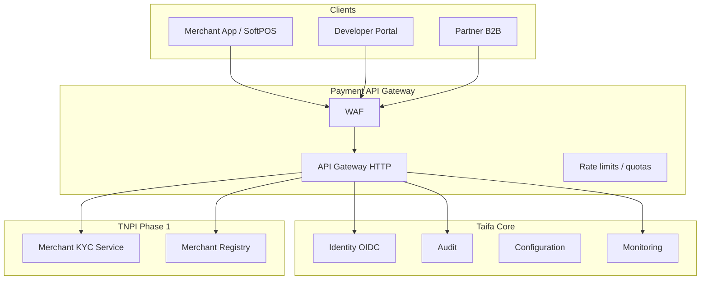
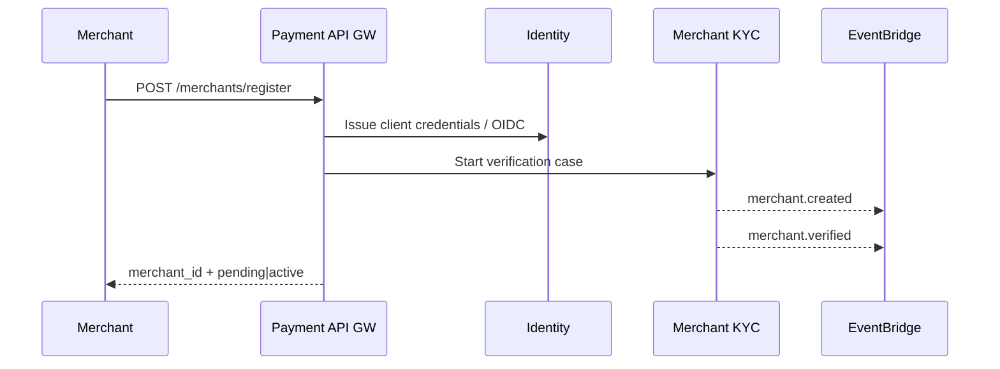
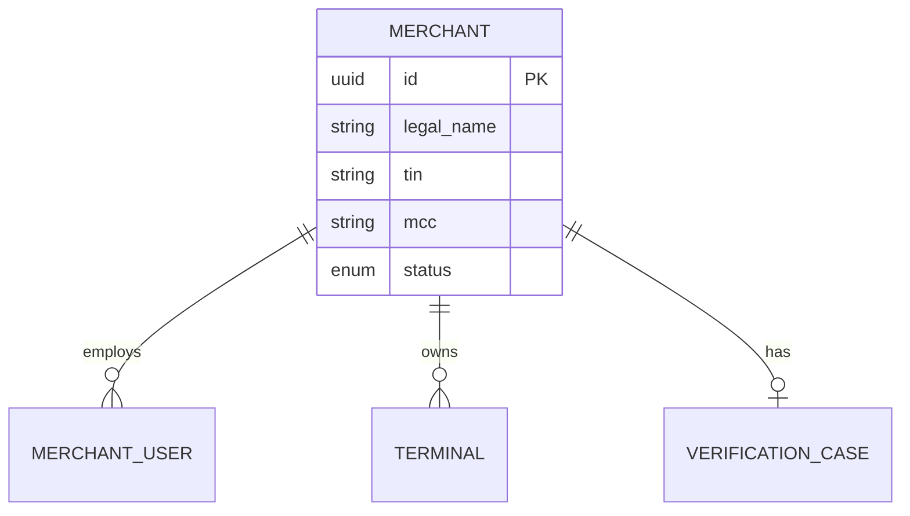

# 01 — Payment Foundation (Phase 1)

**Bounded context:** `platform.*` + `finance.merchant` (onboarding)  
**Depends on:** [Taifa Core Phase 1](../platform/14_PLATFORM_IMPLEMENTATION_GUIDE.md)

---

## Executive summary

Phase 1 delivers the **secure perimeter** for TNPI: merchant and developer identity, payment-dedicated API gateway policies, KYC/verification workflows, OAuth2/OIDC, RBAC, audit, secrets, monitoring, and IaC—reusing Taifa Core without duplicating platform services.

---

## Business vision

Merchants and partners trust TNPI because **identity, access, and evidence** are enterprise-grade before a single shilling is orchestrated.

---

## Architecture overview

Phase 1 detail: **[merchant/00_INDEX.md](merchant/00_INDEX.md)** (Merchant Platform — first TNPI product).

---

## Sequence: merchant onboarding

---

## Domain model (merchant)

| Aggregate | Entities |
| --- | --- |
| `Merchant` | Legal entity, trade name, TIN, MCC, status |
| `MerchantUser` | Staff login, roles |
| `Terminal` | SoftPOS device, QR terminal id |
| `VerificationCase` | Documents, outcome, reviewer |

---

## Bounded contexts

| Context | Owner |
| --- | --- |
| Authentication | Platform Identity |
| Merchant registry | `finance.merchant` |
| Business verification | `finance.merchant` + external KYC provider |
| API exposure | Payment API Gateway (policy layer on Core gateway) |

---

## Microservices (Phase 1)

| Service | Responsibility |
| --- | --- |
| Identity (Core) | OIDC, JWT, device trust |
| Merchant Service | CRUD merchants, terminals |
| Merchant KYC | Document collection, status |
| Payment API Gateway | Routes `/api/v1/payments/*`, `/api/v1/merchants/*` |
| Audit (Core) | Immutable merchant/KYC events |
| Configuration (Core) | Feature flags, limits |

---

## API contracts (summary)

| Method | Path | Purpose |
| --- | --- | --- |
| POST | `/api/v1/merchants` | Register merchant |
| GET | `/api/v1/merchants/{id}` | Profile |
| POST | `/api/v1/merchants/{id}/verification` | Submit KYC |
| POST | `/oauth/token` | Client credentials / auth code |
| GET | `/.well-known/openid-configuration` | OIDC metadata |

Full catalog: [14_API_CATALOG.md](14_API_CATALOG.md).

---

## Security model

- **Zero trust:** JWT on every payment API call; mTLS for partner B2B tier.
- **RBAC:** `merchant.admin`, `merchant.cashier`, `merchant.finance`, `partner.integrator`.
- **Secrets:** PSP keys in Secrets Manager; per-merchant webhook secrets rotated.
- **Audit:** All KYC state changes append-only.

---

## AWS deployment

| Component | Service |
| --- | --- |
| Edge | CloudFront + WAF + API Gateway |
| Compute | ECS Fargate (merchant, KYC workers) |
| Data | RDS PostgreSQL (merchant schema) |
| Cache | Redis (session, rate limit) |
| Identity | Cognito or self-hosted OIDC (PDL TBD) |

Detail: [11_AWS_ARCHITECTURE.md](11_AWS_ARCHITECTURE.md).

---

## Implementation roadmap

| Sprint | Deliverable |
| --- | --- |
| P1-S1 | Payment API GW routes + OIDC integration spec |
| P1-S2 | Merchant registry schema + APIs (design sign-off) |
| P1-S3 | KYC workflow + `merchant.*` events |
| P1-S4 | Audit + monitoring dashboards for onboarding |

Aligned with Core **MS-S1** (Identity) gate.

---

## Sprint plan (Phase 1)

| ID | Story | Depends |
| --- | --- | --- |
| PF-01 | Payment GW OpenAPI aggregate | Core S2 |
| PF-02 | Merchant RBAC catalog | Core S1 |
| PF-03 | KYC provider adapter RFP | Legal |
| PF-04 | Staging deploy merchant service | Core S0 |

---

## Dependencies

Taifa Core Identity, API Gateway, Audit, Secrets, CI/CD, staging VPC.

---

## Acceptance criteria

- Merchant can register and receive `merchant.created` event in staging.
- OIDC token validates on payment GW test route.
- KYC reject/approve paths audited.

---

## Definition of done

Per [architecture/09](../architecture/09_DEFINITION_OF_DONE.md); security review for KYC PII flows.

---

## Future roadmap

- eKYC with NIDA / BRELA integration
- Sub-merchant marketplace model
- ISO 20022 party identifiers

---

## Cross-references

[00_PAYMENT_PROGRAM.md](00_PAYMENT_PROGRAM.md) · [10_SECURITY.md](10_SECURITY.md) · [16_PARTNER_INTEGRATION_GUIDE.md](16_PARTNER_INTEGRATION_GUIDE.md)
