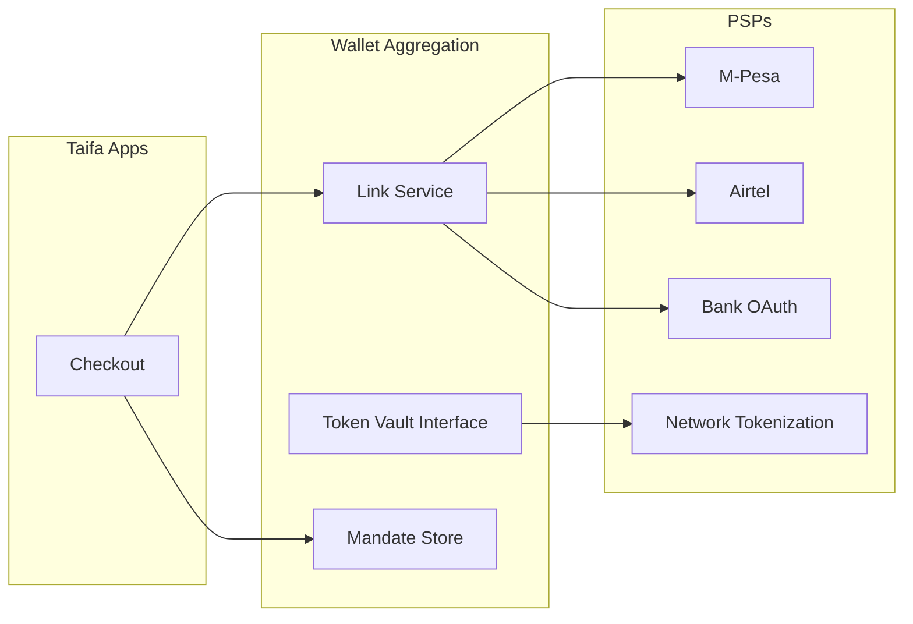
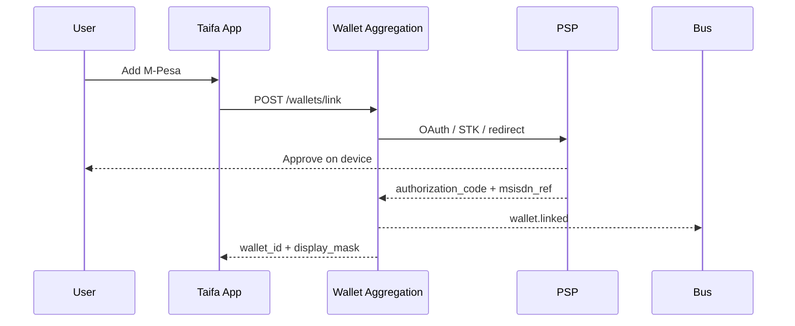
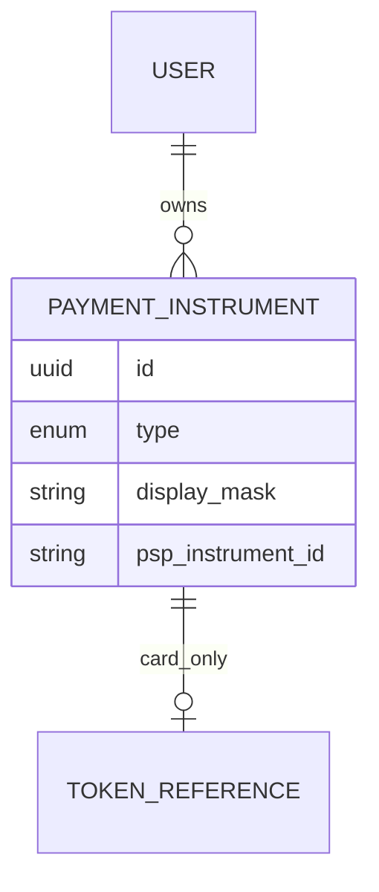

# 02 — Wallet Aggregation

**Bounded context:** `finance.payment_sources` (Payment Sources Platform)  
**Phase:** 2 — Payment Sources (canonical detail: [payment-sources/00_INDEX.md](payment-sources/00_INDEX.md))

> **Note:** This program-level summary remains for navigation. Implementation specs live in **`docs/payments/payment-sources/`**.

---

## Executive summary

Wallet aggregation lets users **link** M-Pesa, Airtel Money, Mixx by Yas, HaloPesa, bank accounts, and cards—similar to **Apple Wallet / Google Pay**—without Taifa storing consumer float. Taifa stores **consent**, **provider references**, and **PCI-compliant tokens** only.

---

## Business vision

One checkout experience; user picks funding source; PSP remains authoritative for balance and debit.

---

## Architecture overview

---

## Sequence: link wallet

---

## Domain model

| Entity | Description |
| --- | --- |
| `PaymentInstrument` | Linked source (type, mask, PSP ref) |
| `LinkSession` | In-flight OAuth/STK |
| `Mandate` | Recurring/debit authority |
| `TokenReference` | Opaque vault pointer (cards) |

---

## Bounded contexts

- **Owner:** `finance.wallet_aggregation`
- **Consumers:** Orchestration, checkout UIs, SoftPOS (payer wallet)
- **Forbidden:** Storing PAN/CVV; storing PSP passwords

---

## Microservices

**Wallet Aggregation Service** — link, list, revoke, default instrument; **Token Vault Adapter** (HSM/PCI zone).

---

## API contracts

| Method | Path | Purpose |
| --- | --- | --- |
| POST | `/api/v1/wallets/link` | Start link |
| GET | `/api/v1/wallets` | List instruments |
| DELETE | `/api/v1/wallets/{id}` | Revoke |
| PATCH | `/api/v1/wallets/{id}/default` | Set default |

---

## Security model

- PSP tokens encrypted with KMS; vault in PCI CDE if card PAN tokenization on-platform.
- MSISDN hashed at rest where regulation allows; display last-4 only.
- Strong customer authentication per PSP rules.

---

## AWS deployment

ECS service + RDS; Redis for link session state; Secrets Manager for PSP client credentials.

---

## Implementation roadmap

| Sprint | Deliverable |
| --- | --- |
| P2-W1 | M-Pesa link adapter design |
| P2-W2 | Airtel + bank redirect adapters |
| P2-W3 | Network tokenization partner selection |
| P2-W4 | `wallet.linked` / `wallet.revoked` events live |

---

## Dependencies

Phase 1 identity; PSP sandboxes; [03_PAYMENT_ORCHESTRATION.md](03_PAYMENT_ORCHESTRATION.md).

---

## Acceptance criteria

- User links two instruments; orchestrator can charge default.
- Revoke invalidates mandates within SLA.
- No PAN in application logs.

---

## Definition of done

Threat model for link flows; PCI SAQ scope updated if vault in Taifa zone.

---

## Future roadmap

CBDC wallet adapter; cross-border instruments; biometric binding.

---

## Cross-references

[03_PAYMENT_ORCHESTRATION.md](03_PAYMENT_ORCHESTRATION.md) · [17_COMPLIANCE_GUIDE.md](17_COMPLIANCE_GUIDE.md)
