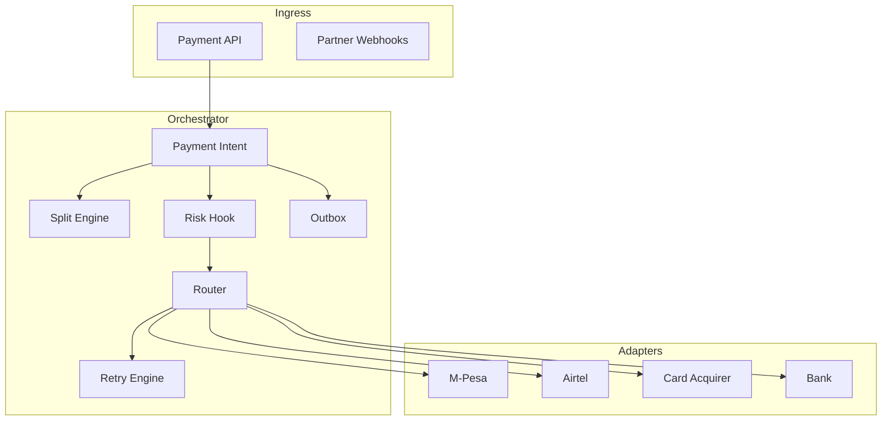
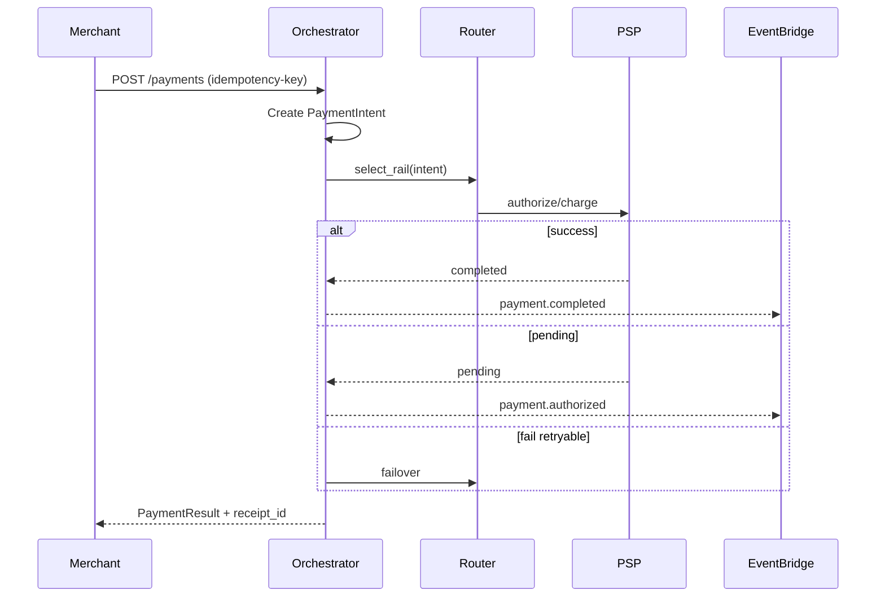
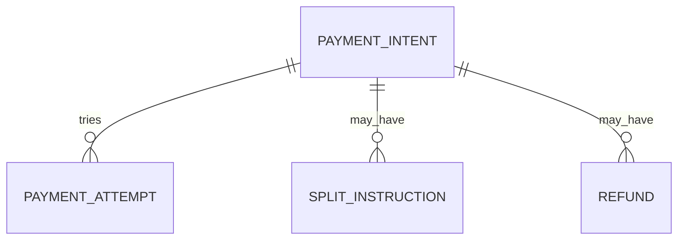

# 03 — Payment Orchestration

**Bounded context:** `finance.orchestration`  
**Phase:** 3 — Payment Orchestration Platform (canonical: [orchestration/00_INDEX.md](orchestration/00_INDEX.md))

> Program-level summary. Full Phase 3 pack: **`docs/payments/orchestration/`** · Gate: [PHASE3_GATE_PACKAGE.md](orchestration/PHASE3_GATE_PACKAGE.md).

---

## Executive summary

The **Payment Orchestration Engine** is TNPI’s brain: route payments across PSPs, retry intelligently, split funds, emit webhooks/receipts, score risk, and fail over when providers degrade—while preserving idempotency and auditability.

---

## Business vision

Merchants integrate once; TNPI optimizes for success rate, cost, and compliance across Tanzania’s fragmented rails.

---

## Architecture overview

Aligns with existing [PaymentRouter concept](../PAYMENTS.md) — TNPI generalizes to merchant acceptance + multi-tenant.

---

## Sequence: authorize and capture

---

## Domain model

| Aggregate | Notes |
| --- | --- |
| `PaymentIntent` | Amount, currency, merchant, instrument, metadata |
| `PaymentAttempt` | Per-PSP try, status, provider_ref |
| `SplitInstruction` | Marketplace / transport revenue share |
| `Refund` | Linked to intent, partial allowed |

---

## Bounded contexts

Orchestrator owns intent lifecycle; PSPs own fund movement; Settlement owns batch positions.

---

## Microservices

**Payment Orchestrator** (ECS); **Provider Health Monitor** (Lambda); **Webhook Dispatcher** (SQS worker).

---

## API contracts

| Method | Path | Purpose |
| --- | --- | --- |
| POST | `/api/v1/payments` | Create payment |
| GET | `/api/v1/payments/{id}` | Status |
| POST | `/api/v1/payments/{id}/capture` | Capture auth |
| POST | `/api/v1/payments/{id}/refund` | Refund |
| POST | `/api/v1/payments/{id}/cancel` | Cancel |

---

## Security model

Idempotency-Key required; merchant HMAC on webhooks; ABAC on refunds (role + amount limits).

---

## AWS deployment

ECS Fargate orchestrator; Step Functions for long-running sagas; DynamoDB or RDS for intent state; SQS for async completion.

---

## Implementation roadmap

| Sprint | Deliverable |
| --- | --- |
| P2-O1 | Intent state machine spec |
| P2-O2 | M-Pesa + Airtel adapters |
| P2-O3 | Smart routing rules v1 |
| P2-O4 | Failover + health checks |

---

## Sprint plan

| ID | Story |
| --- | --- |
| ORCH-01 | Idempotency store |
| ORCH-02 | Router preference + fallback |
| ORCH-03 | Split payments API |
| ORCH-04 | Provider SLA metrics |

---

## Dependencies

[02_WALLET_AGGREGATION.md](02_WALLET_AGGREGATION.md), [04_SETTLEMENT.md](04_SETTLEMENT.md), Core events.

---

## Acceptance criteria

- 99.9% idempotent replay safety in tests.
- Failover reduces hard failures in sandbox chaos test.
- All state transitions emit events per [15_EVENT_CATALOG.md](15_EVENT_CATALOG.md).

---

## Definition of done

OpenAPI published; saga compensation documented; runbook for stuck `pending`.

---

## Future roadmap

ML routing; dynamic FX; real-time TIPS integration.

---

## Cross-references

[15_EVENT_CATALOG.md](15_EVENT_CATALOG.md) · [14_API_CATALOG.md](14_API_CATALOG.md)
