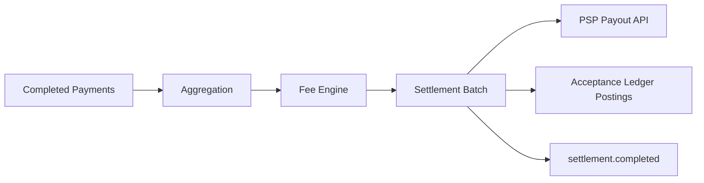
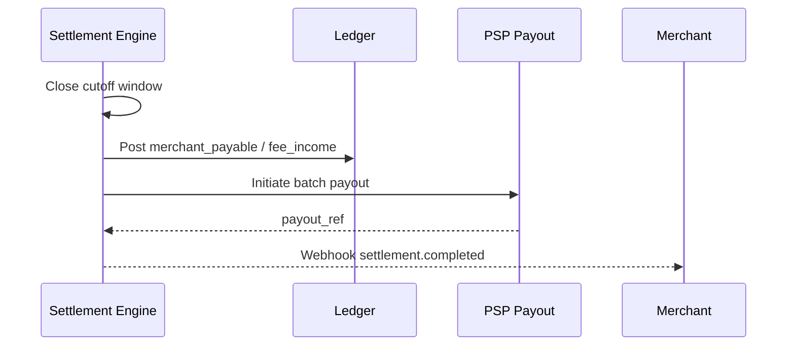
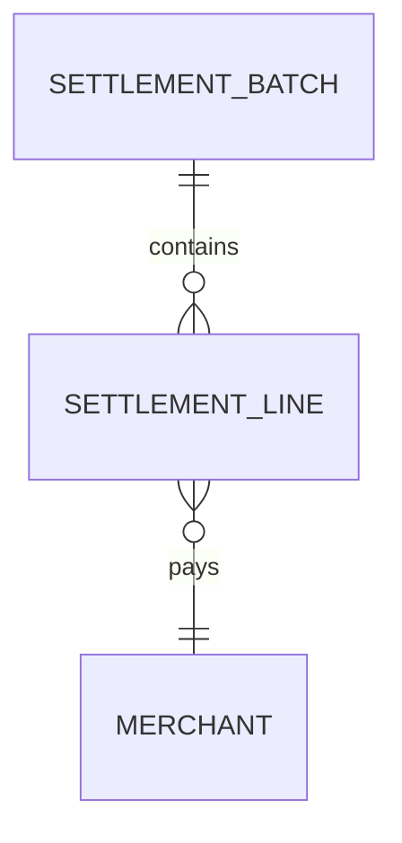

# 04 — Settlement

**Bounded context:** `finance.settlement`  
**Phase:** 5 — Settlement Platform (canonical: [settlement/00_INDEX.md](settlement/00_INDEX.md))

> Program summary. Full Phase 5 pack: **`docs/payments/settlement/`** · Gate: [PHASE5_GATE_PACKAGE.md](settlement/PHASE5_GATE_PACKAGE.md).

---

## Executive summary

The **Settlement Engine** batches merchant payables, applies fees and taxes, coordinates PSP payout instructions, and emits `settlement.completed`—without Taifa holding consumer float. Settlement tracks **what merchants are owed** and **what was instructed** to PSPs/banks.

---

## Business vision

Predictable merchant payouts (T+0/T+1 configurable) with transparent fee breakdown and government levy hooks.

---

## Architecture overview

---

## Sequence: daily settlement

---

## Domain model

| Entity | Role |
| --- | --- |
| `SettlementBatch` | Cutoff, total, status |
| `SettlementLine` | Per merchant amount |
| `PayoutInstruction` | PSP reference |
| `FeeSchedule` | MCC-based rules |

---

## Bounded contexts

Settlement owns batches; Orchestration feeds completed payments; Reconciliation confirms PSP files match.

---

## Microservices

**Settlement Service**; **Fee Engine** (rules); scheduled **Cutoff Worker** (EventBridge).

---

## API contracts

| Method | Path | Purpose |
| --- | --- | --- |
| GET | `/api/v1/settlements` | List batches |
| GET | `/api/v1/settlements/{id}` | Detail + lines |
| GET | `/api/v1/merchants/{id}/balance` | Pending payable (not float) |

---

## Security model

Dual control for manual adjustments; segregation of duties on fee rule changes.

---

## AWS deployment

RDS; Step Functions for batch pipeline; S3 for payout reports.

---

## Implementation roadmap

P2-S1 ledger posting contract · P2-S2 M-Pesa B2C payout adapter · P2-S3 merchant statements.

---

## Dependencies

[03_PAYMENT_ORCHESTRATION.md](03_PAYMENT_ORCHESTRATION.md), [05_RECONCILIATION.md](05_RECONCILIATION.md).

---

## Acceptance criteria

Batch totals match sum of payment lines ± adjustments; audit trail complete.

---

## Definition of done

Reconciliation sign-off on first sandbox batch.

---

## Future roadmap

Instant settlement tier; multi-currency nostro; escrow for marketplaces.

---

## Cross-references

[PAYMENTS.md](../PAYMENTS.md) (ledger accounts) · [17_COMPLIANCE_GUIDE.md](17_COMPLIANCE_GUIDE.md)
