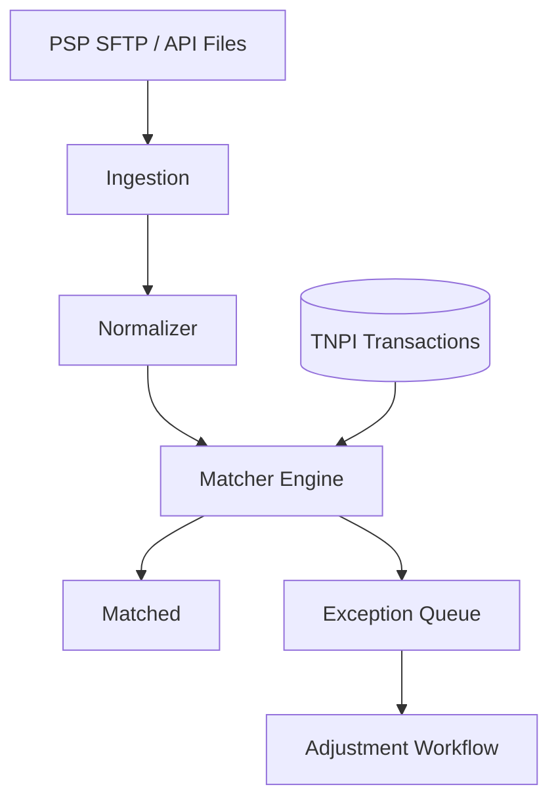
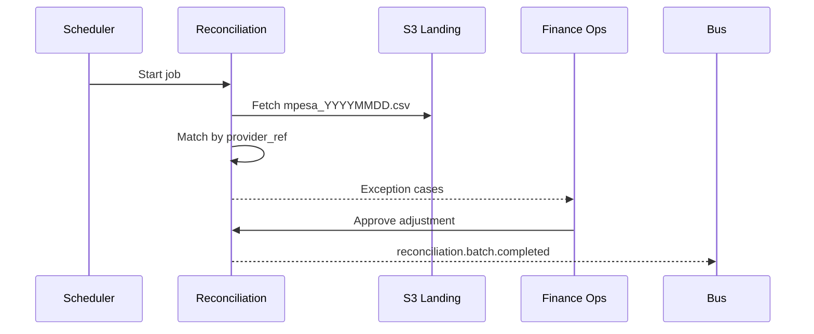

# 05 — Reconciliation

**Bounded context:** `finance.reconciliation`  
**Phase:** 6 — Reconciliation Platform (canonical: [reconciliation/00_INDEX.md](reconciliation/00_INDEX.md))

> Program summary. Full Phase 6 pack: **`docs/payments/reconciliation/`** · Gate: [PHASE6_GATE_PACKAGE.md](reconciliation/PHASE6_GATE_PACKAGE.md).

---

## Executive summary

**Reconciliation** matches TNPI orchestration records against PSP settlement files, bank statements, and card acquirer reports—surfacing exceptions for finance ops and feeding settlement adjustments.

---

## Business vision

Every shilling accounted for between Taifa, merchants, and PSPs with automated matching and human exception queues.

---

## Architecture overview

---

## Sequence: file reconcile

---

## Domain model

| Entity | Description |
| --- | --- |
| `ReconRun` | File, period, stats |
| `ReconMatch` | TNPI id ↔ PSP ref |
| `ExceptionCase` | Unmatched, amount mismatch |
| `Adjustment` | Approved correction |

---

## Bounded contexts

Reconciliation read-only on orchestration SoR; writes adjustments via settlement API.

---

## Microservices

**Reconciliation Service**; **File Ingestion** (Lambda); **Exception UI** (merchant portal module).

---

## API contracts

Internal ops APIs + merchant-facing exception status (read-only).

---

## Security model

PII-redacted files in S3 with KMS; least privilege on SFTP credentials.

---

## AWS deployment

S3 landing zone; Glue/Athena optional for analytics; ECS workers.

---

## Implementation roadmap

P2-R1 M-Pesa statement format · P2-R2 matcher v1 · P2-R3 exception SLA dashboards.

---

## Dependencies

[04_SETTLEMENT.md](04_SETTLEMENT.md), PSP file specs.

---

## Acceptance criteria

≥98% auto-match in sandbox; exceptions triaged within defined SLA.

---

## Definition of done

Runbook for manual match; sign-off from Finance.

---

## Future roadmap

ML-assisted matching; real-time recon via webhooks.

---

## Cross-references

[04_SETTLEMENT.md](04_SETTLEMENT.md) · [18_RISK_REGISTER.md](18_RISK_REGISTER.md)
