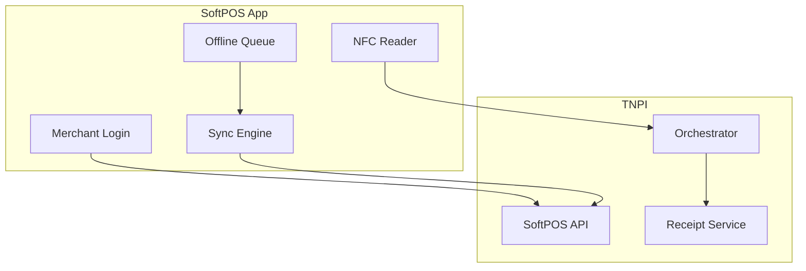
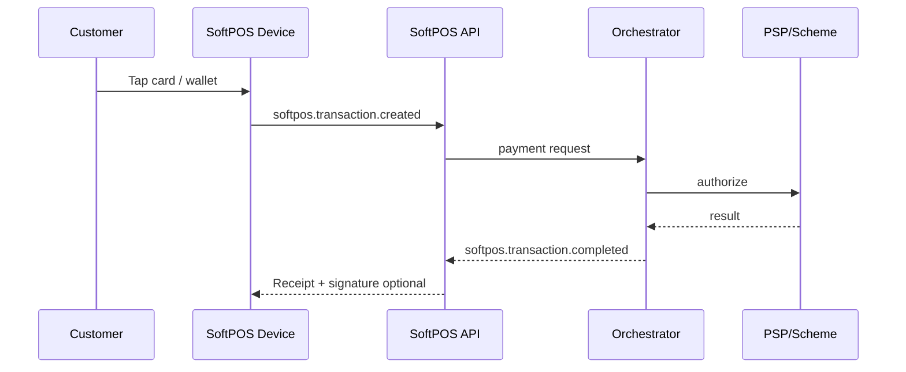

# 06 — SoftPOS

**Bounded context:** `finance.acceptance.softpos`  
**Phase:** 4 — Merchant Acceptance Platform (canonical: [merchant-acceptance/02_SOFTPOS.md](merchant-acceptance/02_SOFTPOS.md))

> Program summary. Full Phase 4 MAP pack: **`docs/payments/merchant-acceptance/`**.

---

## Executive summary

**Enterprise SoftPOS** turns NFC-capable Android devices (and future iPhone Tap to Pay) into certified merchant terminals: login, tap-to-pay, wallet and card acceptance, digital receipts, offline queue, sync, refunds, and settlement visibility—integrated with TNPI orchestration.

---

## Business vision

Every shopkeeper and conductor accepts digital payments without dedicated POS hardware—at scheme-compliant security levels.

---

## Architecture overview

Extends [tap_pay](../tap_pay/01_ARCHITECTURE.md) — SoftPOS is **merchant-present** acceptance; Tap & Pay is **consumer-present**.

---

## Sequence: tap transaction

---

## Domain model

| Entity | Role |
| --- | --- |
| `SoftPosSession` | Merchant user, terminal, device attestation |
| `TapTransaction` | Amount, EMV data handle (no clear PAN) |
| `OfflinePayment` | Queued until sync |
| `DeviceEnrollment` | Keys, PCI status |

---

## Bounded contexts

SoftPOS owns session/device; orchestration owns payment intent; never duplicate ledger.

---

## Microservices

**SoftPOS Service**; **Device Attestation**; **Offline Sync Worker**.

---

## API contracts

| Method | Path | Purpose |
| --- | --- | --- |
| POST | `/api/v1/softpos/sessions` | Start shift |
| POST | `/api/v1/softpos/transactions` | Submit tap |
| POST | `/api/v1/softpos/sync` | Upload offline batch |
| POST | `/api/v1/softpos/refunds` | Refund |

Events: `softpos.transaction.created`, `softpos.transaction.completed`.

---

## Security model & certification

| Topic | Requirement |
| --- | --- |
| **PCI DSS** | SoftPOS in PCI MPoC / CPoC scope; PAN only in certified SDK/kernel |
| **Scheme** | Visa Tap to Phone / Mastercard Tap on Phone certification |
| **Device** | Attestation (Play Integrity / DeviceCheck future) |
| **Keys** | DUKPT or scheme-defined key injection via HSM partner |
| **PIN on Glass** | Only where certified and network-approved |

Detail: [17_COMPLIANCE_GUIDE.md](17_COMPLIANCE_GUIDE.md).

---

## AWS deployment

API Gateway → ECS; S3 for receipt artifacts; KMS for device keys (or partner HSM).

---

## Implementation roadmap

P3-SP1 Android NFC MVP design · P3-SP2 offline queue · P3-SP3 certification test plan · P3-SP4 iPhone roadmap.

---

## Dependencies

Phase 1 merchant identity; Phase 2 orchestration; acquirer agreement.

---

## Acceptance criteria

Sandbox tap completes end-to-end; offline replay idempotent; no PAN in logs.

---

## Definition of done

Security architecture review; certification gap list approved.

---

## Future roadmap

PIN on Glass; multi-currency; tipping and donation flows.

---

## Cross-references

[07_QR_PAYMENTS.md](07_QR_PAYMENTS.md) · [tap_pay/07_DEVICE_COMPATIBILITY.md](../tap_pay/07_DEVICE_COMPATIBILITY.md)
