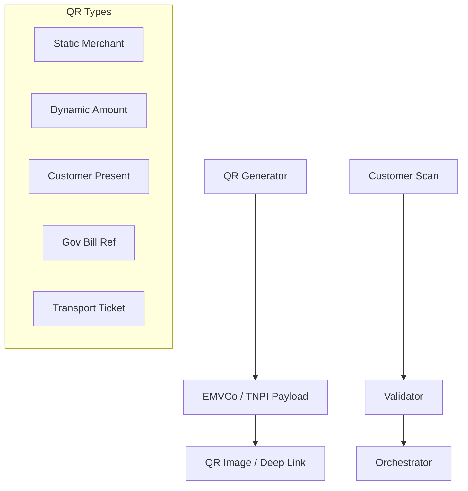
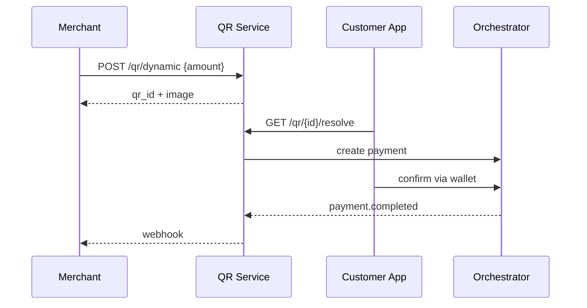

# 07 — QR Payments

**Bounded context:** `finance.acceptance.qr`  
**Phase:** 4 — Merchant Acceptance Platform (canonical: [merchant-acceptance/03_QR_PAYMENTS.md](merchant-acceptance/03_QR_PAYMENTS.md))

> Program summary. Full Phase 4 MAP pack: **`docs/payments/merchant-acceptance/`**.

---

## Executive summary

TNPI **QR** supports static merchant QR, dynamic checkout QR, customer-present QR, government payment QR, and transport fare QR—with offline validation patterns where network is unreliable.

---

## Business vision

Stickers on daladalas, counters, and park gates become payment endpoints—scannable by any Taifa or PSP app that participates in the national QR standard.

---

## Architecture overview

---

## Sequence: dynamic QR pay

---

## Domain model

| Entity | Description |
| --- | --- |
| `QrCode` | Type, payload, expiry, merchant |
| `QrPaymentBinding` | Links QR to PaymentIntent |
| `OfflineToken` | Signed payload for offline verify |

---

## QR types

| Type | Use |
| --- | --- |
| Static | Fixed merchant receive |
| Dynamic | Amount + order ref |
| Merchant | Printed sticker |
| Customer | Payer shows QR to merchant |
| Government | Bill reference (GEPG-style integration) |
| Transport | Route/vehicle/flat fare |

---

## Microservices

**QR Service**; shared **Payload Codec** (versioned).

---

## API contracts

| Method | Path | Purpose |
| --- | --- | --- |
| POST | `/api/v1/qr/static` | Register static |
| POST | `/api/v1/qr/dynamic` | Generate dynamic |
| GET | `/api/v1/qr/{id}` | Resolve |
| POST | `/api/v1/qr/{id}/pay` | Initiate pay |

Event: `qr.generated`.

---

## Security model

Signed payloads; short TTL on dynamic QR; rate limit scan attempts; merchant binding enforced.

---

## AWS deployment

ECS + Redis for TTL; CloudFront for QR image CDN optional.

---

## Implementation roadmap

P3-Q1 payload spec v1 · P3-Q2 static+dynamic · P3-Q3 gov bill ref adapter · P3-Q4 offline verify.

---

## Dependencies

[03_PAYMENT_ORCHESTRATION.md](03_PAYMENT_ORCHESTRATION.md).

---

## Acceptance criteria

Interop test with two wallet apps; expired QR rejected; amount tamper detected.

---

## Definition of done

Published QR spec in partner guide.

---

## Future roadmap

EMVCo global QR; cross-border scan-to-pay.

---

## Cross-references

[16_PARTNER_INTEGRATION_GUIDE.md](16_PARTNER_INTEGRATION_GUIDE.md) · [08_TRANSPORT_PAYMENTS.md](08_TRANSPORT_PAYMENTS.md)
