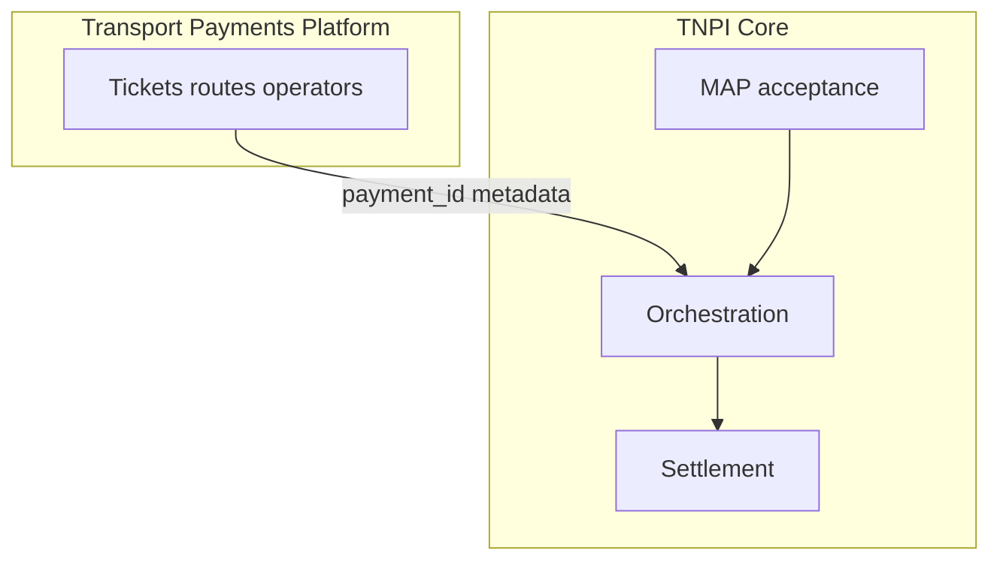
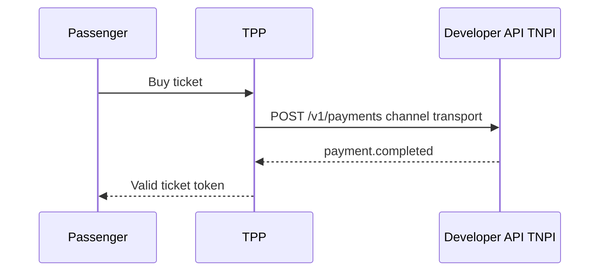

# 08 — Transport Payments

**Bounded context:** `mobility.transport.payments`  
**Canonical platform:** [transport/00_PLATFORM_OVERVIEW.md](../transport/00_PLATFORM_OVERVIEW.md) (TPP)

> TNPI program summary (payment channel). **Full Transport Payments Platform** design: **`docs/transport/`** — consumes TNPI Core via [Developer Platform](developer-platform/00_INDEX.md); does **not** duplicate payment logic.

---

## Executive summary

TNPI enables **every vehicle and station** to accept digital fares: daladalas, BRT, TRC, SGR, ferries, airports, parking, taxis, ride-hailing—via QR, SoftPOS, wallets, cards, NFC. **TPP** owns tickets, routes, operators; **TNPI** owns payments and settlement.

---

## Business vision

Cashless national mobility with operator settlement, ridership analytics, and integrated receipts—without mobility domains owning money SoR.

---

## Architecture overview

**Rule:** Mobility stores `payment_id` references only ([Domain Governance](../architecture/01_DOMAIN_GOVERNANCE.md)).

---

## Sequence: bus fare

---

## Cross-references

[transport/05_TICKETING.md](../transport/05_TICKETING.md) · [07_QR_PAYMENTS.md](07_QR_PAYMENTS.md) · [06_SOFTPOS.md](06_SOFTPOS.md)
