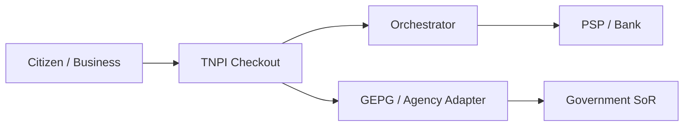
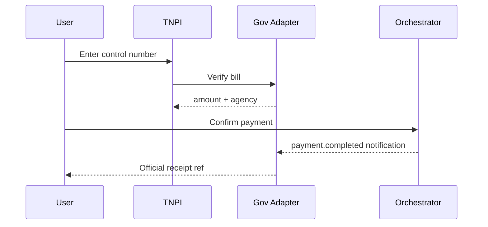

# 09 — Government & National Digital Payments

**Bounded context:** `finance.acceptance` + `government.*`  
**Phase:** 5 — National Digital Payments  
**Digital services platform:** [government/00_PLATFORM_OVERVIEW.md](../government/00_PLATFORM_OVERVIEW.md) (GDSP GaaP) — **payments remain TNPI**; GDSP delegates all fees to TNPI.

---

## Executive summary

TNPI expands to **government bills**, hospital fees, school/university payments, tourism levies, utilities, tax, licensing, passports, visas, courts, business registration, and municipal services—using orchestration, QR, and partner APIs while respecting GEPG and agency systems of record.

---

## Business vision

Citizens pay once through Taifa acceptance; agencies receive reconciled, auditable deposits without building duplicate payment stacks.

---

## Architecture overview

---

## Sequence: government bill pay

---

## Use cases

| Sector | Examples |
| --- | --- |
| Government | Tax, license, passport, visa, court |
| Health | Hospital bills, NHIF co-pay |
| Education | School fees, university tuition |
| Tourism | Park fees, hotel checkout |
| Commerce | Market levies, trade permits |
| Agriculture | Subsidy co-payments |
| Utilities | LUKU, water |

---

## Domain model

`GovernmentBillReference` (external); `PaymentIntent.metadata.gov.*`; no duplicate bill SoR in TNPI.

---

## Bounded contexts

Government domain owns bill validity; TNPI owns payment; events propagate settlement to agency accounts.

---

## Microservices

**Government Payment Adapter**; **Invoice Payment API**; reporting for **TRA / MoF** formats (regulated).

---

## API contracts

`/api/v1/gov/bills/lookup`, `/api/v1/payments` with `purpose: government`.

---

## Security model

Strong authentication for high-value tax; rate limits; fraud rules on control number guessing.

---

## AWS deployment

Isolated VPC endpoints to government networks (private link future); enhanced audit retention.

---

## Implementation roadmap

P5-G1 GEPG integration design · P5-G2 hospital pilot · P5-G3 education bulk pay · P5-G4 tourism park QR.

---

## Dependencies

[tourism/08_GOVERNMENT_DOMAIN.md](../tourism/08_GOVERNMENT_DOMAIN.md), Phase 2 core.

---

## Acceptance criteria

Sandbox bill lookup + pay + agency notification; reconciliation file accepted by finance test team.

---

## Definition of done

Legal MOU template; compliance sign-off.

---

## Future roadmap

Digital tax stamps; cross-ministry dashboard.

---

## Cross-references

[07_QR_PAYMENTS.md](07_QR_PAYMENTS.md) · [17_COMPLIANCE_GUIDE.md](17_COMPLIANCE_GUIDE.md)
