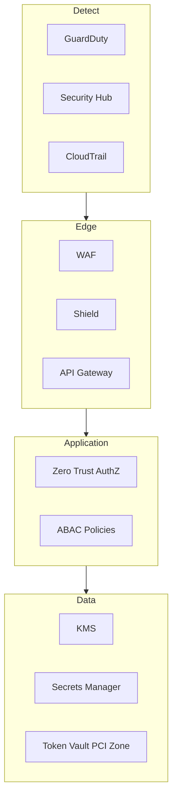
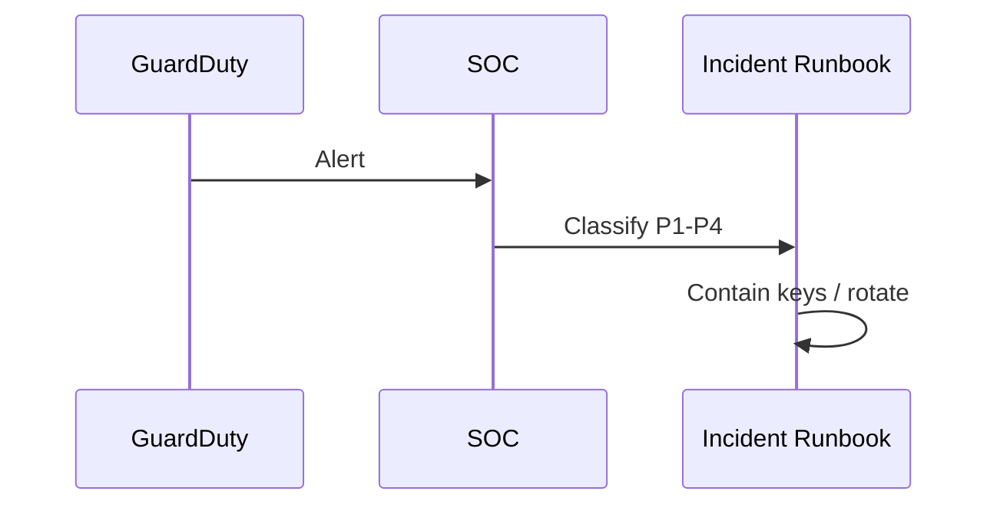

# 10 — TNPI Security Architecture

**Scope:** Cross-cutting — all TNPI phases  
**Aligns with:** [Platform Security](../platform/11_SECURITY_PLATFORM.md) · [Architecture Security](../architecture/05_SECURITY_STANDARDS.md)

---

## Executive summary

TNPI security implements **zero trust**, **PCI DSS** for card environments, **ISO 27001** alignment, and national regulatory expectations—separating consumer funds (PSPs) from Taifa’s orchestration and acceptance data.

---

## Business vision

Trust at national scale: merchants, regulators, and schemes audit TNPI with confidence.

---

## Architecture overview

---

## Security model

| Layer | Controls |
| --- | --- |
| Identity | OIDC, MFA for ops, merchant step-up for refunds |
| Network | Private subnets, VPC endpoints, no public RDS |
| Application | OWASP ASVS L2; input validation; idempotency |
| Data | Encryption at rest/transit; field-level for PII |
| Card data | PCI CDE isolation; no PAN in orchestrator logs |
| Operations | Break-glass, dual control, immutable audit |

---

## PCI DSS scope

| Zone | In scope? |
| --- | --- |
| Orchestrator (no PAN) | SAQ A or outsourced |
| SoftPOS SDK / vault | **In scope** — MPoC |
| QR (wallet redirect) | Typically out of PAN scope |
| Admin with card search | **Never** without tokenization |

---

## Sequence: security incident

---

## Microservices security

Per-service IAM roles; mTLS service mesh optional; secrets per PSP.

---

## AWS deployment

KMS CMK per env; Secrets Manager rotation; WAF OWASP rules; Security Hub standards.

---

## Implementation roadmap

P1 threat model · P2 vault design · P3 penetration test plan · ongoing dependency scan.

---

## Dependencies

Taifa Core audit; [17_COMPLIANCE_GUIDE.md](17_COMPLIANCE_GUIDE.md).

---

## Acceptance criteria

Threat model signed; PCI scope doc approved; no critical findings open at go-live gate.

---

## Definition of done

Security checklist per release in [17_COMPLIANCE_GUIDE.md](17_COMPLIANCE_GUIDE.md).

---

## Future roadmap

HSM; bug bounty; regional SOC2.

---

## Cross-references

[tap_pay/06_SECURITY.md](../tap_pay/06_SECURITY.md) · [18_RISK_REGISTER.md](18_RISK_REGISTER.md)
