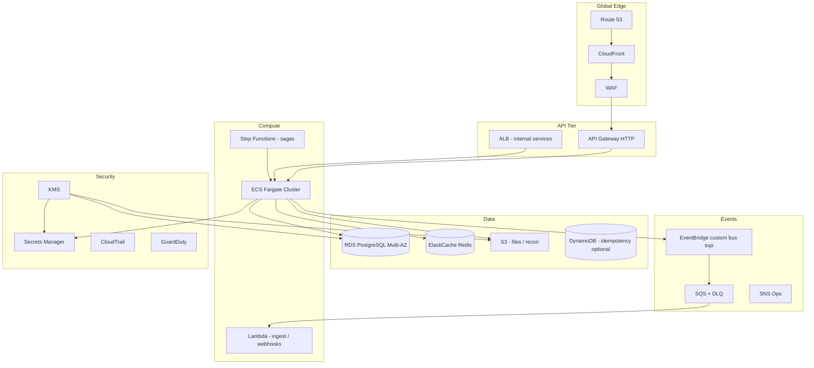
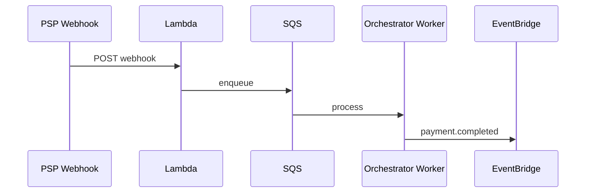

# 11 — AWS Architecture (TNPI)

**Region:** `af-south-1` primary · DR: `eu-west-1` warm (future)

---

## Executive summary

Production TNPI on AWS uses **multi-account**, **IaC**, and **Well-Architected** patterns: API Gateway and CloudFront at the edge, ECS Fargate for services, RDS PostgreSQL, Redis, EventBridge + SQS + Step Functions, with GuardDuty, KMS, and Backup.

---

## Business vision

Elastic scale from pilot merchants to national traffic without architectural rewrites.

---

## Architecture diagram

---

## Account layout

| Account | Workloads |
| --- | --- |
| `taifa-shared` | Terraform state, ECR |
| `taifa-staging` | TNPI staging |
| `taifa-prod` | TNPI production |
| `taifa-pci` | Optional isolated PCI CDE |

Aligns with [platform/13](../platform/13_INFRASTRUCTURE_PLATFORM.md) and [SPRINT_0](../platform/SPRINT_0_ENGINEERING_PLAN.md).

---

## Service mapping

| TNPI service | AWS |
| --- | --- |
| Payment API GW | API Gateway + WAF |
| Orchestrator | ECS Fargate |
| Settlement batch | Step Functions + ECS |
| Reconciliation ingest | Lambda + S3 |
| Webhooks | SQS + ECS worker |
| Fraud rules | ECS + Redis features |
| SoftPOS API | ECS (scale per region) |
| Reporting | Athena + S3 / RDS read replica |

---

## Sequence: payment async completion

---

## High availability

Multi-AZ RDS; ECS min tasks ≥2; API Gateway regional; EventBridge multi-AZ; RPO/RTO per [04_SETTLEMENT](04_SETTLEMENT.md).

---

## Observability

CloudWatch metrics/alarms; X-Ray traces on orchestrator; structured logs with `correlation_id`; SNS paging.

---

## IaC

Terraform modules under `infra/modules/*`; TNPI-specific module `tnpi-orchestrator` (future); envs `staging` / `prod`.

---

## Implementation roadmap

| Phase | AWS milestone |
| --- | --- |
| P1 | API GW + ECS skeleton in staging |
| P2 | EventBridge bus + RDS schemas |
| P3 | SoftPOS autoscale policies |
| P4 | Edge caching for QR assets |

---

## Dependencies

Core platform VPC; PSP IP allowlists.

---

## Acceptance criteria

Load test orchestrator at target TPS in staging; failover drill documented.

---

## Definition of done

Well-Architected review; cost guardrails (budgets).

---

## Future roadmap

Multi-region active-passive; PrivateLink to banks.

---

## Cross-references

[12_IMPLEMENTATION_PLAN.md](12_IMPLEMENTATION_PLAN.md) · [infra/README.md](../../infra/README.md)
