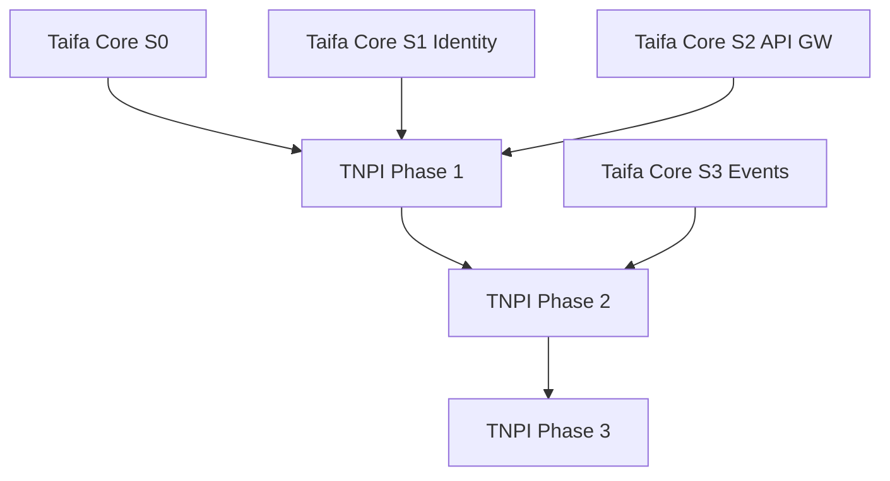

# 12 — TNPI Implementation Plan

**Owner:** Enterprise Payment Architecture Team  
**Gate:** Documentation-first; implementation follows Taifa Core + TNPI phase approvals

---

## Executive summary

This plan sequences TNPI from **Phase 1 foundation** through **Phase 5 national digital** in sprints, with explicit dependencies on Taifa Core and without breaking existing Tap & Pay → orchestration flows.

---

## Business vision

Deliver incremental, verifiable capability—each phase unlocks the next—while legacy `apps/backend/payments` evolves behind ports.

---

## Architecture overview

Phases per [00_PAYMENT_PROGRAM.md](00_PAYMENT_PROGRAM.md); microservices introduced behind API contracts before UI scale.

---

## Migration from current codebase

| Current | TNPI target |
| --- | --- |
| `payments/` Django app | Orchestrator + adapters (strangler) |
| `PAYMENTS.md` ledger | Acceptance accounting ledger |
| `tap_pay/` | SoftPOS / NFC channel |
| `acceptance/` MAP tap | Merchant acceptance intents → TNPI API |

**Rule:** No big-bang rewrite; facade APIs preserve `/api/v1` stability where possible.

---

## Phase sprint map

### Phase 1 — Foundation (8–10 sprints)

| Sprint | Focus | Deliverables |
| --- | --- | --- |
| P1.1 | Payment GW spec | OpenAPI aggregate, WAF rules doc |
| P1.2 | Merchant registry | ERD, APIs, events |
| P1.3 | Merchant KYC | Workflow, partner adapter |
| P1.4 | Hardening | Audit, monitoring, staging deploy |

**Depends:** Core S0 (IaC), Core S1 (Identity).

### Phase 2 — Payment Core (12–16 sprints)

| Sprint | Focus |
| --- | --- |
| P2.1 | Orchestrator intent FSM |
| P2.2 | Wallet aggregation M-Pesa |
| P2.3 | Additional PSPs + router |
| P2.4 | Settlement + ledger postings |
| P2.5 | Reconciliation v1 |
| P2.6 | Webhooks + receipts + fraud v1 |

### Phase 3 — Acceptance (10–12 sprints)

| Sprint | Focus |
| --- | --- |
| P3.1 | QR static/dynamic |
| P3.2 | SoftPOS Android MVP |
| P3.3 | Payment links + e-com API |
| P3.4 | Recurring / subscriptions |

### Phase 4 — Mobility (8 sprints)

| Sprint | Focus |
| --- | --- |
| P4.1 | Transport metadata contract |
| P4.2 | BRT / daladala pilots |
| P4.3 | Revenue split rules |

### Phase 5 — National (ongoing)

Agency adapters per [09_GOVERNMENT_PAYMENTS.md](09_GOVERNMENT_PAYMENTS.md).

---

## Team topology

| Stream | Roles |
| --- | --- |
| Platform | Identity, GW, IaC |
| Payments Core | Orchestration, settlement |
| Acceptance | SoftPOS, QR |
| Partnerships | PSP, schemes |
| Compliance | PCI, BoT |

---

## Dependencies

---

## Acceptance criteria (program)

| Milestone | Criteria |
| --- | --- |
| M1 | Merchant onboarded in staging |
| M2 | Wallet link + pay sandbox |
| M3 | First SoftPOS cert test transaction |
| M4 | Transport pilot live |
| M5 | Gov bill pay sandbox |

---

## Definition of done

Per service: OpenAPI, events, threat model delta, runbook, Core DoD.

---

## Future roadmap

[13_PAYMENT_ROADMAP.md](13_PAYMENT_ROADMAP.md)

---

## Cross-references

[14_API_CATALOG.md](14_API_CATALOG.md) · [15_EVENT_CATALOG.md](15_EVENT_CATALOG.md) · [18_RISK_REGISTER.md](18_RISK_REGISTER.md)
