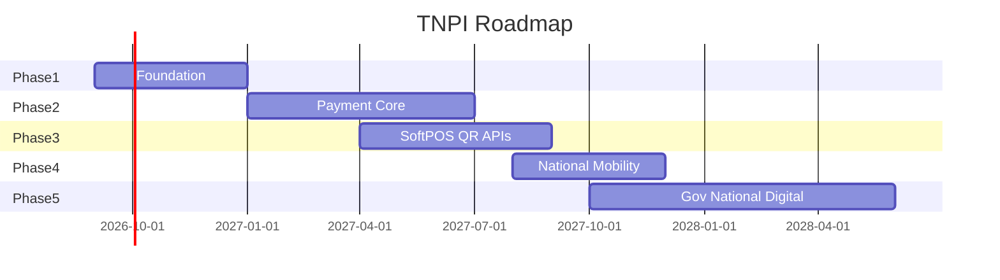

# 13 — Payment Roadmap

**Horizon:** 2026–2028 (Tanzania) · 2028+ (East Africa)

---

## Executive summary

Roadmap aligns TNPI phases with national digitization priorities: foundation → core rails → acceptance → mobility → government—without competing with PSP wallets.

---

## Business vision

Taifa becomes the **default acceptance layer** for Tanzanian digital commerce and public services.

---

## Timeline (mermaid)

---

## Phase outcomes

| Phase | Key outcomes |
| --- | --- |
| 1 | Merchants onboarded; payment API live |
| 2 | Multi-PSP orchestration; settlement/recon |
| 3 | SoftPOS + QR national spec |
| 4 | Transit operators on TNPI |
| 5 | GEPG + sector billing |

---

## Capability matrix

| Capability | P1 | P2 | P3 | P4 | P5 |
| --- | --- | --- | --- | --- | --- |
| Merchant KYC | ● | | | | |
| Orchestration | | ● | ● | ● | ● |
| SoftPOS | | | ● | ● | ● |
| QR | | | ● | ● | ● |
| Transport | | | | ● | ● |
| Government | | | | | ● |

---

## East Africa expansion

| Market | Approach |
| --- | --- |
| Kenya | M-Pesa KE adapter; CBK compliance |
| Uganda | MTN/Airtel UG |
| Rwanda | Mobile money + TIPS-like hooks |

---

## Dependencies

PSP contracts; scheme certification; Core platform milestones.

---

## Acceptance criteria

Quarterly roadmap review with Architecture Board; KPI dashboard (TPV, success rate, active merchants).

---

## Definition of done

Roadmap version published; linked from [00_PAYMENT_PROGRAM.md](00_PAYMENT_PROGRAM.md).

---

## Future roadmap

CBDC; cross-border FX; open banking PSD2-style APIs.

---

## Cross-references

[12_IMPLEMENTATION_PLAN.md](12_IMPLEMENTATION_PLAN.md) · [platform/15_PLATFORM_ROADMAP.md](../platform/15_PLATFORM_ROADMAP.md)
