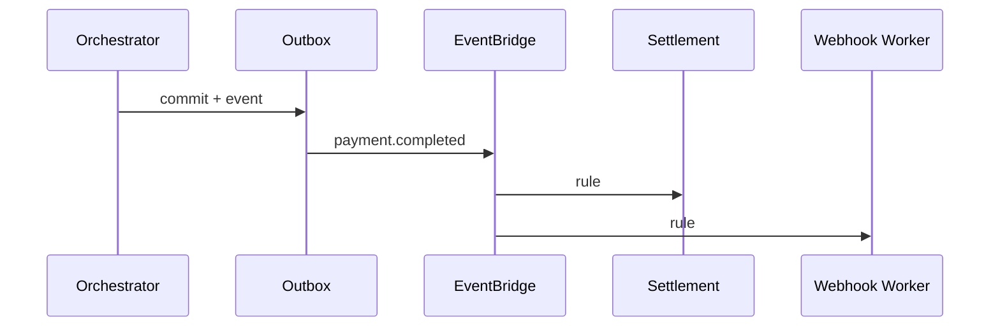

# 15 — TNPI Event Catalog

**Envelope:** [platform/schemas/event-envelope-v1.json](../platform/schemas/event-envelope-v1.json)  
**Bus:** EventBridge `tnpi-platform` (custom) + Core platform bus federation  
**Prefix policy:** Align with [ADR-0002](../architecture/adr/0002-event-catalog-prefix-policy.md) — propose `payment.*`, `merchant.*`, `wallet.*`, `settlement.*`, `qr.*`, `softpos.*`, `transport.*`

---

## Executive summary

Event-driven integration for TNPI: merchants, orchestration, settlement, acceptance channels, and vertical modules (mobility, government) consume facts—not database coupling.

---

## Event envelope (required fields)

| Field | Description |
| --- | --- |
| `event_id` | UUID |
| `event_type` | e.g. `payment.completed` |
| `occurred_at` | ISO-8601 UTC |
| `correlation_id` | Trace |
| `tenant_id` | Merchant / org |
| `payload` | Type-specific JSON |

---

## Merchant events

| event_type | Producer | Consumers |
| --- | --- | --- |
| `merchant.created` | Merchant Service | Audit, CRM, Risk |
| `merchant.updated` | Merchant Service | Search index |
| `merchant.verified` | KYC Service | Orchestrator (enable live pay) |
| `merchant.suspended` | Risk / Compliance | GW (block) |

---

## Wallet events

| event_type | Producer | Consumers |
| --- | --- | --- |
| `wallet.linked` | Wallet Aggregation | Orchestrator, Notifications |
| `wallet.revoked` | Wallet Aggregation | Orchestrator |
| `wallet.default_changed` | Wallet Aggregation | Checkout UI cache |

---

## Payment events

| event_type | Producer | Consumers |
| --- | --- | --- |
| `payment.intent.created` | Orchestrator | Analytics |
| `payment.authorized` | Orchestrator | Order systems |
| `payment.completed` | Orchestrator | Settlement, Webhooks, Mobility |
| `payment.failed` | Orchestrator | Webhooks, Fraud |
| `payment.refunded` | Orchestrator | Settlement, Receipts |
| `payment.dispute.opened` | Disputes | Merchant portal |

---

## Settlement & reconciliation

| event_type | Producer | Consumers |
| --- | --- | --- |
| `settlement.batch.opened` | Settlement | Finance ops |
| `settlement.completed` | Settlement | Merchants, Webhooks |
| `reconciliation.batch.completed` | Reconciliation | Finance |
| `reconciliation.exception.raised` | Reconciliation | Ops queue |

---

## Receipt & notifications

| event_type | Producer | Consumers |
| --- | --- | --- |
| `receipt.generated` | Receipt Service | SMS/Email, Apps |

---

## QR & SoftPOS

| event_type | Producer | Consumers |
| --- | --- | --- |
| `qr.generated` | QR Service | Merchant display |
| `qr.scanned` | QR Service | Analytics |
| `softpos.transaction.created` | SoftPOS | Risk |
| `softpos.transaction.completed` | SoftPOS | Settlement pipeline |

---

## Transport

| event_type | Producer | Consumers |
| --- | --- | --- |
| `transport.ticket.purchased` | Orchestrator (metadata) | Mobility AVL, Pass validators |

---

## Sequence: payment.completed propagation

---

## Security model

Events contain no PAN; PII minimized; encryption on bus where cross-account; IAM per consumer rule.

---

## AWS deployment

EventBridge rules → SQS queues per consumer; DLQ on all subscribers; schema registry (optional).

---

## Implementation roadmap

P2-E1 catalog freeze · P2-E2 outbox in orchestrator · P3-E3 SoftPOS/QR events.

---

## Dependencies

[03_EVENT_PLATFORM](../platform/03_EVENT_PLATFORM.md).

---

## Acceptance criteria

Schema validation in CI; idempotent consumers documented.

---

## Definition of done

Each event has JSON Schema in `docs/payments/schemas/` (future folder).

---

## Cross-references

[architecture/02_EVENT_CATALOG.md](../architecture/02_EVENT_CATALOG.md) · [03_PAYMENT_ORCHESTRATION.md](03_PAYMENT_ORCHESTRATION.md)
