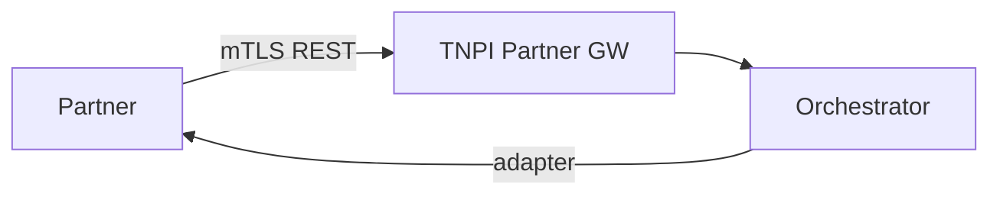
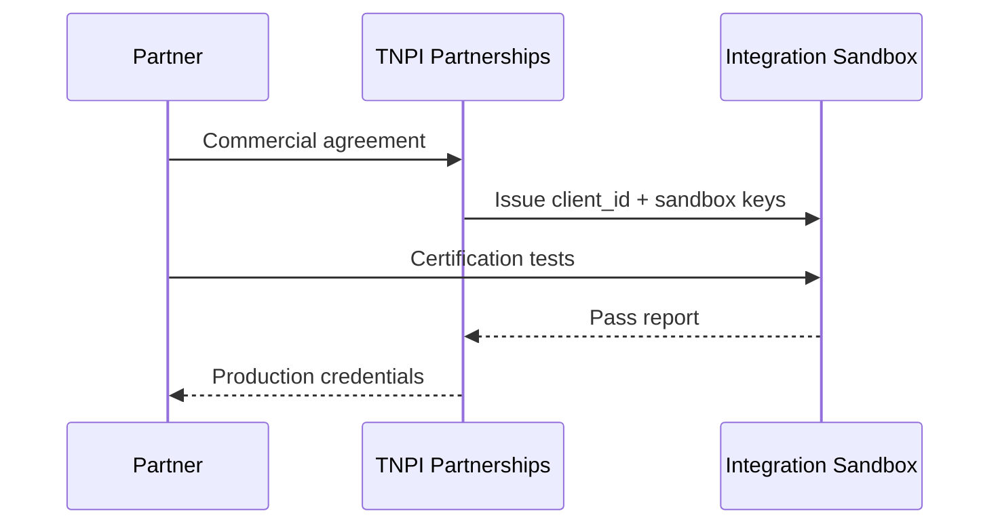

# 16 — Partner Integration Guide

**Audience:** PSPs, banks, card acquirers, government bill systems, large merchants

---

## Executive summary

How partners integrate with TNPI: credentials, environments, payment flows, webhooks, reconciliation files, and certification—without accessing Taifa internal systems.

---

## Business vision

Partners onboard once to reach all Taifa acceptance channels (API, QR, SoftPOS indirect).

---

## Integration models

| Model | Partner type |
| --- | --- |
| **PSP rail** | M-Pesa, Airtel, banks — TNPI calls partner APIs |
| **Acquirer** | Card processing — TNPI SoftPOS/e-com |
| **Bill issuer** | Government — lookup + notify |
| **Merchant aggregator** | ISV — OAuth on behalf of sub-merchants |

---

## Architecture overview

---

## Onboarding sequence

---

## Environments

| Env | URL pattern |
| --- | --- |
| Sandbox | `https://sandbox.payments.taifa.go.tz` |
| Production | `https://api.taifa.go.tz` |

---

## PSP adapter contract (outbound from TNPI)

Partners implement (or expose):

- `authorize` / `charge` / `status` / `refund`
- Webhook for async completion
- Settlement file format spec

TNPI implements **inbound** webhooks per [14_API_CATALOG.md](14_API_CATALOG.md).

---

## Certification checklist

| # | Test |
| --- | --- |
| C1 | Idempotent duplicate charge |
| C2 | Timeout + retry handling |
| C3 | Refund full/partial |
| C4 | Webhook signature validation |
| C5 | Settlement file round-trip |

---

## Security model

mTLS certs rotated annually; IP allowlists; no shared merchant credentials across partners.

---

## AWS deployment

Partner-facing API GW usage plans; separate API keys per partner.

---

## Implementation roadmap

Partner portal MVP in Phase 2; self-service sandbox keys Phase 3.

---

## Dependencies

Legal agreements; [17_COMPLIANCE_GUIDE.md](17_COMPLIANCE_GUIDE.md).

---

## Acceptance criteria

One PSP certified end-to-end in sandbox.

---

## Definition of done

Partner runbook published; support SLA defined.

---

## Future roadmap

Open banking AIS/PIS; scheme direct connectivity.

---

## Cross-references

[14_API_CATALOG.md](14_API_CATALOG.md) · [05_RECONCILIATION.md](05_RECONCILIATION.md)
