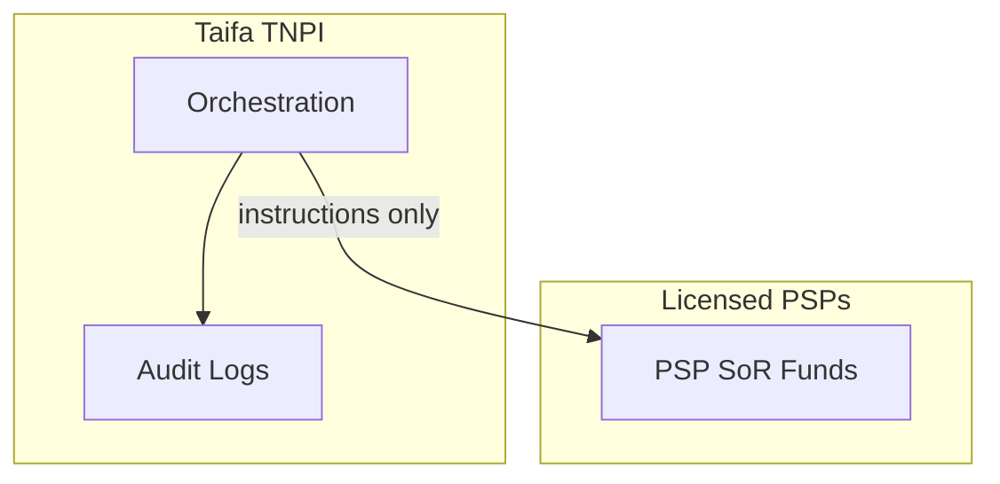

# 17 — Compliance Guide (TNPI)

**Regulatory context:** Bank of Tanzania PSP ecosystem · PCI DSS · ISO 27001 · Data protection

---

## Executive summary

TNPI operates as **payment acceptance infrastructure** partnering with licensed PSPs—not as a deposit-taking wallet. This guide maps controls, scope, and evidence for auditors and regulators.

---

## Business vision

Compliance enables scale: schemes and government trust Taifa as infrastructure, not shadow banking.

---

## Regulatory positioning

| Question | Answer |
| --- | --- |
| Does Taifa hold customer funds? | **No** — PSPs settle per their licenses |
| What does Taifa hold? | Orchestration records, tokens, merchant payables |
| TNPI role | Technical service provider / aggregator (legal classification per MOU) |

---

## PCI DSS

| Component | Typical SAQ |
| --- | --- |
| Redirect to PSP wallet | SAQ A |
| Hosted fields / tokenization partner | SAQ A-EP |
| SoftPOS MPoC | **Full program** with QSA |

Card data never logged; vault in CDE; annual ASV scans on CDE.

---

## ISO 27001 alignment

Map TNPI controls to [governance/SECURITY_GOVERNANCE.md](../governance/SECURITY_GOVERNANCE.md): access control, crypto, logging, supplier security, incident response.

---

## AML / CFT

Merchant KYC tiers; transaction monitoring via [Fraud Engine](03_PAYMENT_ORCHESTRATION.md); STR escalation to compliance officer (process).

---

## Data protection

Minimize PII; lawful basis for processing; retention schedules; cross-border transfer policy for East Africa expansion.

---

## Architecture (compliance view)

---

## ADR governance alignment

[ADR-0001](../adr/0001-single-payment-ledger.md) — ledger records **acceptance accounting**; consumer wallet balances remain at PSP. Document migration note in architecture board minutes.

---

## Evidence artifacts

| Artifact | Owner |
| --- | --- |
| PCI scope diagram | Security |
| Pen test report | Security |
| KYC policy | Compliance |
| Settlement reconciliation samples | Finance |

Store under `docs/payments/evidence/` (future).

---

## Implementation roadmap

P1 compliance charter · P2 PCI gap assessment · P3 QSA engagement for SoftPOS.

---

## Acceptance criteria

Legal opinion on TNPI classification; PCI scope signed.

---

## Definition of done

Annual compliance calendar published.

---

## Future roadmap

ISO 27001 certification; regional passport (EAC).

---

## Cross-references

[10_SECURITY.md](10_SECURITY.md) · [18_RISK_REGISTER.md](18_RISK_REGISTER.md)
