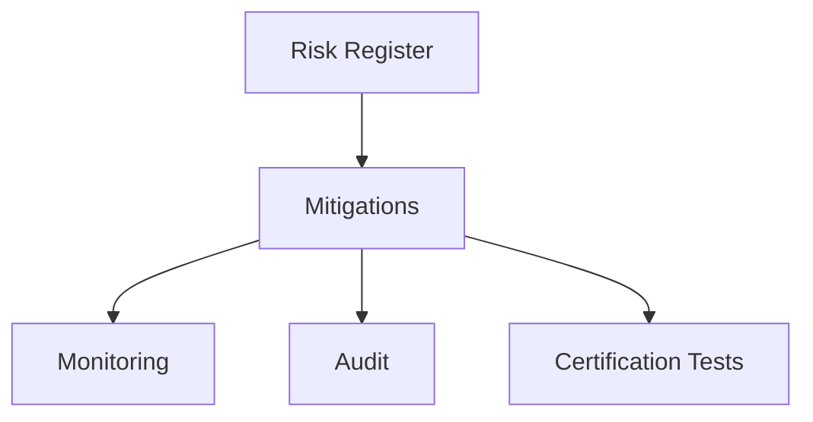

# 18 — TNPI Risk Register

**Owner:** Enterprise Payment Architecture + Risk Committee  
**Review:** Monthly during implementation; quarterly in steady state

---

## Executive summary

Top risks to TNPI delivery, security, regulatory acceptance, and national reputation—with mitigations and residual risk ratings.

---

## Rating scale

| Likelihood | Impact | Priority |
| --- | --- | --- |
| L/M/H | L/M/H | P1 (critical) – P4 (low) |

---

## Risk register

| ID | Risk | L | I | P | Mitigation | Owner |
| --- | --- | --- | --- | --- | --- | --- |
| R-TNPI-001 | Misinterpreted as competing wallet vs M-Pesa | M | H | **P1** | Public positioning; PSP partnership MOUs; no consumer float | Partnerships |
| R-TNPI-002 | PCI scope creep (PAN in logs) | M | H | **P1** | Vault + log scrubbing; QSA review | Security |
| R-TNPI-003 | PSP API downtime degrades national acceptance | H | M | **P1** | Smart routing, failover, health monitors | Platform |
| R-TNPI-004 | Reconciliation gaps → merchant distrust | M | H | **P2** | Automated matcher + exception SLA | Finance |
| R-TNPI-005 | SoftPOS certification delays | M | M | **P2** | Early acquirer engagement; phased Android | Acceptance |
| R-TNPI-006 | Legacy ledger code diverges from TNPI model | M | M | **P2** | Strangler fig; ADR on acceptance ledger | Engineering |
| R-TNPI-007 | Cross-domain DB writes (mobility/tourism) | L | H | **P2** | Domain governance audits; contract tests | Architecture |
| R-TNPI-008 | Fraud at scale on small-ticket transport | H | M | **P2** | Velocity rules; device attestation | Risk |
| R-TNPI-009 | Government integration scope creep | M | M | **P3** | Phase 5 gate; per-agency SOW | Program |
| R-TNPI-010 | East Africa regulatory fragmentation | M | M | **P3** | Per-country legal playbook | Legal |
| R-TNPI-011 | AWS account / IAM misconfiguration | L | H | **P2** | IaC only; OIDC CI; Security Hub | DevOps |
| R-TNPI-012 | Idempotency failure → double charge | L | H | **P1** | Mandatory keys; chaos tests | Payments Core |
| R-TNPI-013 | Offline SoftPOS replay attacks | M | M | **P2** | Signed offline tokens; sync nonces | Acceptance |
| R-TNPI-014 | Core platform delay blocks TNPI Phase 1 | M | H | **P2** | Parallel doc work; clear Core dependencies | Program |
| R-TNPI-015 | Scheme rejection of Tap-to-Phone design | M | H | **P2** | Early scheme labs; certified SDK partner | Compliance |

---

## Architecture overview (risk controls)

---

## Dependencies

[12_IMPLEMENTATION_PLAN.md](12_IMPLEMENTATION_PLAN.md); Core [platform/earb/08_PLATFORM_RISKS.md](../platform/earb/08_PLATFORM_RISKS.md).

---

## Acceptance criteria

All P1 risks have active mitigations and owners; escalations defined.

---

## Definition of done

Risk review minutes archived; new risks added within 5 business days of discovery.

---

## Future roadmap

Operational risk framework; insurance / bonding for merchants.

---

## Cross-references

[00_PAYMENT_PROGRAM.md](00_PAYMENT_PROGRAM.md) · [10_SECURITY.md](10_SECURITY.md) · [17_COMPLIANCE_GUIDE.md](17_COMPLIANCE_GUIDE.md)
