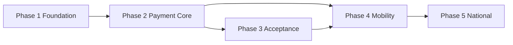

# Taifa National Payment Infrastructure (TNPI)

**Program status:** Architecture approved — documentation phase (no production code in this pack)  
**Authority:** [Architecture Constitution](../architecture/00_ARCHITECTURE_CONSTITUTION.md) · [Platform Governance](../GOVERNANCE.md) · [Taifa Core](../platform/00_PLATFORM_OVERVIEW.md)

---

## What TNPI is

TNPI is Tanzania’s **payment acceptance and orchestration infrastructure**. It connects wallets, banks, and card networks into one secure platform for merchants, transport, government, and digital commerce.

| TNPI is | TNPI is not |
| --- | --- |
| Payment orchestration & acceptance | A consumer wallet competing with M-Pesa |
| Merchant onboarding & KYC | A bank or mobile money operator |
| Settlement & reconciliation orchestration | Custodian of customer funds |
| SoftPOS, QR, links, APIs | A card issuer |

**Funds:** Customer money remains at **payment service providers (PSPs)**. Taifa holds **orchestration state**, **tokens** (PCI-compliant), **merchant settlement positions**, and **audit evidence**.

---

## Document map

| # | Document | Phase |
| --- | --- | --- |
| 00 | [00_PAYMENT_PROGRAM.md](00_PAYMENT_PROGRAM.md) | Program charter |
| 01 | [01_PAYMENT_FOUNDATION.md](01_PAYMENT_FOUNDATION.md) | 1 — Platform |
| 02 | [02_WALLET_AGGREGATION.md](02_WALLET_AGGREGATION.md) | 2 — Core |
| 03 | [03_PAYMENT_ORCHESTRATION.md](03_PAYMENT_ORCHESTRATION.md) | 2 — Core |
| 04 | [04_SETTLEMENT.md](04_SETTLEMENT.md) | 2 — Core |
| 05 | [05_RECONCILIATION.md](05_RECONCILIATION.md) | 2 — Core |
| 06 | [06_SOFTPOS.md](06_SOFTPOS.md) | 3 — Acceptance |
| 07 | [07_QR_PAYMENTS.md](07_QR_PAYMENTS.md) | 3 — Acceptance |
| 08 | [08_TRANSPORT_PAYMENTS.md](08_TRANSPORT_PAYMENTS.md) | 4 — Mobility |
| 09 | [09_GOVERNMENT_PAYMENTS.md](09_GOVERNMENT_PAYMENTS.md) | 5 — National |
| 10 | [10_SECURITY.md](10_SECURITY.md) | Cross-cutting |
| 11 | [11_AWS_ARCHITECTURE.md](11_AWS_ARCHITECTURE.md) | Cross-cutting |
| 12 | [12_IMPLEMENTATION_PLAN.md](12_IMPLEMENTATION_PLAN.md) | Execution |
| 13 | [13_PAYMENT_ROADMAP.md](13_PAYMENT_ROADMAP.md) | Roadmap |
| 14 | [14_API_CATALOG.md](14_API_CATALOG.md) | Contracts |
| 15 | [15_EVENT_CATALOG.md](15_EVENT_CATALOG.md) | Events |
| 16 | [16_PARTNER_INTEGRATION_GUIDE.md](16_PARTNER_INTEGRATION_GUIDE.md) | Partners |
| 17 | [17_COMPLIANCE_GUIDE.md](17_COMPLIANCE_GUIDE.md) | Compliance |
| 18 | [18_RISK_REGISTER.md](18_RISK_REGISTER.md) | Risks |

---

## Related legacy / implementation references

| Asset | Role |
| --- | --- |
| [PAYMENTS.md](../PAYMENTS.md) | Current ledger & provider abstraction (evolves under TNPI) |
| [tap_pay/](../tap_pay/00_INDEX.md) | Tap/NFC interaction layer → TNPI acceptance channels |
| [DATA_MODEL.md](../DATA_MODEL.md) | Postgres schema (payments domain) |
| [ADR-0001](../adr/0001-single-payment-ledger.md) | **Acceptance accounting SoR** — reinterpreted in [00](00_PAYMENT_PROGRAM.md) § Governance alignment |

---

## Phase summary

**Prerequisite:** Taifa Core Sprint 0+ (identity, events, IaC) per [SPRINT_0_ENGINEERING_PLAN.md](../platform/SPRINT_0_ENGINEERING_PLAN.md).

---

## TNPI phase products

| Phase | Product | Documentation | Gate to next |
| --- | --- | --- | --- |
| **1** | Merchant Platform | [merchant/00_INDEX.md](merchant/00_INDEX.md) | [PHASE1_GATE_PACKAGE](merchant/PHASE1_GATE_PACKAGE.md) → Phase 2 |
| **2** | Payment Sources Platform | [payment-sources/00_INDEX.md](payment-sources/00_INDEX.md) | [PHASE2_GATE_PACKAGE](payment-sources/PHASE2_GATE_PACKAGE.md) → Phase 3 |
| **3** | Payment Orchestration | [orchestration/00_INDEX.md](orchestration/00_INDEX.md) | [PHASE3_GATE_PACKAGE](orchestration/PHASE3_GATE_PACKAGE.md) → Phase 4 |
| **4** | Merchant Acceptance (MAP) | [merchant-acceptance/00_INDEX.md](merchant-acceptance/00_INDEX.md) | [PHASE4_GATE_PACKAGE](merchant-acceptance/PHASE4_GATE_PACKAGE.md) → Phase 5 |
| **5** | Settlement Platform | [settlement/00_INDEX.md](settlement/00_INDEX.md) | [PHASE5_GATE_PACKAGE](settlement/PHASE5_GATE_PACKAGE.md) → Phase 6 |
| **6** | Reconciliation Platform | [reconciliation/00_INDEX.md](reconciliation/00_INDEX.md) | [PHASE6_GATE_PACKAGE](reconciliation/PHASE6_GATE_PACKAGE.md) → Phase 7 |
| **7** | Fraud & Risk Platform (FRP) | [fraud-risk/00_INDEX.md](fraud-risk/00_INDEX.md) | [PHASE7_GATE_PACKAGE](fraud-risk/PHASE7_GATE_PACKAGE.md) → Phase 8 |
| **8** | Developer Platform | [developer-platform/00_INDEX.md](developer-platform/00_INDEX.md) | [PHASE8_GATE_PACKAGE](developer-platform/PHASE8_GATE_PACKAGE.md) → Phase 9 |
| **9** | Transport Payments Platform (TPP) | [transport/00_PLATFORM_OVERVIEW.md](../transport/00_PLATFORM_OVERVIEW.md) | Nationwide rollout per transport pack |

TNPI Phases 1–8: reusable core · **TPP** (`docs/transport/`): mobility product consuming TNPI only.
