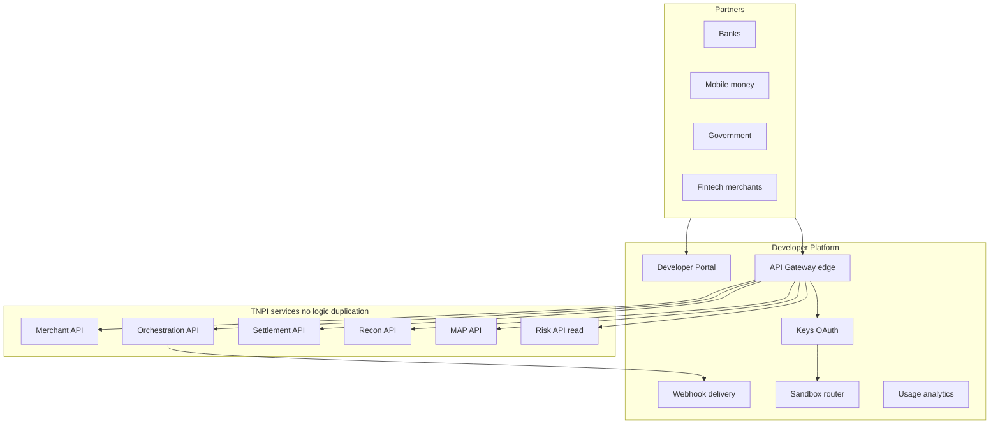
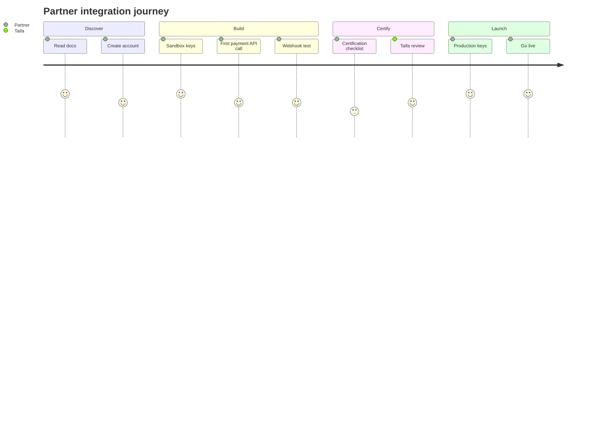
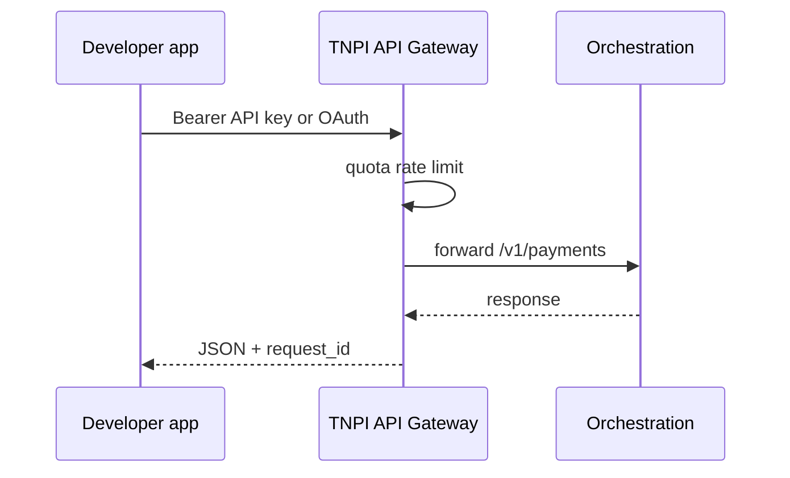

# 01 — Product Vision

---

## Executive summary

Taifa **Developer Platform** (Phase 8) is Tanzania’s national payment **integration layer**: one portal, one API surface, sandbox and production environments, webhooks, SDKs, and partner certification—modeled on Stripe Developers, Adyen, PayPal, Twilio, and Plaid, exposing TNPI Phases 1–7 through versioned contracts.

---

## Business purpose

Banks, telcos, government, fintechs, and merchants integrate once with standards, security, and observability—accelerating national adoption without bespoke integrations per domain team.

---

## Architecture overview

---

## Developer journey

---

## Product vision

**Every partner integrates through one trusted gateway—documented, tested, certified, and measurable.**

---

## Partner segments

| Segment | Primary APIs |
| --- | --- |
| Banks / PSPs | Payment sources, webhooks |
| Merchants / ISVs | Payments, MAP, settlement reports |
| Government | Gov collections, reporting |
| Transport (Phase 9 prep) | Transport fare APIs (exposed here) |
| Tourism / insurance | Payments + risk read |
| Healthcare / education | Payments + invoicing hooks |

---

## API flow (high level)

---

## OpenAPI standards

Single **TNPI OpenAPI registry**; domain specs merged at gateway; `x-tnpi-product` tags per phase.

---

## Security considerations

OAuth2/OIDC, API keys, webhook HMAC, mTLS option for banks — [07_API_SECURITY.md](07_API_SECURITY.md).

---

## AWS architecture

CloudFront portal, API Gateway, Fargate control plane — [11_AWS_ARCHITECTURE.md](11_AWS_ARCHITECTURE.md).

---

## Operational considerations

99.9% gateway availability target; status page; breaking change policy 12-month deprecation.

---

## Implementation strategy

DP-0 registry → DP-1 portal + keys → DP-2 sandbox → DP-3 webhooks → DP-4 SDKs v1 → DP-5 certification → DP-6 gate.

---

## Future expansion

International partners · community forum · marketplace of certified apps.

---

## Cross-references

[02_DEVELOPER_PORTAL.md](02_DEVELOPER_PORTAL.md) · [PHASE8_GATE_PACKAGE.md](PHASE8_GATE_PACKAGE.md)
