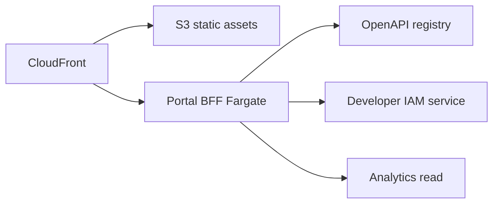
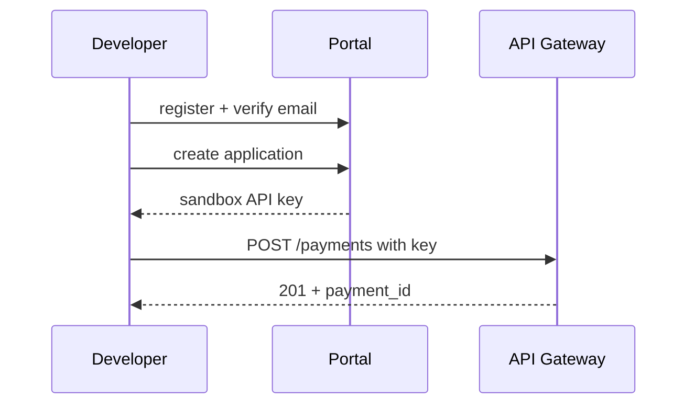

# 02 — Developer Portal

---

## Executive summary

World-class **developer portal**: getting started, interactive docs, API explorer, SDK downloads, tutorials, webhooks guide, auth guide, testing, certification, release notes, FAQ—hosted on CloudFront with SSR or static + API backend.

---

## Business purpose

DX drives integration velocity; portal is the primary product surface for external developers.

---

## Architecture overview

---

## Portal sections

| Section | Content |
| --- | --- |
| Getting started | 10-minute first payment (sandbox) |
| Quick starts | Per language + channel |
| API reference | Generated from OpenAPI |
| API explorer | Try-it with sandbox key |
| SDKs | Versioned downloads + changelog |
| Webhooks | Subscribe, verify, replay |
| Auth | API keys vs OAuth flows |
| Testing | Sandbox scenarios |
| Certification | Checklist + submit |
| Release notes | API changelog |
| Blog / FAQ | Product updates |
| Support | Tickets (Phase 8 v1 email + ticket API) |

---

## Developer journey: first API call

---

## Interactive explorer

OAuth to portal session; inject sandbox key server-side; never log secrets; rate limited per developer.

---

## OpenAPI standards

Redoc or Stoplight; multi-spec navigation; try-it proxies to `api.sandbox.taifa.go.tz`.

---

## Security considerations

CSP, MFA for production key reveal, audit on key download.

---

## AWS architecture

CloudFront + WAF; Route53 `developers.taifa.go.tz`.

---

## Operational considerations

Search index for docs; localized Swahili summaries (future).

---

## Implementation strategy

DP-1: static docs + manual keys; DP-2: explorer + dynamic apps.

---

## Future expansion

Community forum SSO; partner solution directory.

---

## Cross-references

[03_API_PLATFORM.md](03_API_PLATFORM.md) · [08_API_SPECIFICATION.md](08_API_SPECIFICATION.md)
