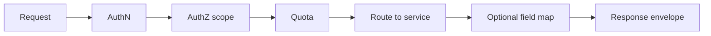
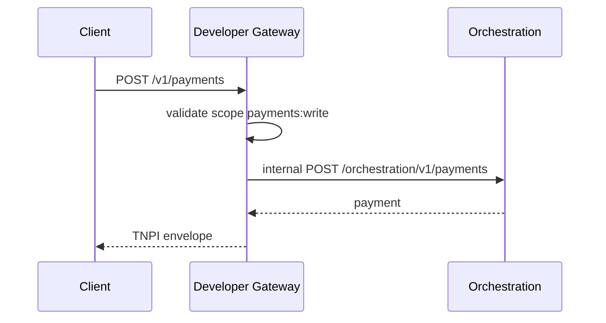

# 03 — API Platform

---

## Executive summary

Enterprise **API aggregation layer**: versioned REST (OpenAPI 3.1), unified error model, request IDs, product categories mapped to TNPI Phases 1–7 backends—**no business logic** in gateway beyond auth, routing, transformation, quotas.

---

## Business purpose

One hostname and versioning policy for all external integrators.

---

## Architecture overview

```mermaid
flowchart TB
  EXT[External client]
  GW[API Gateway]
  subgraph routes [Route map]
    MER[/v1/merchants/*]
    PAY[/v1/payments/*]
    SRC[/v1/payment-sources/*]
    SET[/v1/settlements/*]
    REC[/v1/reconciliation/*]
    MAP[/v1/acceptance/*]
    TR[/v1/transport/*]
    GOV[/v1/government/*]
    RPT[/v1/reports/*]
    RISK[/v1/risk/* read]
    WH[/v1/webhooks/*]
  end
  EXT --> GW --> routes
  routes --> VPC[VPC internal ALB]
```

---

## API categories

| Category | Upstream (Phase) | Notes |
| --- | --- | --- |
| Merchant | Phase 1 | Onboarding read after cert |
| Payment | Phase 3 | Core payments |
| Payment source | Phase 2 | Tokenized sources |
| Settlement | Phase 5 | Positions, payouts read |
| Reconciliation | Phase 6 | Reports, exceptions read |
| SoftPOS / QR | Phase 4 MAP | Terminal, QR sessions |
| Transport | Phase 9 prep | Fare quote, trip pay |
| Government | Program 09 | Collections |
| Reporting / analytics | Cross | Aggregated usage |
| Risk | Phase 7 | Read-only scores/alerts partner scope |
| Webhook admin | Phase 8 | Registration, logs |

---

## API flow diagram



---

## Version management

- URL path: `/v1`, `/v2` (preferred for breaking changes)  
- Header: `TNPI-Version: 2026-08-01` for date-based (Stripe-style) on select products  
- Deprecation: `Sunset` header + portal changelog minimum 12 months  

---

## Rate limiting & quotas

Per application: burst + sustained; tier by certification level (sandbox vs production vs enterprise).

---

## Sequence: routed payment



---

## OpenAPI standards

- `info.version` per product  
- Shared `components.schemas` for Money, Error, Pagination  
- Webhooks documented via `webhooks` OpenAPI 3.1  

---

## Security

Scope-based access per application — [07_API_SECURITY.md](07_API_SECURITY.md).

---

## Operational considerations

Per-route latency SLOs; circuit breaker to upstream; cached OpenAPI at edge.

---

## Implementation strategy

Import domain OpenAPI; gateway OpenAPI is union + extensions only.

---

## Future expansion

GraphQL read facade for dashboards (optional, not v1).

---

## Cross-references

[08_API_SPECIFICATION.md](08_API_SPECIFICATION.md) · [05_SANDBOX.md](05_SANDBOX.md)
