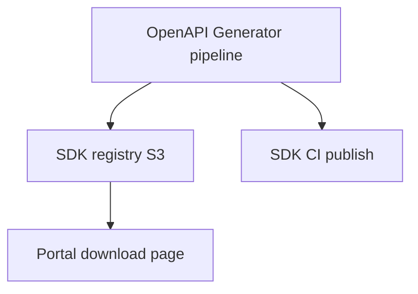

# 04 — SDK Platform

---

## Executive summary

Official **TNPI SDKs** for Flutter, Android, iOS, JavaScript/Node, Java, .NET, Python, Go, PHP—with shared API conventions, auth helpers, webhook verification libs, and sandbox base URL configuration.

---

## Business purpose

Reduce integration errors and time-to-first-payment across Tanzania’s mobile-first ecosystem.

---

## Architecture overview

---

## SDK matrix (v1 priority)

| SDK | Priority | Use case |
| --- | --- | --- |
| Flutter | P0 | Taifa super-app, merchant apps |
| Android / iOS | P0 | SoftPOS, QR |
| JavaScript / Node | P0 | Web checkout, server |
| Java / .NET | P1 | Enterprise ERP |
| Python / Go | P1 | Gov / data integrations |
| PHP | P2 | SME ecommerce |
| React Native | Future | Cross-mobile |
| KMP | Future | Shared mobile core |

---

## SDK capabilities (common)

- Config: `apiKey`, `environment`, `baseUrl`, `timeout`  
- Auth: API key header; OAuth helper for user-delegated flows  
- Idempotency-Key on POST  
- Webhook signature verify module  
- Structured errors → `TnpiError`  
- Telemetry hook (opt-in) for support  

---

## Developer journey

---

## Versioning

Semver per SDK; maps to minimum API `/v1`; breaking SDK major when API sunset.

---

## OpenAPI standards

Single generator config; post-process for Taifa naming (`TnpiClient`).

---

## Security

No embedded secrets; secure storage guides (Keychain, Keystore).

---

## AWS

S3 versioned artifacts; CloudFront signed URLs for beta SDKs.

---

## Events

`sdk.downloaded` — [09_EVENT_CATALOG.md](09_EVENT_CATALOG.md).

---

## Implementation strategy

DP-4: Node + Flutter first; others from same OpenAPI.

---

## Future expansion

Package managers: npm, pub.dev, Maven Central, NuGet.

---

## Cross-references

[02_DEVELOPER_PORTAL.md](02_DEVELOPER_PORTAL.md) · [03_API_PLATFORM.md](03_API_PLATFORM.md)
