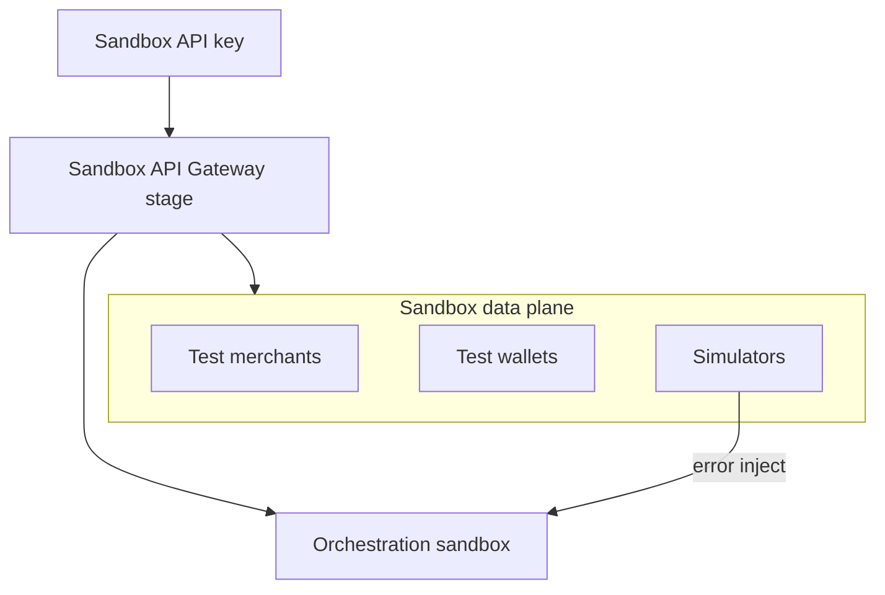
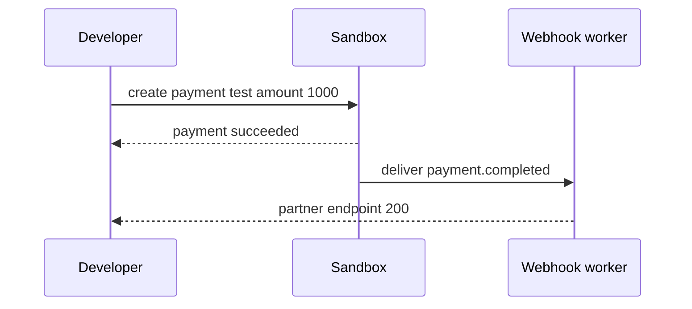

# 05 — Sandbox

---

## Executive summary

Complete **sandbox environment**: isolated accounts, fake money, test merchants, payment sources, webhook simulation, error injection, settlement/refund simulation, and load-test endpoints—routing to TNPI sandbox stacks (not production).

---

## Business purpose

Partners certify integrations without financial or regulatory risk.

---

## Architecture overview

---

## Sandbox capabilities

| Feature | Behavior |
| --- | --- |
| Sandbox accounts | Per developer org |
| Fake transactions | Deterministic test PAN/MM numbers |
| Test wallets | M-Pesa-style simulate |
| Test merchants | Pre-seeded + custom |
| Test payment sources | Tokenize test instruments |
| Webhook simulation | Portal fire test event |
| Error simulation | `?simulate=decline` headers |
| Settlement simulation | Accelerated T+0 sandbox cycles |
| Refund simulation | Full/partial |
| Load testing | Dedicated rate tier + approval |

---

## Developer journey

---

## Isolation

Separate AWS account or VPC stage; no routing to prod RDS; distinct EventBridge bus `tnpi-sandbox`.

---

## API flow

Header `TNPI-Environment: sandbox` required; keys prefixed `sk_test_` / `pk_test_`.

---

## Security

Sandbox data synthetic only; no real NIDA; purge sandboxes inactive 90d.

---

## Operational considerations

Daily reset optional for shared demo tenants; dedicated tenant for certification.

---

## Implementation strategy

DP-2: stage + simulators; DP-5: certification harness uses sandbox.

---

## Future expansion

Record/replay HTTP fixtures for CI.

---

## Cross-references

[06_WEBHOOK_PLATFORM.md](06_WEBHOOK_PLATFORM.md) · [18_CERTIFICATION_PROGRAM.md](18_CERTIFICATION_PROGRAM.md)
