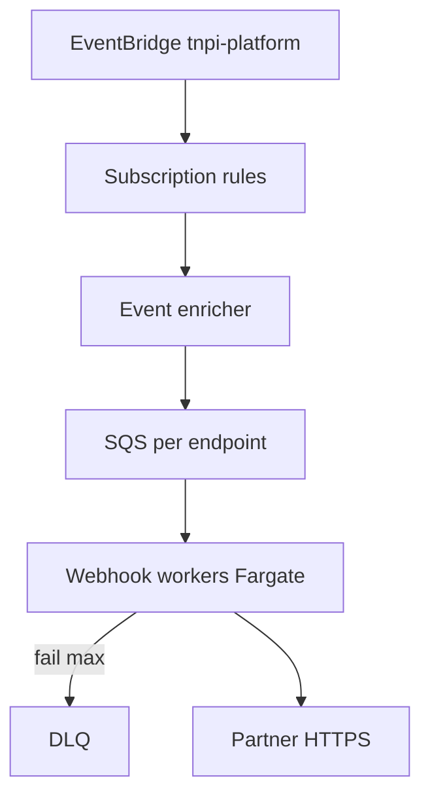
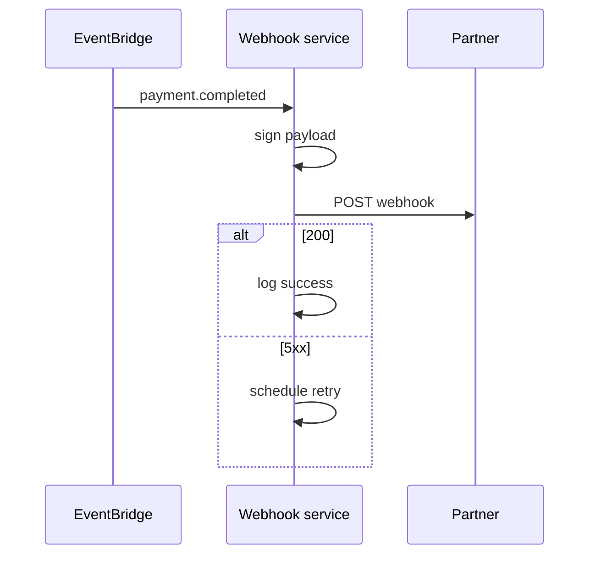
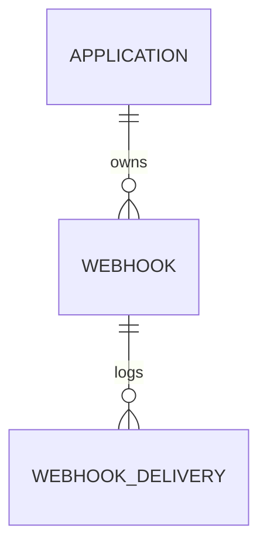

# 06 — Webhook Platform

---

## Executive summary

Managed **webhook delivery**: registration, HMAC verification, retries, DLQ, delivery logs, event filtering, versioning, replay protection—subscribing to TNPI EventBridge and fan-out to partner HTTPS endpoints.

---

## Business purpose

Reliable async integration without partners polling payment state.

---

## Architecture overview



---

## Registration model

Per application: URL, secret, event types[], API version, active flag, optional IP allowlist on partner side (documented).

---

## Verification

```
TNPI-Signature: t={timestamp},v1={hmac_sha256_hex}
signed_payload = timestamp + "." + raw_body
```

Reject if timestamp skew &gt; 5 minutes (replay protection).

---

## Retry policy

| Attempt | Delay |
| --- | --- |
| 1 | immediate |
| 2 | 1 min |
| 3 | 5 min |
| 4 | 30 min |
| 5 | 2 h |
| 6 | 24 h |

Then DLQ + `webhook.delivery.failed` alert.

---

## Sequence: delivery



---

## Developer journey

Portal → Webhooks → Add endpoint → Select events → Send test → View delivery log.

---

## API (admin)

See [08_API_SPECIFICATION.md](08_API_SPECIFICATION.md) — `/v1/webhooks/*`.

---

## ER



---

## Security

Secrets in Secrets Manager; rotate via portal; TLS 1.2+ only.

---

## AWS

SQS + Lambda/Fargate; idempotency key `event_id` in partner docs.

---

## Implementation strategy

DP-3: core delivery; DP-4: portal UI + replay tool (signed, audit).

---

## Future expansion

Partner mTLS client auth to Taifa egress IPs.

---

## Cross-references

[07_API_SECURITY.md](07_API_SECURITY.md) · [09_EVENT_CATALOG.md](09_EVENT_CATALOG.md)
