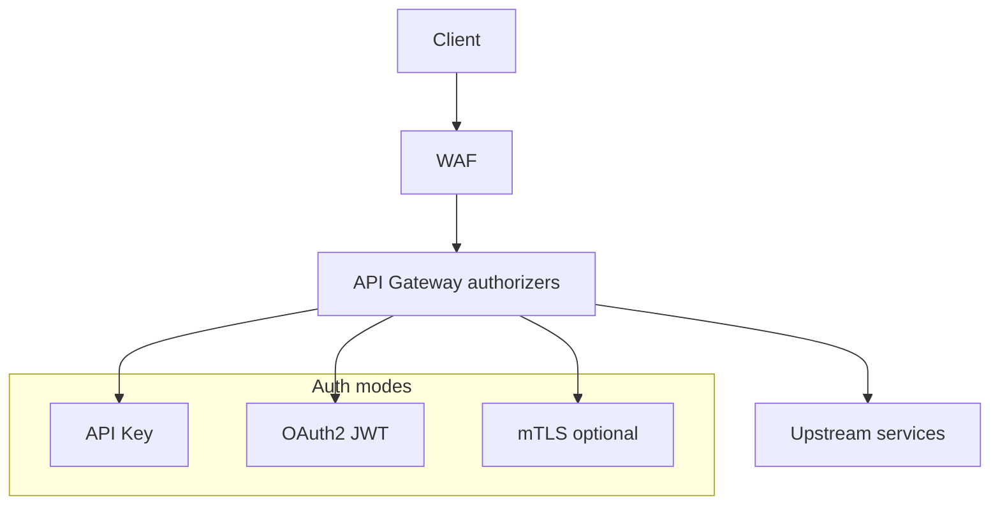
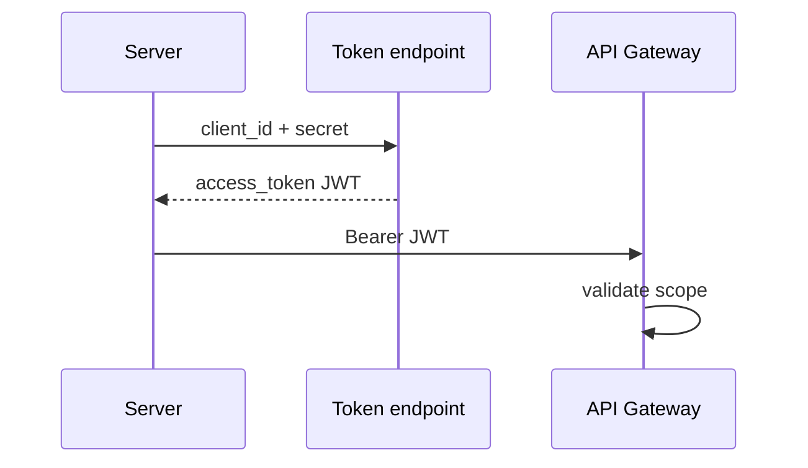

# 07 — API Security

---

## Executive summary

Defense-in-depth for public APIs: **OAuth 2.0 / OIDC** (user-delegated), **API keys** (server-to-server), **JWT** validation, optional **mTLS** for banks, webhook signatures, request signing (enterprise), rate limits, IP allowlists, KMS, Secrets Manager, key rotation.

---

## Business purpose

National payment APIs are high-value targets; security is non-negotiable for BoT-regulated partners.

---

## Architecture overview

---

## Authentication modes

| Mode | Use case |
| --- | --- |
| API key (`Authorization: Bearer sk_live_...`) | Backend integrations |
| OAuth2 client credentials | B2B service accounts |
| OAuth2 authorization code + PKCE | Merchant user dashboards |
| OIDC | SSO for portal |
| mTLS | Tier-1 bank direct |

---

## Authorization (scopes)

Examples: `payments:read`, `payments:write`, `merchants:read`, `settlements:read`, `webhooks:manage` — bound to **application** and **organization**.

---

## API keys

- Prefix distinguishes env (`sk_test_`, `sk_live_`)  
- Store hash only (bcrypt/argon2)  
- Rotation: grace period dual-key 24h  
- Maker-checker for first production key  

---

## Webhook security

HMAC-SHA256, timestamp, constant-time compare — [06_WEBHOOK_PLATFORM.md](06_WEBHOOK_PLATFORM.md).

---

## Request signing (optional enterprise)

`TNPI-Request-Signature` for high-value gov/bank APIs (canonical string similar to AWS SigV4 lite).

---

## Rate limiting & IP

API Gateway usage plans; optional Taifa-side allowlist for sensitive routes; partner documents egress IPs.

---

## Sequence: OAuth client credentials

---

## PCI alignment

Portal never collects PAN; partners use hosted fields / tokenization APIs from Phase 2.

---

## Secrets

Secrets Manager; automatic rotation for internal signing keys; CloudTrail on access.

---

## Operational considerations

Security incident playbooks; revoke all keys for compromised app.

---

## Implementation strategy

DP-1: API keys + WAF; DP-2: OAuth via Taifa Core identity.

---

## Future expansion

FAPI profile for open banking (future).

---

## Cross-references

[08_API_SPECIFICATION.md](08_API_SPECIFICATION.md) · [11_AWS_ARCHITECTURE.md](11_AWS_ARCHITECTURE.md)
