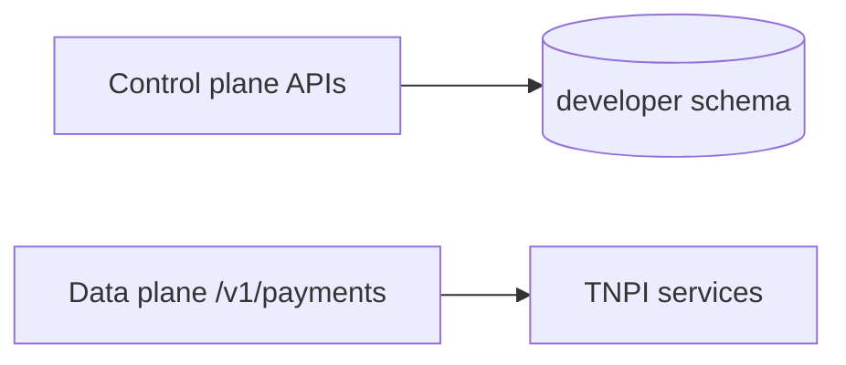

# 08 — API Specification

**Public base:** `https://api.taifa.go.tz` · **Sandbox:** `https://api.sandbox.taifa.go.tz`  
**Control plane:** `https://api.taifa.go.tz/v1/developer` (portal backend)

---

## Executive summary

Developer Platform **control APIs** plus catalog of **exposed TNPI product APIs**—OpenAPI 3.1, unified errors, pagination, idempotency.

---

## Business purpose

Machine-readable contracts for portal, SDK generation, and partner CI.

---

## Standard headers

| Header | Required | Description |
| --- | --- | --- |
| `Authorization` | Yes | `Bearer {key}` or JWT |
| `TNPI-Environment` | Sandbox | `sandbox` \| `production` |
| `Idempotency-Key` | POST payments | UUID |
| `TNPI-Request-Id` | Optional | Client trace; echoed in response |

---

## Error envelope

```json
{
  "error": {
    "code": "rate_limit_exceeded",
    "message": "Too many requests",
    "request_id": "req_abc",
    "doc_url": "https://developers.taifa.go.tz/errors/rate_limit"
  }
}
```

---

## Developer / organization APIs

| Method | Path | Description |
| --- | --- | --- |
| POST | `/v1/developer/register` | Create developer |
| GET | `/v1/developer/me` | Profile |
| POST | `/v1/organizations` | Create org |
| GET | `/v1/organizations/{id}` | Org detail |
| POST | `/v1/organizations/{id}/members` | Invite |

---

## Application & keys

| Method | Path |
| --- | --- |
| POST | `/v1/applications` |
| GET | `/v1/applications` |
| GET | `/v1/applications/{id}` |
| POST | `/v1/applications/{id}/keys` | Create key (sandbox auto) |
| POST | `/v1/applications/{id}/keys/{key_id}/rotate` |
| DELETE | `/v1/applications/{id}/keys/{key_id}` |
| POST | `/v1/applications/{id}/submit-for-review` | Production access |

---

## OAuth clients

| Method | Path |
| --- | --- |
| POST | `/v1/oauth/clients` |
| GET | `/v1/oauth/clients/{id}` |
| POST | `/v1/oauth/clients/{id}/rotate-secret` |

---

## Webhooks (admin)

| Method | Path |
| --- | --- |
| POST | `/v1/webhooks` |
| GET | `/v1/webhooks` |
| PATCH | `/v1/webhooks/{id}` |
| DELETE | `/v1/webhooks/{id}` |
| POST | `/v1/webhooks/{id}/test` |
| GET | `/v1/webhooks/{id}/deliveries` |
| POST | `/v1/webhooks/{id}/deliveries/{delivery_id}/replay` |

---

## Analytics (read)

| Method | Path |
| --- | --- |
| GET | `/v1/analytics/usage` |
| GET | `/v1/analytics/errors` |
| GET | `/v1/analytics/latency` |

---

## Certification & support

| Method | Path |
| --- | --- |
| POST | `/v1/certification/submissions` |
| GET | `/v1/certification/status` |
| POST | `/v1/support/tickets` |

---

## Product API catalog (routed, not implemented in DP)

| Prefix | Product doc |
| --- | --- |
| `/v1/payments/*` | [orchestration/07](../orchestration/07_API_SPECIFICATION.md) |
| `/v1/merchants/*` | [merchant/](../merchant/00_INDEX.md) |
| `/v1/payment-sources/*` | [payment-sources/](../payment-sources/00_INDEX.md) |
| `/v1/settlements/*` | [settlement/](../settlement/00_INDEX.md) |
| `/v1/reconciliation/*` | [reconciliation/](../reconciliation/00_INDEX.md) |
| `/v1/acceptance/*` | [merchant-acceptance/](../merchant-acceptance/00_INDEX.md) |
| `/v1/risk/*` | [fraud-risk/](../fraud-risk/07_API_SPECIFICATION.md) (scoped read) |
| `/v1/transport/*` | Phase 9 (stub routes documented) |

---

## API flow diagram



---

## OpenAPI standards

- Repository: `openapi/tnpi-developer-v1.yaml`, `openapi/tnpi-public-v1.yaml`  
- Postman collection generated in CI  
- Changelog in portal from git tags  

---

## Security

All control plane routes require developer session or service role; production key creation requires approved application.

---

## AWS

API Gateway separate APIs: `tnpi-public`, `tnpi-developer-control`.

---

## Implementation strategy

Contract-first; breaking changes require `/v2`.

---

## Future expansion

AsyncAPI for webhook payload schemas export.

---

## Cross-references

[03_API_PLATFORM.md](03_API_PLATFORM.md) · [07_API_SECURITY.md](07_API_SECURITY.md)
