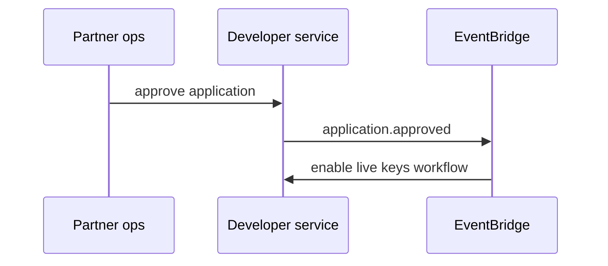

# 09 — Event Catalog

**Topic prefix:** `tnpi.developer` · **Bus:** `tnpi-platform` (+ `tnpi-sandbox`)

---

## Executive summary

Events for developer lifecycle, applications, keys, webhooks, SDK, sandbox, certification—internal ops and optional partner notifications.

---

## Business purpose

Audit, analytics, and automation for partner onboarding pipelines.

---

## Developer & org

| Event | When |
| --- | --- |
| `developer.registered` | Account created |
| `developer.verified` | Email/KYC step complete |
| `organization.created` | Org provisioned |
| `organization.member.added` | Invite accepted |

---

## Application & keys

| Event | When |
| --- | --- |
| `application.created` | New app |
| `application.submitted` | Prod review requested |
| `application.approved` | Prod access granted |
| `application.rejected` | With reasons |
| `api.key.created` | New key (metadata only, not secret) |
| `api.key.rotated` | Rotation complete |
| `api.key.revoked` | Key disabled |

---

## Webhooks & SDK

| Event | When |
| --- | --- |
| `webhook.registered` | Endpoint created |
| `webhook.updated` | Config change |
| `webhook.delivered` | Successful delivery |
| `webhook.delivery.failed` | Exhausted retries |
| `sdk.downloaded` | Artifact download |

---

## Sandbox & certification

| Event | When |
| --- | --- |
| `sandbox.account.created` | Sandbox tenant |
| `sandbox.reset` | Scheduled reset |
| `developer.certified` | Program pass |
| `certification.submitted` | Review queue |

---

## Sequence: application approved

---

## Security

Never include API secrets in events; use `key_id` references only.

---

## AWS

EventBridge → SNS for internal teams; not forwarded to partners (they get product webhooks).

---

## Implementation strategy

DP-0 schema registry entries.

---

## Future expansion

Partner-facing event stream (Kafka) for enterprise.

---

## Cross-references

[06_WEBHOOK_PLATFORM.md](06_WEBHOOK_PLATFORM.md) · [10_DATABASE_MODEL.md](10_DATABASE_MODEL.md)
