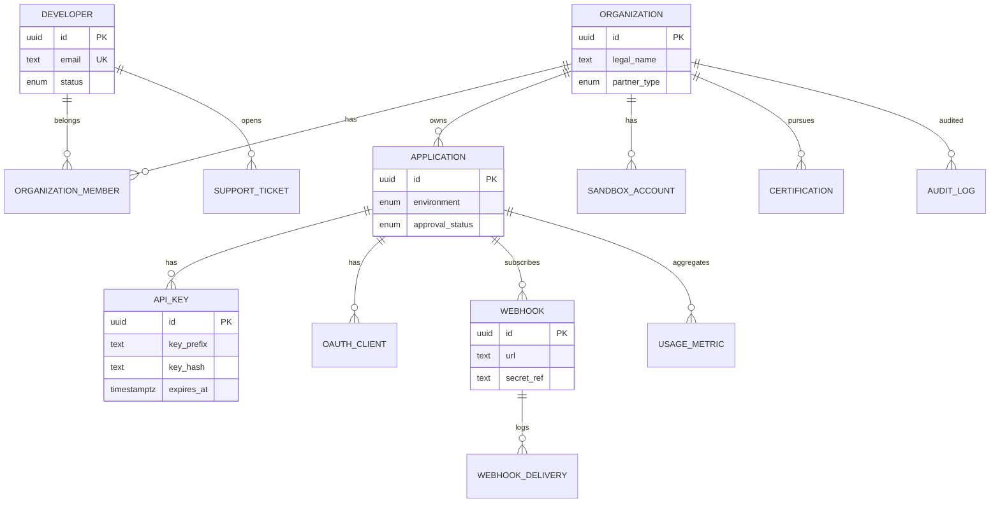

# 10 — Database Model

**Schema:** `developer_platform`

---

## Executive summary

ER for developers, organizations, applications, keys, OAuth clients, webhooks, SDK metadata, sandbox accounts, usage metrics, certification, support tickets, audit.

---

## Business purpose

SoR for **integration identity and delivery**—not payment or merchant SoR.

---

## ER diagram

---

## Entity summary

| Entity | Role |
| --- | --- |
| `Developer` | Individual user |
| `Organization` | Bank, merchant, gov agency |
| `Application` | OAuth app + key container |
| `APIKey` | Hashed credentials |
| `OAuthClient` | Client id/secret refs |
| `Webhook` | Endpoint config |
| `SDK` | Version metadata + S3 URI |
| `SandboxAccount` | Links to sandbox tenant ids |
| `UsageMetric` | Rollups per app/route |
| `Certification` | Checklist state |
| `SupportTicket` | DX support |
| `AuditLog` | Immutable admin actions |

---

## Cross-context references

`merchant_id`, `tenant_id` as external UUIDs—no FK to Phase 1 DB.

---

## Redis

Rate limit counters; session cache; webhook dedupe `event_id` TTL.

---

## Security

Encrypt PII columns; KMS for webhook secret pointers.

---

## AWS

RDS PostgreSQL; read replica for analytics dashboards.

---

## Implementation strategy

Partition `usage_metric` daily; archive to S3 parquet.

---

## Future expansion

Multi-region org replication read-only.

---

## Cross-references

[08_API_SPECIFICATION.md](08_API_SPECIFICATION.md) · [11_AWS_ARCHITECTURE.md](11_AWS_ARCHITECTURE.md)
