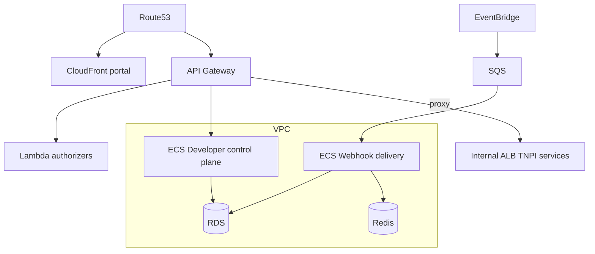
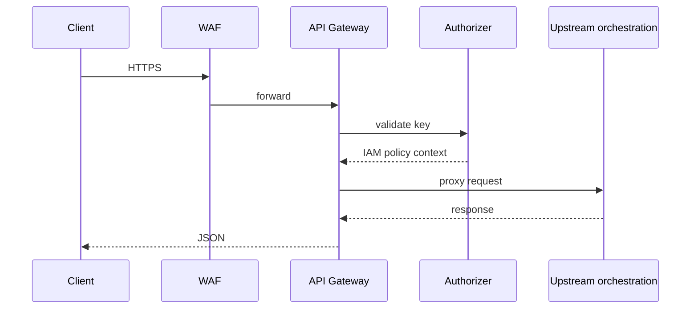

# 11 — AWS Architecture

---

## Executive summary

Production layout: **CloudFront** (portal), **Route53**, **API Gateway** (public + control), **ECS Fargate** (developer services, webhook workers), **Lambda** (authorizers, lightweight transforms), **EventBridge**, **SQS/SNS**, **RDS PostgreSQL**, **Redis**, **CloudWatch**, **CloudTrail**, **KMS**, **Secrets Manager**, **Backup**, **GuardDuty**, **Security Hub**.

---

## Business purpose

Scalable, secure edge with clear separation of sandbox and production.

---

## Architecture overview

---

## API Gateway

| API | Purpose |
| --- | --- |
| `tnpi-public-prod` | `/v1/*` data plane |
| `tnpi-public-sandbox` | Sandbox stage |
| `tnpi-developer` | Control plane `/v1/developer`, apps, webhooks |

Usage plans + API keys mapped to application records.

---

## Developer Portal

S3 static + CloudFront; BFF on Fargate; WAF OWASP rules.

---

## Webhook plane

EventBridge rules per event type → enrichment Lambda → SQS per webhook → Fargate workers → partner HTTPS.

---

## Sequence: public API request

---

## Multi-account

| Account | Workload |
| --- | --- |
| TNPI prod | Gateway prod, portal prod |
| TNPI sandbox | Full sandbox stack |
| Security | Central logging |

---

## Observability (embedded)

CloudWatch metrics: `4xx`, `5xx`, latency, webhook success rate; X-Ray on gateway → upstream.

---

## DR

RDS Multi-AZ; webhook DLQ replay runbook; RPO 15m.

---

## Security

Private subnets; VPC endpoints; KMS CMK per env; Secrets Manager for signing keys.

---

## Implementation strategy

Terraform module `tnpi-developer-platform`; reuse Taifa Core network.

---

## Future expansion

AWS API Gateway developer portal feature evaluate vs custom portal (likely custom for national branding).

---

## Cross-references

[07_API_SECURITY.md](07_API_SECURITY.md) · [12_IMPLEMENTATION_GUIDE.md](12_IMPLEMENTATION_GUIDE.md)
