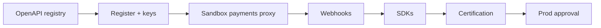

# 12 — Implementation Guide

---

## Executive summary

Delivery **DP-0 through DP-7**: OpenAPI registry, portal MVP, sandbox stage, gateway routes, webhooks, SDKs, certification, Phase 9 handoff.

---

## Business purpose

Sequence work so partners can integrate in sandbox before production approval.

---

## Prerequisites

| Item | Source |
| --- | --- |
| Domain OpenAPI specs | Phases 1–7 |
| Identity OIDC | Taifa Core |
| Internal service URLs | IaC |
| Event catalog | Platform bus |

---

## Service decomposition

| Service | Role |
| --- | --- |
| `devportal-bff` | Portal API |
| `dev-iam` | Orgs, apps, keys |
| `dev-gateway-config` | Route + scope sync |
| `webhook-delivery` | Outbound HTTP |
| `dev-analytics` | Usage rollups |

**No payment logic** in these services—HTTP proxy + policy only.

---

## Developer journey (implementation milestones)

---

## Gateway integration pattern

1. Import upstream OpenAPI path.  
2. Attach authorizer mapping `application_id` → scopes.  
3. Map request/response headers (`TNPI-Request-Id`).  
4. Emit usage metric async to Kinesis/SQS.

---

## Sandbox routing

`TNPI-Environment: sandbox` → sandbox stage VPC links; keys validated against sandbox RDS only.

---

## Security gates

- Production application requires manual approval  
- mTLS onboarding runbook for banks  
- Pen test before public launch  

---

## Operational considerations

Status page `status.taifa.go.tz`; incident comms template for API outages.

---

## Testing

Contract tests per routed path; webhook delivery integration tests; chaos on upstream timeout.

---

## Implementation strategy

See [PHASE8_GATE_PACKAGE.md](PHASE8_GATE_PACKAGE.md) §3 and [14_BACKLOG.md](14_BACKLOG.md).

---

## Future expansion

Self-service custom domains for hosted checkout (partner branding).

---

## Cross-references

[13_ROADMAP.md](13_ROADMAP.md) · [16_DEFINITION_OF_DONE.md](16_DEFINITION_OF_DONE.md)
