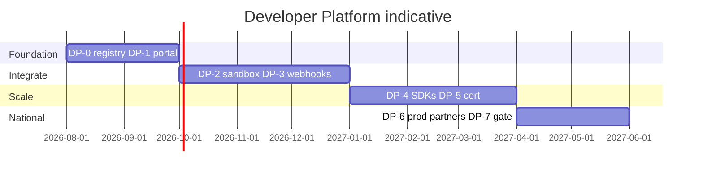

# 13 — Roadmap

---

## Executive summary

~12-month rollout: portal + keys (Q3 2026), sandbox + payments proxy (Q4), webhooks + SDKs (Q1 2027), certification + prod partners (Q2 2027).

---

## Business purpose

Align developer platform with TNPI service maturity and BoT partner onboarding.

---

## Milestones

| Milestone | Outcome |
| --- | --- |
| M1 | Sandbox payment via gateway |
| M2 | Webhook delivery 99% success staging |
| M3 | Flutter + Node SDK GA |
| M4 | First certified bank partner |
| M5 | Phase 9 Transport platform kickoff |

---

## API surface rollout

| Wave | APIs |
| --- | --- |
| W1 | Payments, webhooks |
| W2 | MAP QR/SoftPOS |
| W3 | Settlement/recon read |
| W4 | Transport stub → Phase 9 full |
| W5 | Risk read (partner scoped) |

---

## Dependencies

Phase 3 orchestration sandbox · Phase 7 assess hook exposed only internally (not public v1).

---

## Future expansion

International API regions; developer marketplace.

---

## Cross-references

[14_BACKLOG.md](14_BACKLOG.md) · [PHASE8_GATE_PACKAGE.md](PHASE8_GATE_PACKAGE.md)
