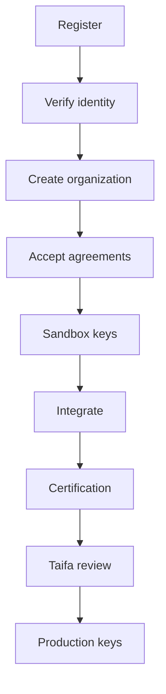
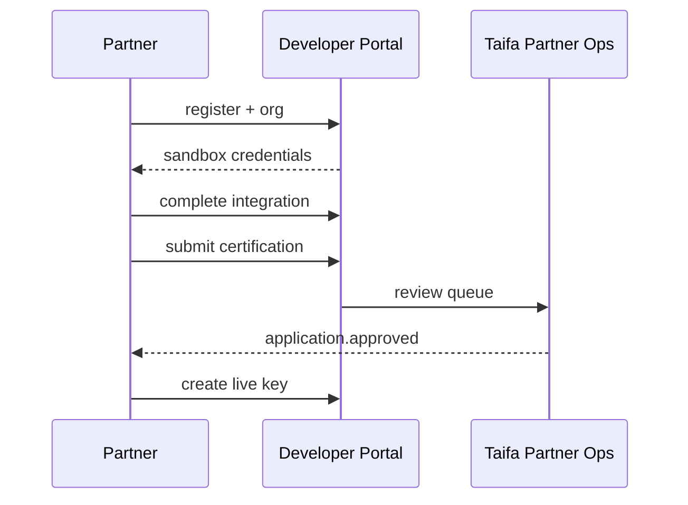

# 17 — Partner Onboarding

---

## Executive summary

End-to-end **partner onboarding**: registration, verification, organization type, legal agreements, sandbox access, integration, certification, production approval—tailored for banks, telcos, government, and ISVs.

---

## Business purpose

Controlled national access to TNPI APIs with clear accountability.

---

## Architecture overview

---

## Partner types

| Type | Verification | Default scopes |
| --- | --- | --- |
| Bank / PSP | Enhanced due diligence | sources, webhooks |
| Telco | License verification | sources, payments |
| Government agency | MoU reference | gov, reports |
| Merchant / ISV | Business reg | payments, MAP |
| Transport operator | Phase 9 track | transport, payments |
| Fintech | BoT sandbox rules | payments |

---

## Developer journey

---

## Legal & compliance

- API Terms of Use  
- Data processing addendum  
- PCI responsibility matrix (partner SAQ)  

---

## API flow

Production routes enabled only when `application.approval_status = approved`.

---

## Security

Enhanced verification for production; mTLS onboarding workshop for banks.

---

## AWS

Partner docs in S3; signed MoU metadata in RDS.

---

## Operational considerations

SLA: sandbox instant; production review 10 business days target.

---

## Implementation strategy

DP-1 registration; DP-5 approval workflow in portal.

---

## Future expansion

Self-service BoT regulatory filing reference field.

---

## Cross-references

[18_CERTIFICATION_PROGRAM.md](18_CERTIFICATION_PROGRAM.md) · [07_API_SECURITY.md](07_API_SECURITY.md)
