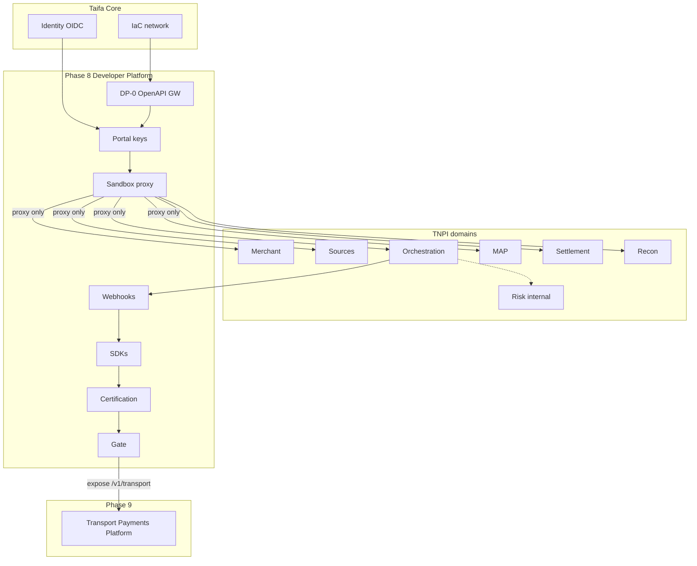

# TNPI Phase 8 — Gate Package (Developer Platform)

**Status:** Architecture planning complete — Phase 7 Fraud & Risk gate assumed **approved**  
**Date:** 2026-08-06

---

## 1. Product Readiness Report

### Executive summary

The **Developer Platform** pack (`docs/payments/developer-platform/00–19`) defines TNPI Phase 8: the **official public integration gateway**—portal, API keys, OAuth, sandbox, webhooks, SDKs, analytics, certification—**proxying** to Phases 1–7 without implementing payment, merchant, settlement, reconciliation, or fraud logic.

### Readiness matrix

| Dimension | Status |
| --- | --- |
| Vision, portal, API platform, SDK, sandbox, webhooks | ✅ |
| Security, OpenAPI, events, ER, AWS | ✅ |
| Onboarding, certification, backlog, acceptance, risks | ✅ |
| **Implementation** | ⬜ |
| **Upstream OpenAPI frozen (payments v1)** | ⬜ |
| **Sandbox orchestration stack** | ⬜ assumed |

### Verdict

| Question | Answer |
| --- | --- |
| Start Developer Platform **implementation**? | **Yes** (architecture) |
| National public API edge? | **After** §5 + acceptance |
| Start Phase 9 Transport Payments Platform? | After §6 exit |

---

## 2. Dependency Graph

**Boundary:** Developer Platform **does not** call PSPs directly; orchestration remains payment brain. Risk assess stays **internal** to orchestration in v1 public API.

---

## 3. Sprint Breakdown

| Sprint | Duration | Focus | Backlog |
| --- | --- | --- | --- |
| **DP-0** | 2 wk | OpenAPI registry, gateway, WAF | DPB-001–002 |
| **DP-1** | 3 wk | Portal, org, apps, sandbox keys | DPB-003–005 |
| **DP-2** | 4 wk | Sandbox stage, payment/merchant proxy | DPB-006–008 |
| **DP-3** | 4 wk | Webhooks, metrics | DPB-009–012 |
| **DP-4** | 3 wk | OAuth, Node/Flutter SDK, Postman | DPB-013–015 |
| **DP-5** | 3 wk | Certification + prod approval | DPB-016–018 |
| **DP-6** | 2 wk | Settlement/recon routes, load tier | DPB-019–020 |
| **DP-7** | 2 wk | Gate + Transport platform charter | DPB-021 |

**Total (indicative):** ~23 weeks

---

## 4. Architecture Review Report

### Scope

Single public edge; proxy vs duplicate logic; sandbox isolation; webhook security; partner onboarding.

### Findings

| ID | Finding | Severity | Action |
| --- | --- | --- | --- |
| AR-DP-01 | All prod external traffic via gateway | Critical | ADR-TNPI-DP-002 |
| AR-DP-02 | No business logic in DP services | Critical | ADR-TNPI-DP-001, CI boundary scan |
| AR-DP-03 | Sandbox/prod isolation | Critical | Separate stage/account |
| AR-DP-04 | API key storage hashed only | High | DP-1 |
| AR-DP-05 | Webhook SSRF risk | High | URL validation DP-3 |
| AR-DP-06 | OpenAPI drift | Med | CI contract tests DP-0 |
| AR-DP-07 | Public risk APIs expose attack surface | Med | Defer risk read to v2; internal only v1 |

### Proposed ADRs

- **ADR-TNPI-DP-001** — Developer Platform is control + proxy plane only  
- **ADR-TNPI-DP-002** — Mandatory production API Gateway edge  
- **ADR-TNPI-DP-003** — Production requires approval + certification

### Verdict

**Approved to implement Phase 8** when orchestration public payment OpenAPI v1 is published.

---

## 5. Production Readiness Assessment

| Area | Staging | Production |
| --- | --- | --- |
| Gateway availability | 99.5% | 99.9% |
| Webhook delivery success | ≥98% | ≥99% with DLQ |
| Partner onboarding SLA | Best effort | 10 business days review |
| WAF / Shield | Basic | Advanced |
| Docs + SDK | Beta | GA Flutter + Node |
| Certified partners | 1 pilot | ≥3 before national PR |
| DR | Restore test | Multi-AZ + runbook |

**Verdict:** Architecture **ready**; public launch **after** DP-2–DP-5 staging sign-off + security pen test.

---

## 6. Exit Criteria — Phase 9 (Transport Payments Platform)

Phase 9 may start when:

| # | Criterion |
| --- | --- |
| E1 | [15_ACCEPTANCE_CRITERIA.md](15_ACCEPTANCE_CRITERIA.md) AC-D1–D16 + AC-N1–N3 staging passed |
| E2 | Phase 8 gate signed |
| E3 | Sandbox payment E2E via public gateway for 30 consecutive days |
| E4 | Webhook delivery + retry demonstrated |
| E5 | At least one partner completes certification track (Payments Core) |
| E6 | Production application approval workflow live |
| E7 | **Transport Payments Platform design pack** initiated (`docs/transport/`) |
| E8 | `/v1/transport/*` route stubs documented in gateway (proxy to Phase 9 service) |
| E9 | Mobility program alignment with [08_TRANSPORT_PAYMENTS.md](../08_TRANSPORT_PAYMENTS.md) |
| E10 | Boundary audit: no payment orchestration/settlement/recon/fraud logic in DP repo |
| E11 | OpenAPI public catalog includes payment + MAP minimum set |
| E12 | Status page and API changelog operational |

**Phase 9 scope (preview):** Dedicated **Transport Payments Platform**—fare products, operator settlement splits, conductor/device models, BRT/daladala/rail/air APIs—consuming orchestration and MAP via Developer Platform routes, not replacing Phase 3/4 engines.

---

## Cross-references

[00_INDEX.md](00_INDEX.md) · [fraud-risk/PHASE7_GATE_PACKAGE.md](../fraud-risk/PHASE7_GATE_PACKAGE.md)
