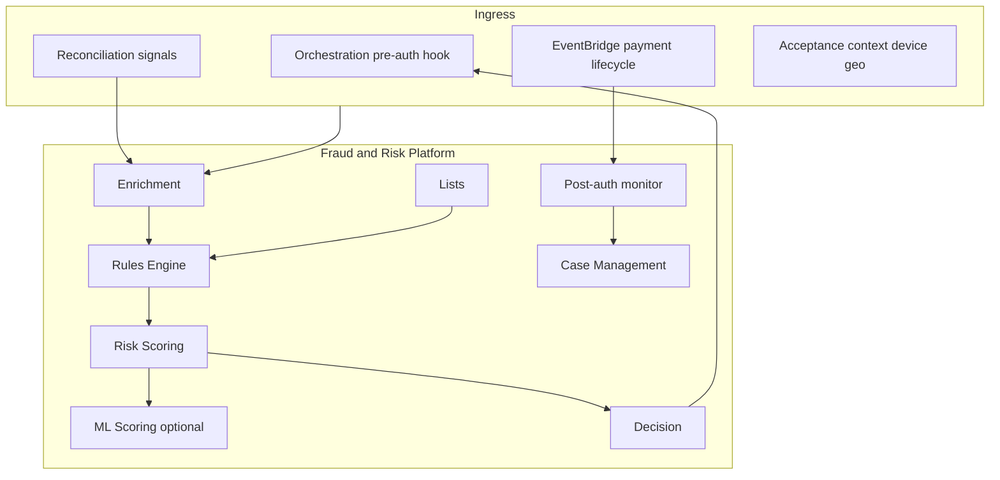
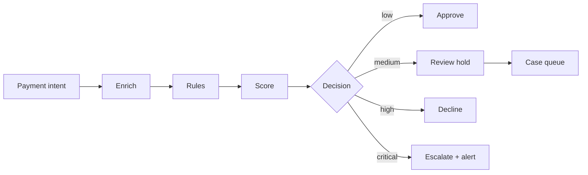

# 01 — Product Vision

---

## Executive summary

Taifa **Fraud & Risk Platform (FRP)** (Phase 7) is Tanzania’s national payment intelligence layer: real-time decisioning on every TNPI payment, continuous post-transaction monitoring, investigator case management, and AML-ready audit—patterned on Stripe Radar, Adyen RevenueProtect, and tier-1 bank fraud stacks, adapted for M-Pesa, SoftPOS, QR, government, transport, and marketplace flows.

---

## Business purpose

Protect merchants, consumers, PSP partners, and the state from fraud, abuse, and compliance failure while keeping authorization latency within orchestration SLAs.

---

## Architecture overview

---

## Product vision

**Every payment intelligently assessed—fraud stopped early, risk visible everywhere, investigators empowered, regulators confident.**

---

## Coverage matrix

| Channel | Pre-auth | Post-auth | Notes |
| --- | --- | --- | --- |
| Merchant API | ✅ | ✅ | Velocity + amount |
| SoftPOS | ✅ | ✅ | Device binding |
| QR / links | ✅ | ✅ | URL / merchant risk |
| Government | ✅ | ✅ | Control-number abuse |
| Transport | ✅ | ✅ | Micro-ticket velocity |
| Tourism / insurance | ✅ | ✅ | Cross-merchant patterns |
| Marketplace splits | ✅ | ✅ | Seller risk |
| Cross-border (future) | ✅ | ✅ | Country rules |

---

## Risk decision flow

---

## Capability model

Risk scoring · merchant/customer/device/behavioral risk · velocity · TM · pattern/geo/IP/device fingerprint · rules · ML hooks · manual review · cases · black/white/watch lists · compliance monitoring · dashboards · alerts.

---

## Domain events (summary)

`risk.assessment.*`, `fraud.*`, `case.*`, `watchlist.updated` — see [08_EVENT_CATALOG.md](08_EVENT_CATALOG.md).

---

## Security considerations

RBAC/ABAC, SoD, immutable audit, PCI minimization (no PAN), KMS, AML-ready retention — [10_SECURITY_MODEL.md](10_SECURITY_MODEL.md).

---

## Operational considerations

p99 assess &lt; 150 ms (staging target); rule publish without deploy; 24/7 alert routing.

---

## Implementation strategy

FR-0 platform shell → FR-1 sync assess API → FR-2 rules v1 → FR-3 lists & cases → FR-4 post-auth → FR-5 ML hook → FR-6 gate.

---

## Future expansion

Digital identity trust signals · open banking account verification · LLM investigation copilot (read-only on case evidence).

---

## Cross-references

[02_RISK_ENGINE.md](02_RISK_ENGINE.md) · [PHASE7_GATE_PACKAGE.md](PHASE7_GATE_PACKAGE.md)
