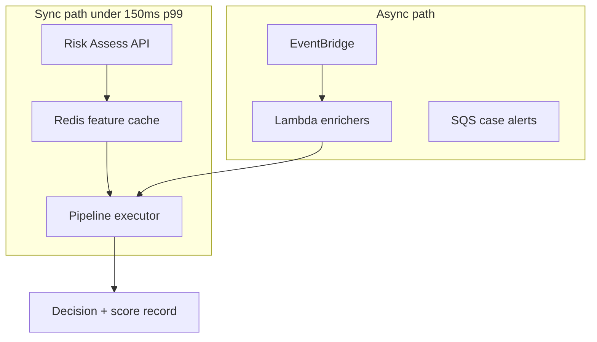
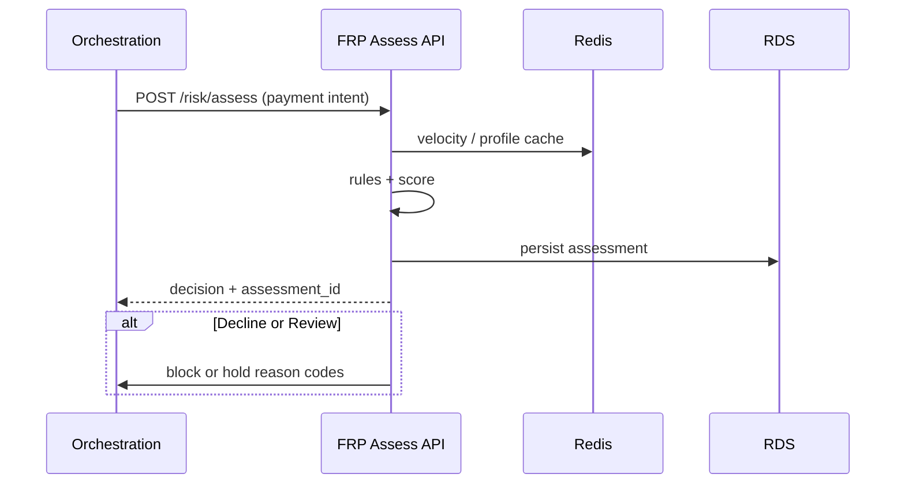
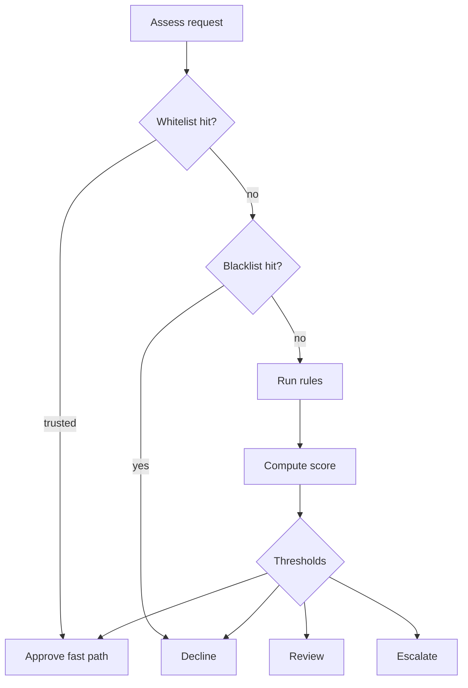

# 02 — Risk Engine

---

## Executive summary

The **Risk Engine** orchestrates enrichment, rule evaluation, scoring, optional ML, and decisions for sync (pre-auth) and async (post-auth) paths—single entry for orchestration and event consumers.

---

## Business purpose

One coherent decision pipeline so channels do not implement ad-hoc fraud logic.

---

## Architecture overview

---

## Pipeline stages

| Stage | Responsibility |
| --- | --- |
| 1. Normalize | Map orchestration payload to `RiskContext` |
| 2. Enrich | Profiles, velocity counters, geo, device, recon flags |
| 3. List check | Black / white / watch (short-circuit where policy allows) |
| 4. Rules | Ordered rule sets per product & merchant tier |
| 5. Score | Unified 0–1000 model |
| 6. ML | Optional additive score + explain codes |
| 7. Decide | Approve / Review / Decline / Escalate |
| 8. Persist | `RiskAssessment` + audit |
| 9. Emit | `risk.assessment.completed`, alerts |

---

## Sequence: pre-authorization

---

## Risk decision flow

---

## Inputs

| Source | Data |
| --- | --- |
| Orchestration | amount, currency, merchant, customer ref, payment method type, channel |
| Merchant Platform | KYC tier, MCC, tenure |
| MAP | device_id, terminal_id, geo |
| Reconciliation | exception velocity, mismatch patterns (aggregated) |
| External (future) | IP reputation, device intel |

---

## Outputs

Decision enum, score, reason codes[], rule hits[], assessment_id, TTL for review holds.

---

## API / events / DB

[07_API_SPECIFICATION.md](07_API_SPECIFICATION.md) · [08_EVENT_CATALOG.md](08_EVENT_CATALOG.md) · [09_DATABASE_MODEL.md](09_DATABASE_MODEL.md)

---

## AWS

API Gateway → ECS Fargate assess service; Redis cluster; EventBridge for async — [11_AWS_ARCHITECTURE.md](11_AWS_ARCHITECTURE.md).

---

## Security considerations

No storage of full PAN; token references only; assess logs redacted.

---

## Operational considerations

Circuit breaker: if FRP unavailable, orchestration uses **policy** (fail-open sandbox / fail-closed prod) per ADR.

---

## Implementation strategy

Implement pipeline as composable stages with feature flags per merchant.

---

## Future expansion

Graph risk (linked entities); consortium fraud signals (regulated sharing).

---

## Cross-references

[03_RULE_ENGINE.md](03_RULE_ENGINE.md) · [04_RISK_SCORING.md](04_RISK_SCORING.md)
