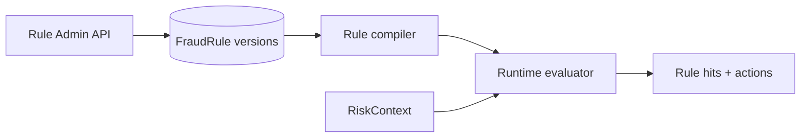
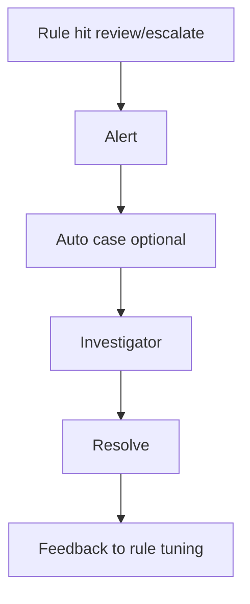
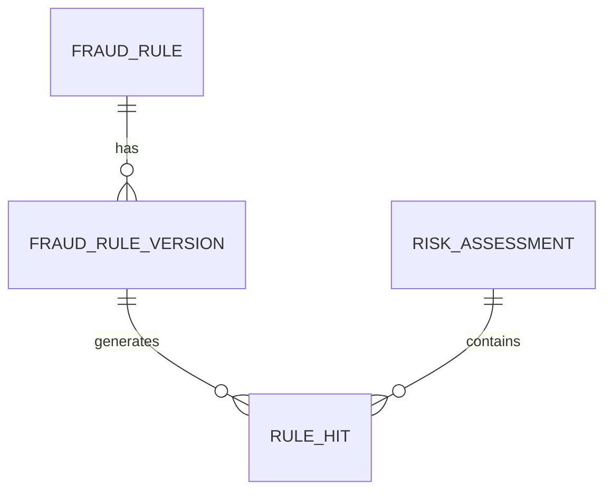

# 03 — Rule Engine

---

## Executive summary

Configurable **rules engine** supporting velocity, amount, country, merchant, device, customer, behavior, time, geo, frequency, provider risk, and adaptive tiers—with versioning, dry-run, and shadow mode.

---

## Business purpose

Risk analysts and fraud ops must change defenses without code deploys (within governance).

---

## Architecture overview



---

## Rule types

| Category | Examples |
| --- | --- |
| Velocity | &gt; N payments / customer / 1h |
| Amount | &gt; TZS X without step-up |
| Country | non-TZ IP + high amount |
| Merchant | new merchant + high ticket |
| Device | unknown device + SoftPOS |
| Customer | first payment &gt; threshold |
| Behavior | amount 10× historical avg |
| Time | 03:00–05:00 unusual activity |
| Geo | impossible travel |
| Frequency | same card token 5× / 10 min |
| Provider | PSP degradation risk flag |
| Adaptive | score band changes thresholds |

---

## Rule structure (logical)

```yaml
id: RULE-VEL-001
version: 3
scope: { products: [softpos, qr], merchant_tiers: [standard] }
condition: velocity(customer_id, 1h) > 10 AND amount > 500000
action: { decision: review, score_delta: 150, reason: VEL_HIGH }
priority: 100
enabled: true
shadow: false
```

---

## Evaluation order

1. Global emergency rules (BoT / national)  
2. Product rules (transport, gov)  
3. Merchant custom rules (contract)  
4. Default TNPI rules  

First **decline** wins unless whitelist; **review** accumulates; score deltas sum (capped).

---

## Fraud investigation workflow (rule-triggered)



---

## ER (rules)



---

## API

CRUD rules, publish, dry-run, shadow metrics — [07_API_SPECIFICATION.md](07_API_SPECIFICATION.md).

---

## Events

`fraud.rule.published`, `fraud.detected` — [08_EVENT_CATALOG.md](08_EVENT_CATALOG.md).

---

## Security

Maker-checker on rule publish prod; immutable version history.

---

## Operational considerations

Rule simulation on historical assessments (batch job).

---

## Implementation strategy

Start JSON DSL + safe expression evaluator; avoid arbitrary code execution.

---

## Future expansion

AI-suggested rules (human approval required).

---

## Cross-references

[04_RISK_SCORING.md](04_RISK_SCORING.md) · [06_MACHINE_LEARNING.md](06_MACHINE_LEARNING.md)
