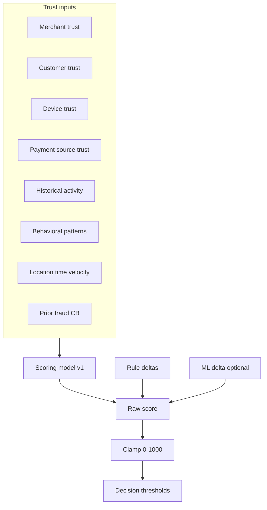
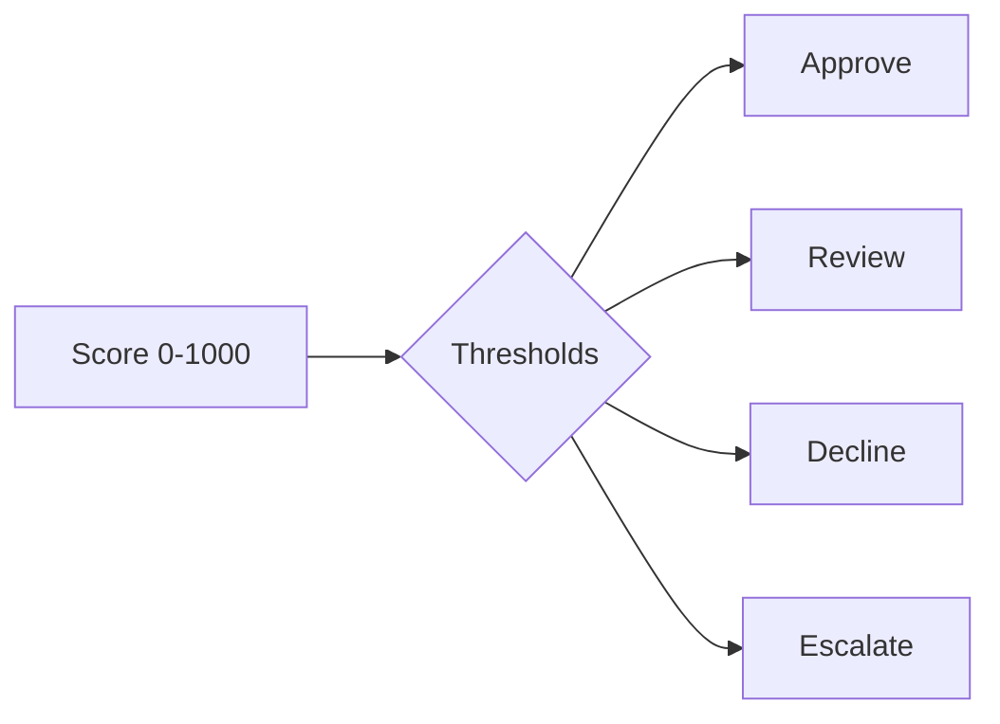
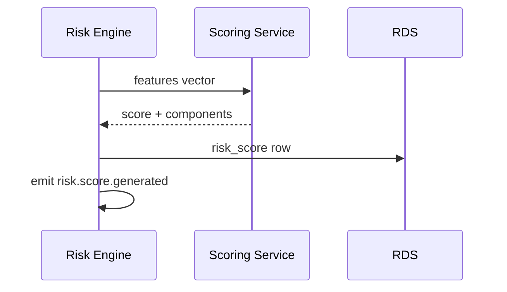

# 04 — Risk Scoring

---

## Executive summary

**Unified risk score** (0–1000) combining trust dimensions, behavioral signals, velocity, location, time, fraud/chargeback history, and rule deltas—mapped to **Approve**, **Review**, **Decline**, **Escalate**.

---

## Business purpose

Consistent decisions across channels; explainable outcomes for merchants and regulators.

---

## Architecture overview

---

## Input dimensions

| Dimension | Source | Weight (v1 indicative) |
| --- | --- | --- |
| Merchant trust | KYC tier, tenure, chargeback rate | 25% |
| Customer trust | account age, verify level | 20% |
| Device trust | enrollment, attestation | 15% |
| Payment source | token age, issuer country | 15% |
| Behavior | amount vs baseline | 15% |
| Context | geo, time, velocity | 10% |

---

## Output decisions

| Score band | Decision | Orchestration action |
| --- | --- | --- |
| 0–299 | Approve | Continue auth |
| 300–599 | Review | Hold + manual queue |
| 600–799 | Decline | Block |
| 800–1000 | Escalate | Decline + fraud alert + optional case |

Thresholds **configurable** per product; merchant tiers may shift bands.

---

## Risk decision flow

---

## Sequence: score generated

---

## Explainability

Persist `score_components` JSON: `{ merchant: 72, velocity: -40, rule_RULE-001: 150 }`.

---

## Reconciliation feed

Elevated recon exception rate on merchant → negative trust delta (async, daily aggregate).

---

## API / DB / events

GET `/risk/scores/{assessment_id}` · `RiskScore` entity · `risk.score.generated`.

---

## Security

Scores may contain sensitive inference—restrict to fraud/finance roles.

---

## Operational considerations

Monitor score distribution drift; quarterly threshold review.

---

## Implementation strategy

v1 weighted formula; v2 calibrated on labeled cases; v3 ML blend.

---

## Future expansion

Chargeback prediction model as pre-emptive score input.

---

## Cross-references

[02_RISK_ENGINE.md](02_RISK_ENGINE.md) · [09_DATABASE_MODEL.md](09_DATABASE_MODEL.md)
