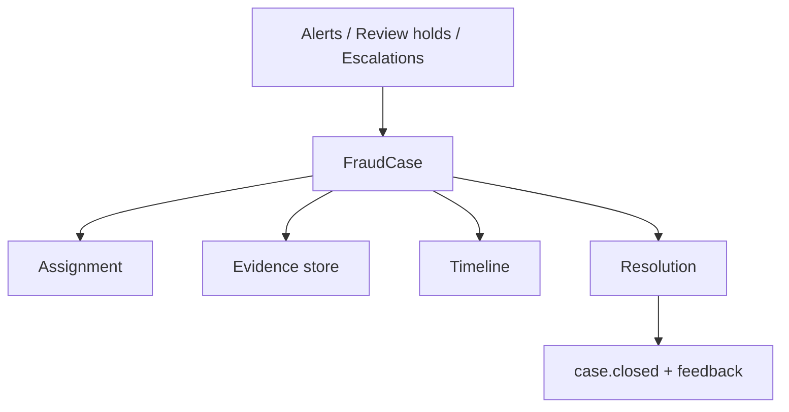
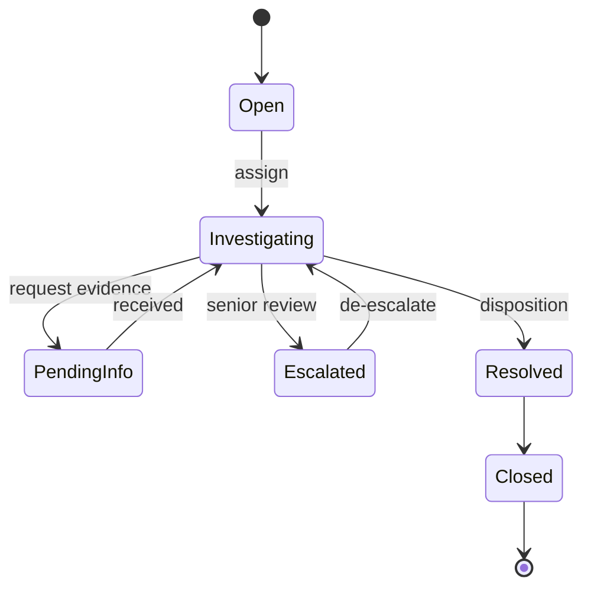
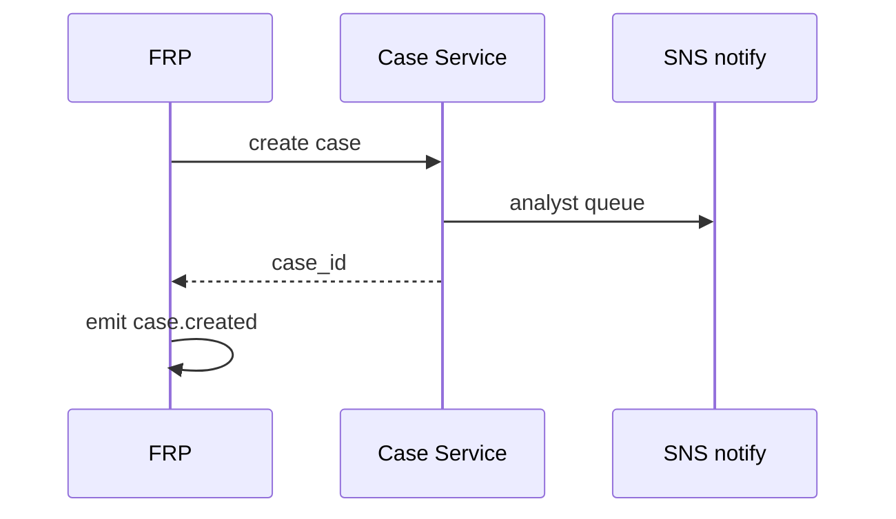
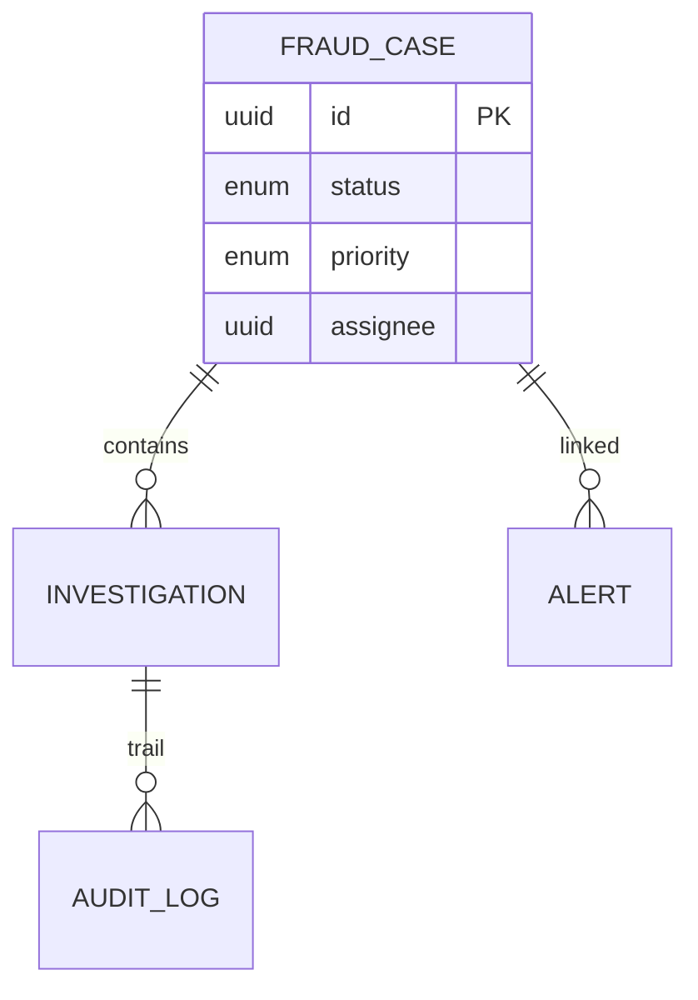

# 05 — Case Management

---

## Executive summary

**Fraud case management** for investigations: creation (manual/auto), assignment, evidence, timeline, notes, status, resolution, escalation, and regulatory reporting hooks.

---

## Business purpose

Convert alerts and review decisions into traceable investigations with SLA and audit trail.

---

## Architecture overview

---

## Fraud investigation workflow

---

## Case types

| Type | Trigger |
| --- | --- |
| Transaction review | Review decision |
| Merchant investigation | `merchant.flagged` |
| Customer abuse | velocity / AML pattern |
| Device compromise | device.flagged |
| Chargeback defense | dispute incoming |
| Recon anomaly | high-value mismatch signal |

---

## Evidence

Links to `payment_id`, `assessment_id`, device logs (redacted), merchant docs, investigator uploads (S3 KMS).

---

## Sequence: case created

---

## Dispositions

Confirmed fraud · false positive · inconclusive · merchant error · customer dispute · referred to law enforcement (AML).

---

## API

[07_API_SPECIFICATION.md](07_API_SPECIFICATION.md) — cases CRUD, assign, notes, close.

---

## ER

---

## Security

Investigator RBAC; PII access logged; export requires approval.

---

## Operational considerations

SLA: P1 4h, P2 24h, P3 72h; backlog dashboards.

---

## Implementation strategy

FR-3: case API + basic UI or integrate with existing ops console.

---

## Future expansion

LLM assistant summarizes timeline (no auto-disposition).

---

## Cross-references

[08_EVENT_CATALOG.md](08_EVENT_CATALOG.md) · [12_OBSERVABILITY.md](12_OBSERVABILITY.md)
