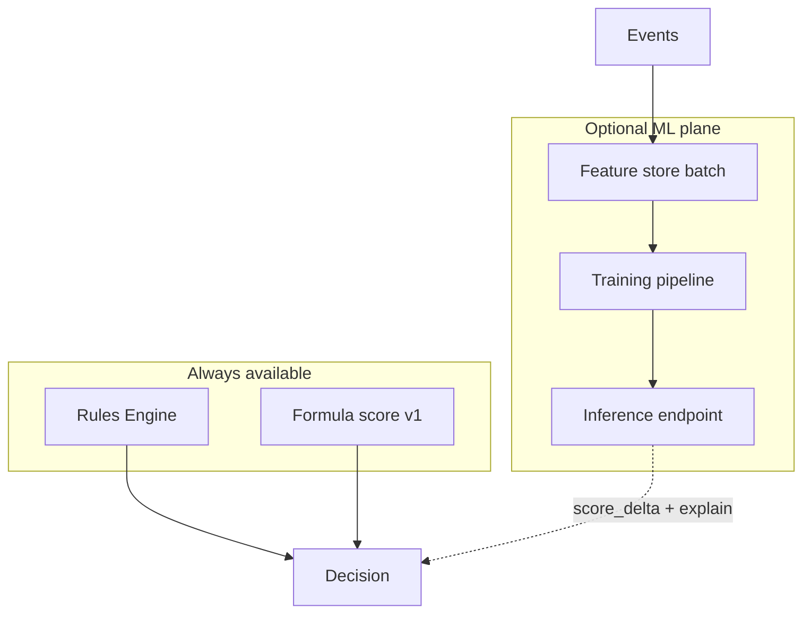
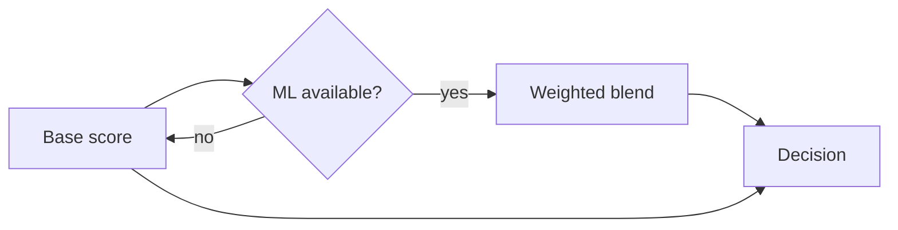

# 06 — Machine Learning & Analytics

---

## Executive summary

**Modular ML integration**: behavior analytics, fraud prediction, anomaly detection, pattern recognition—optional at scoring stage; **rule-based path remains authoritative** when ML is down.

---

## Business purpose

Improve detection rate and reduce false positives without blocking MVP on model maturity.

---

## Architecture overview

---

## Integration points

| Hook | When | Contract |
| --- | --- | --- |
| Pre-auth inference | After rules, before final decision | `ml_score`, `model_version`, `features_hash` |
| Post-auth batch | Nightly | Update merchant/customer risk profiles |
| Anomaly | Stream on `payment.completed` | Alert only, no auto-decline v1 |
| Chargeback model | Weekly batch | Adjust merchant trust |

---

## AWS options (future)

SageMaker endpoints or Amazon Fraud Detector; features in S3 + RDS feature tables; no PAN in features.

---

## Risk decision flow (ML optional)

---

## Governance

Model promotion: shadow → canary merchants → full; rollback via feature flag.

---

## Security

Training data anonymized; model artifacts in encrypted S3; access via IAM.

---

## Operational considerations

Track precision/recall on labeled cases; false positive rate KPI.

---

## Implementation strategy

FR-5: stub inference + contract; FR-6+: first production model.

---

## Future expansion

LLM investigation assistant (read-only RAG on case bundle).

---

## Cross-references

[04_RISK_SCORING.md](04_RISK_SCORING.md) · [11_AWS_ARCHITECTURE.md](11_AWS_ARCHITECTURE.md)
